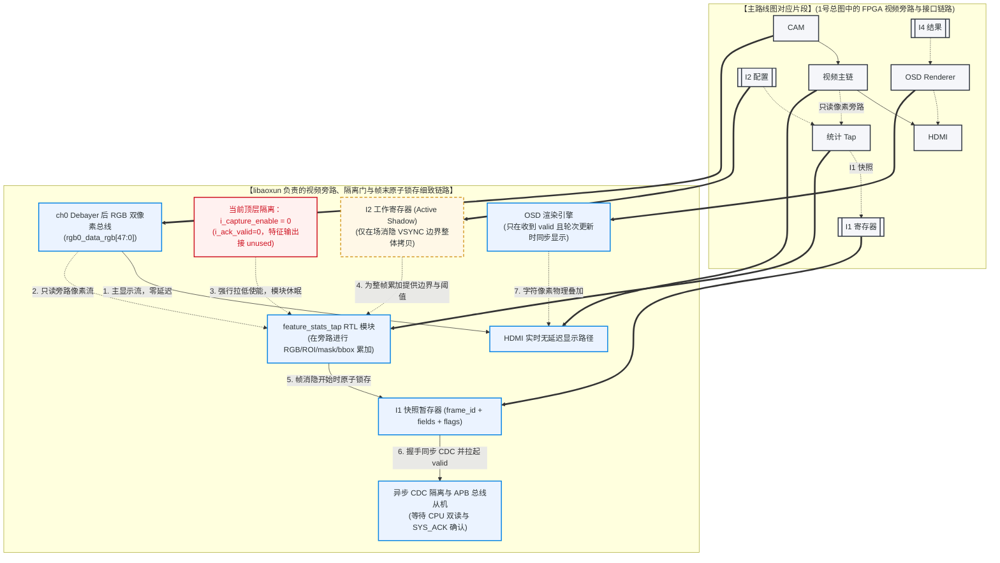

# 4. Libaoxun 视角：视频旁路、I1/I2 硬件契约与 F1 接入边界

本指南是 [主图：项目数据链路与三人分工](file:///d:/第十届集创赛-雄芯院材料/learning_guides/接口对齐与数据链路学习/1_project_data_link_and_roles_guide.md#2-项目整体数据传输链路与队员分工图示) 的 **FPGA 前端细节补充**。它放大主图中的 `视频主链 → Tap → I1` 和 `I2 active config → Tap` 支路，并连接到未来 `I4 → OSD → HDMI` 的硬件侧边界。

> **当前状态（2026-07-18 实读）**：ch0 Debayer 后 RGB 旁路位置和 `feature_stats_tap` RTL/testbench 已存在；顶层把 `i_capture_enable` 固定为 `0`、ACK 固定关闭、特征输出接到 unused 信号。因此统计 RTL 目前**没有**成为 CPU 可读接口，业务 CDC/APB/ACK/I2/I4/OSD 均未实现或未冻结，板级视频/特征/OSD 均未验证。

事实源优先级： [CURRENT_STATE.md](file:///d:/第十届集创赛-雄芯院材料/CURRENT_STATE.md) → [单摄特征快照契约](file:///d:/第十届集创赛-雄芯院材料/competition_project_single_camera/integration/single_camera_feature_contract.md) → [F1 接口对齐总账](file:///d:/第十届集创赛-雄芯院材料/competition_project_single_camera/integration/F1_INTERFACE_ALIGNMENT_DRAFT.md) → 同批 RTL/XML/SoC/BSP/构建证据。

---

## 1. 这份图放大主图的哪一段？

以下图示将主路线图对应的这一段 FPGA 视频旁路与接口链路截出，并在其基础上展开扩展了 libaoxun 负责的视频只读旁路、隔离使能、以及帧末原子快照和场消隐 VSYNC 同步生效机制。

🔍 点击展开/收起：Libaoxun FPGA旁路图专有名词释义

*   **rgb0_data_rgb[47:0]**：视频处理流水线中经过 Debayer 图像还原后产生的 48 位并行双像素 RGB 彩色信号。
*   **i_capture_enable**：顶层 RTL 内部用于控制特征统计模块是否对输入像素进行累加处理的物理使能信号，当前固定为 0。
*   **Active Config**：当前帧统计时硬件正在引用的配置参数（如当前的 ROI 边界，颜色阈值等）。
*   **frame_id**：FPGA 统计引擎对所处视频流帧的流水计数值。
*   **feature_stats_tap**：libaoxun 编写的特征累加统计 RTL 模块，挂载在视频主链路的旁路。
*   **OSD Renderer**：负责在像素流输出到 HDMI 前进行字符图形叠加的专用硬件渲染贴图块。

📖 点击展开/收起：Libaoxun FPGA旁路图图文对照生动表述

本图展示了**“高速公路旁路称重超载检查站的工作机制”**：
1.  **直行通道（HDMI 主链）**：从摄像头（CAM）开来的大货车源源不断行驶在高速路主干道（VID 视频主链）上，直接出港驶向显示器（HDMI），主干道上没有任何收费站或红绿灯阻挡，保证货车行进绝对零延迟。
2.  **称重旁路（Tap 统计）**：在直行通道旁边，我们开了一个极窄的分流称重车道（只读旁路）。大货车快速通过主干道时，旁路上的称重拍照设备（TAP 统计）默默对货车长宽高、货色（像素）进行抓拍称重，但不要求货车在主干道上刹车减速。目前由于顶层控制室进行了演习安全物理封闭（i_capture_enable=0），分流入口处于上锁隔离状态，所以称重数据目前并不能流入 CPU。
3.  **上传与确认（I1 & ACK）**：未来，称重照相数据将被打包贴条（I1 寄存器 SNAP），通过专用的高安全 CDC/APB 管道送给中控室（CPU 消费端）。中控室看完扔回签收收据（ACK），称重通道才会重新开放记录下一次拍照。
4.  **电子屏广播显示（I4 & OSD）**：中控室将处理结果传给大屏（OSD_DEV OSD 渲染引擎），在大货车开出海关大门（HDMI 输出）前，将分类结果半透明投影叠加在主画面上，让外面人一眼看清集装箱里面的货品判定。

图中唯一不能妥协的事实是：Tap 是只读旁路，不得反向驱动、阻塞、替换或延迟 HDMI 主像素路径。虚线表示未来 F1 原子批次才可接入的业务链，不是当前可连线或可烧写的实现。

---

## 2. Libaoxun 的职责边界

Libaoxun 负责硬件架构与总线接口物理层的稳定，确保硬件不会对 CPU 造成总线对齐死机。

| 模块/接口 | Libaoxun 当前负责的事实与产出 | 必须与谁对齐 | 当前不得做 |
|---|---|---|---|
| 视频主链 | 维护 ch0 视频、Debayer 后 RGB 与 HDMI 显示链的独立性 | qzs 审核任何顶层/XML/SDC/IP 原子改动 | 为接 feature 改坏 framebuffer、Debayer 或 HDMI；用“旁路”掩盖时序/资源风险 |
| Tap 统计 | 维护 Tap 输入时钟、复位、`rgb_vs/rgb_de/rgb0_data_rgb`、ROI/mask/前景/bbox 的字段语义 | wsc 确认字段/flags/ACK 时序；qzs 确认 Gate/Review Packet | 让 RTL 给出颜色/形状/任务判断，或把统计结果称为 CPU 可读 |
| I1 | 设计经审查的帧末锁存、multi-bit snapshot CDC 或异步 FIFO、发布/ACK/overrun 行为 | wsc 的消费/双读/ACK 规则；同批 SoC/BSP | 用逐位两拍同步拼多位数据；未冻结 ABI 前手填 APB 地址 |
| I2 | 实现 `staging → commit(config_seq) → frame-boundary active` 后，Tap 只使用 active 配置 | wsc 的配置语义；qzs 的接口审查 | 写一个配置立即影响半帧统计；让配置反向影响视频显示 |
| I4 / OSD | 仅提供将来像素渲染的硬件实现条件 | wsc 的结果语义与 qzs 的展示要求 | 先做 result/OSD APB、显示裸寄存器值，或宣称 OSD 已板级闭环 |

💡 点击展开/收起：I1 接口硬件侧生动形象中文介绍

I1 在硬件侧是**“物理相机的原子卷帘快门与防撕裂保险柜”**。当一帧像素的消隐信号（VSYNC）降临时，快门必须在同一拍时钟把所有累积得到的红色像素面积、亮度之和、前景框高低等全部锁入内部只读寄存器（保险柜），并打上当前帧号的封条。在 CPU 扔进写有匹配封条号的钥匙（ACK）前，保险柜绝对不允许修改里面的数据，哪怕下一帧统计好了也只能丢弃并亮红灯。这从物理上杜绝了数据在总线上被撕裂。

💡 点击展开/收起：I2 接口硬件侧生动形象中文介绍

I2 在硬件侧是**“暂存配置寄存器与双重物理缓冲（Active Shadow）”**。当 CPU 通过 APB 总线发来调焦指令时，硬件不把它们直接送到统计引擎。因为如果引擎在一帧图像扫描到一半时接收了新的 ROI 坐标，就会计算出半截错乱的数据。硬件把它们全部锁在 Staging 暂存区。只有等场消隐信号（VSYNC）降临，代表旧画面已经扫描完毕、新画面还没开始时，硬件才把 Staging 的所有参数原子般地复制到 Active Shadow（工作影子区）中，使新参数安全生效。

💡 点击展开/收起：I4 接口硬件侧生动形象中文介绍

I4 在硬件侧是**“半透明像素图层叠加发生器（OSD Renderer）”**。它只读取 CPU 写完结果并提交了 valid 信号的那一组寄存器，在视频时序控制下，把“第 3 轮”、“红色正方体”以及识别理由的字体像素，在 HDMI 场同步信号下“半透明贴图”在主画面之上。未收到 valid 信号前，OSD 应当渲染为等待或清屏，严禁擅自渲染乱码或者错位的历史框图。

---

## 3. 当前真实 Tap 与未来 I1 的边界

### 已存在且可核对

- [feature_stats_tap.v](file:///d:/第十届集创赛-雄芯院材料/competition_project_single_camera/src/feature_stats/feature_stats_tap.v) 将每拍 48-bit RGB 视为两个像素，只累积 ROI 内的红/蓝/黄 mask、前景面积、ROI 像素数、亮度和 bbox；它不驱动视频主链。
- [top.v](file:///d:/第十届集创赛-雄芯院材料/competition_project_single_camera/src/top.v) 把 Tap 放在 ch0 Debayer 后的 `rgb0_data_rgb` 旁路上，但当前 `i_capture_enable=1'b0`、`i_ack_valid=1'b0`，全部特征输出为 unused。
- [feature_stats_tap_tb.v](file:///d:/第十届集创赛-雄芯院材料/competition_project_single_camera/tests/rtl/feature_stats_tap_tb.v) 已覆盖双像素计数、匹配/不匹配 ACK、诊断拒绝与计数溢出拒绝。

### 尚未实现，不能由图补成事实

1. Tap 到 APB/CPU 的 CDC 实现、寄存器布局、读取次序、PSTRB、IRQ、复位行为；
2. CPU 对 snapshot 的真实总线读取与相同 `frame_id` ACK；
3. I2 staging/commit/active 寄存器和 `active_seq` 回读；
4. I4 result/OSD 寄存器、OSD renderer 和 HDMI 叠加；
5. 上述任一改动后的同批 Map/PNR/STA/CDC、bitstream、视频回归和板级证据。

---

## 4. I1/I2 硬件必须共同确认的协议

| 接口 | 硬件必须保证 | CPU/系统依赖它做什么 | 尚待冻结 |
|---|---|---|---|
| I1发布 | 一帧结束时整体锁存 `frame_id`、`config_seq`、统计字段与 flags；有效快照在匹配 ACK 前保持一致 | wsc 双读、拒绝撕裂/过载/诊断帧，再对同帧 ACK | CDC 实现、APB 地址/读序、ACK 位点/复位 |
| I1 overrun | 上一快照未 ACK 时新帧不得伪装为正常稳定快照；标记 `SNAPSHOT_OVERRUN`，不阻塞 HDMI | CPU 将该候选视为不稳定，不生成稳定识别 | 物理跨域和状态清除实现 |
| I2 active | ROI/background/mask/`config_seq` 先完整 staging，提交后仅在完整帧边界变为 active | CPU 能以返回的 active `config_seq` 追溯本帧依据 | 寄存器、commit/active 回执、CDC |
| I4 renderer | 只渲染 CPU 提供的可解释颜色/形状/decision/reason 语义 | qzs 能审查屏幕语义与轮次追溯 | payload ABI、字体、像素接口、锁存时序 |

**禁止偷换概念**：颜色/形状/尺寸分类、四任务关系和机械臂状态机属于 CPU；FPGA 只提供受审的基础统计、通道和像素渲染。

---

## 5. Libaoxun 与队友的接口核对清单

| 先核对谁 | 必须一起读的文件 | 要达成的一句话结论 |
|---|---|---|
| wsc | [single_camera_feature_contract.md](file:///d:/第十届集创赛-雄芯院材料/competition_project_single_camera/integration/single_camera_feature_contract.md)、[single_camera_feature_adapter.h](file:///d:/第十届集创赛-雄芯院材料/competition_project_single_camera/cpu/include/single_camera_feature_adapter.h)、[single_camera_runtime.h](file:///d:/第十届集创赛-雄芯院材料/competition_project_single_camera/cpu/include/single_camera_runtime.h) | “Tap 发布什么、CPU 何时拒绝、ACK 对哪个 frame_id、`config_seq` 怎样追溯。” |
| qzs | [F1_INTERFACE_ALIGNMENT_DRAFT.md](file:///d:/第十届集创赛-雄芯院材料/competition_project_single_camera/integration/F1_INTERFACE_ALIGNMENT_DRAFT.md)、[2_qzs_role_data_link_and_control_logic.md](file:///d:/第十届集创赛-雄芯院材料/learning_guides/接口对齐与数据链路学习/2_qzs_role_data_link_and_control_logic.md) | “I4 仍是拟议，I5 保持阻断，哪些证据/Review Packet 后才可接线。” |
| 全队 | [top.v](file:///d:/第十届集创赛-雄芯院材料/competition_project_single_camera/src/top.v)、[mem_test.xml](file:///d:/第十届集创赛-雄芯院材料/competition_project_single_camera/mem_test.xml)、[mem_test.peri.xml](file:///d:/第十届集创赛-雄芯院材料/competition_project_single_camera/mem_test.peri.xml)、[constrain.sdc](file:///d:/第十届集创赛-雄芯院材料/competition_project_single_camera/constrain.sdc) | “任何业务接入是同一硬件原子批次，旧构建/bitstream 不能继承。” |
| 全队 | [CURRENT_STATE.md](file:///d:/第十届集创赛-雄芯院材料/CURRENT_STATE.md) 与当前 G1 操作卡 | “当前板级 Gate 未关闭；只允许操作卡明确写出的范围。” |

### 本人应先学会的四件事

1. **双像素统计与 ROI 边界**：48-bit RGB 的两个像素怎样在同一有效周期累计，bbox/溢出怎样保持一致。
2. **多位 CDC 与 backpressure 隔离**：为什么 snapshot CDC/异步 FIFO 不能用逐位同步，为什么 overrun 不能回压 HDMI。
3. **配置原子性**：`staging → commit → active` 如何防止 ROI 和阈值在一帧中途变化。
4. **硬件原子批次**：顶层、XML/peri、SDC、IP、BSP/`soc.h` 任一变更为何会使旧构建和板级证据失效。

---

## 6. 交给 Gemini 的编辑边界

Gemini 可以重排版、为这张分图添加直觉类比、波形示意或知识讲解，但**不得**：

- 修改 Tap 的只读旁路原则、`i_capture_enable=0`/ACK 关闭/输出 unused 的当前事实，或把统计 RTL 写成已接 APB/CPU；
- 改写 I1/I2/I4 的方向、字段语义、所有权、未冻结项、Gate 或“板级未验证”状态；
- 把分类、四任务关系、阈值管理、逐轮事务或机械臂状态机迁回 FPGA；
- 修改 `top.v`、XML/peri、SDC McKinney、IP、BSP、构建制品、操作卡或任何硬件配置；
- 添加未经同批 `soc.h` 和 Review Packet 证明的地址、端口、时钟、复位、CDC、OSD 或 UART2 细节。

任何事实性修改必须先由 wsc、libaoxun、qzs 对齐并经 Codex Review Packet 审查。
