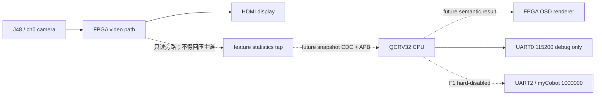

# 单摄 F1 接口对齐总账（初步草案）

> 版本：v0.1-draft
> 日期：2026-07-18
> 适用工程：`competition_project_single_camera/`（隔离候选）
> 状态：`SEMANTICS PARTIALLY FROZEN / WIRE ABI NOT FROZEN / BOARD NOT VERIFIED`

## 0. 用途与边界

本文件是 qzs、wsc、libaoxun 与其开发 Agent 共同使用的**接口对齐总账**。它把已有的局部契约、CPU Host 结构和板级 Gate 放到同一张表中，明确每一项：谁提供、谁消费、何时有效、目前证据等级、何时才允许修改。

它不是新的寄存器地图，也不授权修改 FPGA、SoC、XML、SDC、生成 IP 或机械臂接线。地址、APB 写选通、IRQ、CDC 实现和 UART2 均不在本草案中冻结。

当前权威顺序如下：

1. 根目录 `AGENTS.md` 与 `CURRENT_STATE.md`；
2. [单摄特征快照契约](single_camera_feature_contract.md)；
3. 同一次 Efinity SoC 生成物中的 `soc.h`、BSP、RTL 和 Review Packet；
4. 本文件。

若本文件与前三级冲突，以前三者为准，并在本文件的“待定项”中登记，不得凭旧文档修代码。

## 1. 先统一三个概念

| 名称 | 本项目中的含义 | 当前例子 | 能否直接当硬件事实 |
|---|---|---|---|
| CPU 语义 | C 程序内部如何理解物体、任务与结果 | `sc_observation_t`、`sc_round_result_t` | 否 |
| 线接口 ABI | CPU 通过总线真正读写的字段、宽度、地址、strobe、时序 | APB 寄存器、CDC 快照、ACK | 尚未冻结 |
| 协议 | 双方按顺序交换消息的规则 | `frame_id` 锁存/ACK、结果提交 | 部分语义已冻结，物理实现未冻结 |

因此，`sc_features_t` 和 `sc_round_result_t` 是后续 ABI 的**候选语义来源**，不是可直接 memcpy 到 APB 的寄存器布局；不得从它们推导地址、字节序、对齐或 PSTRB。

## 2. F1 系统边界图

F1 的终点是“CPU 产生可解释的识别、判断、执行/不执行语义，并由 FPGA 渲染”。`ARM_ENABLED=0`：即使结果是目标命中，也只能输出 `EXECUTE_ARM_DISABLED`，不生成任何 myCobot 帧。

## 3. 接口清单与冻结状态

| ID | 接口 | 提供方 → 消费方 | 当前状态 | 当前允许的工作 |
|---|---|---|---|---|
| I0 | CPU 生命证明 | QCRV32 → UART0 | `BOARD NOT VERIFIED` | 仅当前批次 USER2、片上 RAM、Hello 与回显 Gate |
| I1 | 特征快照 | FPGA → CPU | `SEMANTICS DRAFT / RTL DISCONNECTED` | Host 映射与 RTL/testbench；不得接入或猜测地址 |
| I2 | 统计配置 | CPU → FPGA | `SEMANTICS DRAFT` | 讨论 ROI/background/mask/`config_seq`；不得实现业务 APB |
| I3 | 轮次目标与操作事件 | 输入侧 → CPU | `UNSPECIFIED` | 只定义需求与候选状态机；不得沿用旧双摄字段 |
| I4 | 结果与 OSD 语义 | CPU → FPGA OSD | `SEMANTICS PROPOSED` | Host 结果映射；不得实现 result/OSD APB |
| I5 | 机械臂命令 | CPU → UART2 → myCobot | `OUT OF F1 / BLOCKED` | 不接线、不发帧、不占用 UART2/J52 |

`final_project/integration/register_map.md` 是历史候选/参考资料，不是 I1–I4 的单摄物理地址来源；其中旧双摄窗口、`TARGET_SEL` 和占位偏移不得复制到本候选工程。

## 4. I1：FPGA → CPU 特征快照（已对齐的语义）

唯一字段来源为 [单摄特征快照契约](single_camera_feature_contract.md) 和 `cpu/include/single_camera_feature_adapter.h`。

| 字段 | CPU 类型 | 语义/单位 | 有效条件 | 状态 |
|---|---|---|---|---|
| `frame_id` | `uint16_t` | 已发布有效帧编号 | 与整帧快照一起锁存 | 语义已对齐 |
| `config_seq` | `uint16_t` | 本帧实际使用的 active 配置版本 | 与 CPU 期望版本相同 | 语义已对齐 |
| `red_area` / `blue_area` / `yellow_area` | `uint32_t` | ROI 内颜色 mask 像素数 | `STATS_VALID=1` | 语义已对齐 |
| `foreground_area` | `uint32_t` | ROI 内前景像素数 | `STATS_VALID=1` | 语义已对齐 |
| `roi_pixel_count` | `uint32_t` | 实际处理的 ROI 像素数 | 非配置面积推断值 | 语义已对齐 |
| `sum_luma` | `uint32_t` | ROI 内 `R+G+B` 累积值 | 不溢出 | 语义已对齐 |
| `bbox_width` / `bbox_height` | `uint16_t` | 前景包围盒包含端点尺寸，单位 pixel | 无前景时为 0 | 语义已对齐 |
| `source_flags` | `uint8_t` | 帧稳定、ROI、诊断、溢出、overrun、ch0 身份 | 见下方 | 语义已对齐 |

CPU 仅在下列条件同时成立时将快照交给分类器：`FRAME_STABLE`、`ROI_VALID`、`STATS_VALID`、`SOURCE_CH0` 为 1，且 `DIAG_ACTIVE`、`COUNTER_OVERFLOW`、`SNAPSHOT_OVERRUN` 为 0。拒绝快照时不得产生稳定识别结果，更不得把它写成 `SKIP`。

### I1 原子性与 ACK（必须保持）

1. FPGA 在像素域完成一帧后一次性锁存全部字段；
2. CPU 读取前后比较 `frame_id`；不同则整帧废弃、重读；
3. CPU 只 ACK 已成功消费的同一 `frame_id`；不匹配 ACK 必须被拒绝；
4. 未 ACK 不得阻塞 HDMI/DDR 主链；新帧到来只能置 `SNAPSHOT_OVERRUN`，不得覆盖成“正常稳定帧”；
5. 多位快照跨域必须使用经审查的 snapshot CDC 或异步 FIFO，不能逐字段双触发器后拼接。

**尚未冻结：**快照在 APB 上如何分寄存器、读取顺序、PSTRB、是否使用 IRQ、ACK 寄存器位置及复位行为。

## 5. I2：CPU → FPGA 统计配置（只冻结语义）

| 配置组 | CPU 意图 | FPGA 应保证 | 物理 ABI 状态 |
|---|---|---|---|
| `roi` | `{x0,y0,x1,y1}` 闭区间 | 合法范围为 1920×1080，按完整帧 active 版本统计 | 未冻结 |
| `background` | 背景 RGB 均值与前景差异门限 | 只据 active 配置计数，不反向改变视频显示链 | 未冻结 |
| `color_masks` | 红、蓝、黄阈值 | FPGA 只统计 mask 面积，不输出颜色分类结论 | 未冻结 |
| `config_seq` | 16-bit 单调配置版本 | 快照必须回传实际 active 版本 | 未冻结 |

建议将配置更新做成 `staging → commit(config_seq) → frame-boundary active`。这是一项协议要求，不是当前可编码的寄存器方案；必须等 I0 与 APB MAGIC 板级 Gate 通过、同批 `soc.h` 和 Review Packet 齐备后才进行 I2 实现审查。

## 6. I3：轮次目标与操作事件（待设计，不得复用旧字段）

F1 需要有一个明确的输入来源来调用 `sc_f1_apply_target()` 和 `sc_f1_place()`，但当前尚未定义其来自按键、UI、APB 或其他输入。实施前必须在 Review Packet 中一次性确定：

- `task`、`target_color`、`reference_size_cm_x10` 的来源与编码；
- `PLACE` / `ABANDON` 是否存在、谁产生、如何带 `event_seq`；
- 事件重复、乱序、超时和复位后的处理；
- 事件在 CPU 端确认（ACK）的边界。

在此之前，CPU Host 测试的事件只代表软件事务语义，不能宣称存在板级目标输入。

## 7. I4：CPU → FPGA OSD 结果语义（初步提案）

OSD 不应显示不可解释的寄存器值。建议 I4 的**语义载荷**与现有 `sc_round_result_t` 对齐，版本初始为 `result_schema_v=1`：

| 字段 | 来源 | 作用 |
|---|---|---|
| `round_id` | `sc_f1_controller_t.round_seq` | 防止将上一轮结果显示到本轮 |
| `frame_id` / `config_revision` | 已消费 I1 快照 | 追溯结果使用的输入批次 |
| `input_flags` | I1 `source_flags` | 显示或记录为何拒绝输入 |
| `color` / `shape` / `size_cm_x10` | `sc_observation_t` | 可解释识别结果；尺寸 0 表示不可用 |
| `decision` | `sc_decision_t` | `WAIT`、`EXECUTE_ARM_DISABLED` 或 `SKIP` |
| `reason` | `sc_reason_t` | 目标命中、颜色/形状/尺寸不符、不稳定、超时等理由 |
| `arm_enabled` | 固定 0 | F1 安全状态；OSD 不得将其显示为机械臂已执行 |
| `result_valid` | 控制器结果锁存状态 | 只有 1 才可提交给 OSD |

I4 的提交规则建议为：CPU 写完同一结果的 staging 字段后，以 `result_round_id` 为提交标识；FPGA 只在 `result_valid=1` 且 `round_id` 新于已显示轮次时整体锁存。实际寄存器、位宽、字体/像素渲染、清屏与复位行为均待 I4 Review Packet 冻结。

## 8. I5：CPU → myCobot（明确不属于当前 F1）

| 项目 | 当前规则 |
|---|---|
| 物理链路 | UART2/J52，目标波特率 1000000；与 UART0 Hello 完全独立 |
| CPU 语义 | F1 只允许 `EXECUTE_ARM_DISABLED`，不得产生传输对象 |
| 进入条件 | I0、I1、I4 的板级 Gate 关闭后，用户确认电平、线序、共地、固定姿态、速度/角度范围和急停/断电方式，并通过独立 Codex Review Packet |
| 禁止项 | 当前不得接线、发送帧、执行动作，PC/pymycobot 不进入正式闭环 |

## 9. Gate 与证据矩阵

| Gate | 最小观察 | 证明什么 | 不证明什么 |
|---|---|---|---|
| G1a | 匹配 bitstream + USER2 + PC 位于片上 RAM | 调试/下载前置范围 | CPU 已执行 |
| G1b | UART0 完整 Hello 与单字符回显 | 当前 CPU/ELF/UART0 链路可运行 | APB、特征、OSD、UART2 或机械臂 |
| G1c | 只读 APB MAGIC | 当前 APB0 基础窗口实读 | I1–I4 业务寄存器可用 |
| F1-ABI | 同批 `soc.h`、RTL、CDC、寄存器审查 | I1–I4 可开始实现 | HDMI/板级业务闭环 |
| F1-board | 特征帧、ACK、CPU 结果、OSD 的原始板级证据 | 无机械臂 F1 闭环 | myCobot 动作能力 |

每个 Gate 的证据必须包含：工程/制品身份、命令或操作卡、原始日志/截图、结果、warning、未验证项。任何 XML、SDC、IP、顶层、BSP 或 linker 输入变化均使相关旧证据失效。

## 10. 所有权与变更规则

| 区域 | 主责 | 变更前必须对齐 |
|---|---|---|
| I1/I2 的 RTL、CDC、SoC 与 Efinity 输入 | libaoxun | wsc（字段/时序）、qzs（Gate 与原子批次） |
| I1 适配、分类、I3 事务、I4 结果语义 | wsc | libaoxun（真实 ABI）、qzs（状态/安全） |
| I4 展示要求、I5 安全边界、文档总账与合并 | qzs | wsc（CPU语义）、libaoxun（硬件事实） |

任何接口变更必须在同一个 PR/Review Packet 中回答：

1. 改的是 CPU 语义、线接口 ABI，还是协议？
2. 生产者、消费者、测试与文档各需要改什么？
3. 哪个已通过 Gate 因此失效，需要重跑什么？
4. 回滚点是什么？

未更新本表与源契约的字段变更不得合并。

## 11. 当前待定项（只能通过证据关闭）

1. 当前 G1 的 USER2、CPU 实际取指、UART0 回显与 APB MAGIC 仍未板级验证；
2. I1–I4 的真实 APB 基址、寄存器偏移、PSTRB、IRQ 与复位行为；
3. I1 snapshot CDC 的具体实现与 RTL testbench 证据；
4. I3 的真实目标/操作事件来源；
5. I4 的实际 OSD 寄存器布局与帧/轮次锁存方式；
6. 尺寸标定。当前尺寸必须保持不可用，任务三、四不得产生执行授权；
7. I5 的全部电气、串口与动作安全条件。

## 12. 15 分钟学习卡

1. **数据语义不等于地址。** `red_area` 说明“是什么”，寄存器偏移说明“从哪里读”；前者可以先讨论，后者必须由同批生成物定版。
2. **快照要原子。** CPU 不能把帧 N 的 `red_area` 与帧 N+1 的 `bbox_height` 拼成一次识别；`frame_id` + ACK 就是防止这种混帧的收据。
3. **配置也要原子。** ROI/阈值不能半帧变更；`staging → commit → frame-boundary active` 的目的，是让一帧统计只使用一套参数。
4. **结果必须可追溯。** `round_id + frame_id + reason` 让 OSD 上的“跳过”可解释为哪一轮、依据哪一帧、为何跳过。
5. **Gate 是能力边界。** UART0 Hello 只证明 CPU 基础生命，不自动授权 APB、OSD、UART2 或机械臂。

## 13. 下一步（只做文档与审查准备）

1. qzs 组织三人逐项确认 I1 字段和 I1 ACK 规则是否为共同理解；有异议先改源契约；
2. G1b/G1c 板级证据关闭前，不写 I1–I4 的生产 MMIO backend；
3. G1c 后，由 libaoxun 提供同批 `soc.h`、APB/CDC RTL 与端口事实，由 wsc 提出最小 I1/I4 寄存器草案；
4. 再创建一次 F1 ABI Review Packet，逐项把本文件中的 `DRAFT` 改为 `FROZEN`；
5. I4 板级通过前，I5 保持阻断。
