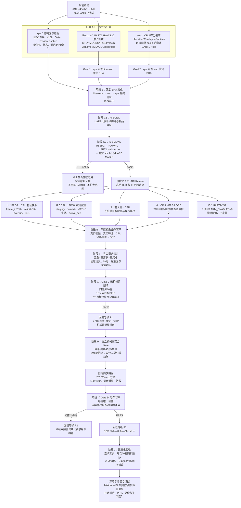
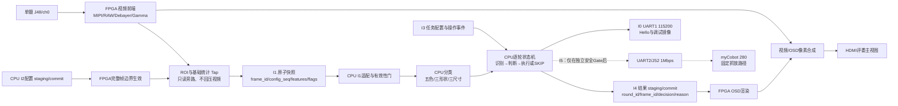

# 单摄决赛系统完整实施路线、框架与三人任务

> 日期：2026-07-18（Asia/Shanghai）
> 文档性质：操作级路线导航，不替代动态状态与正式决策真源
> 当前编写基线：`codex/qzs-final-integration-goals-20260718@6d5e33a2b188abac2fbc5e36dab3155eba45d4f2`
> 正式路线：`competition_project_single_camera/`，单摄 J48/ch0

## 0. 权威边界与读法

本文件回答“完整路线怎么走、每一阶段谁做什么、卡住后去哪里排查”。以下真源优先级始终高于本文件：

1. 用户当前明确指令与官方 0710 比赛细则；
2. [`AGENTS.md`](../../AGENTS.md) 的架构、安全、接口和 Git 红线；
3. [`CURRENT_STATE.md`](../../CURRENT_STATE.md) 的当前 SHA、PASS/FAIL、阻塞和下一 Gate；
4. [`competition_score_maximization_execution_plan_20260712.md`](../../final_project/docs/technical_plans/competition_score_maximization_execution_plan_20260712.md) 的拿分顺序与回退策略；
5. [`TEAM_INTERFACE_FREEZE_AND_FINAL_DAY_OWNERSHIP_20260719.md`](TEAM_INTERFACE_FREEZE_AND_FINAL_DAY_OWNERSHIP_20260719.md) 的三人写入范围；
6. 本文件的操作导航。

计划中的接口和模块不等于已实现、已综合或已上板。任何阶段只能使用本阶段的真实证据声明完成，不得跨 Gate 外推。

### 当前快照

- qzs Goal 0 控制面已在当前个人分支提交为 `6d5e33a`。
- `CURRENT_STATE.md` 仍记录 classifier MSVC 严格入口 `FAIL(C4127)`、I0 UART1 新批次尚未生成、I1-I4 未冻结/未上板、任务二非正方体标定 `BLOCKED`、UART2/J52/myCobot `NO-GO`。
- 当前工作树存在一份未跟踪的 Goal 2 审查记录。该补充记录称固定 WSC 候选 `35b074c385fa34a588f7168307f360c1f38d7152` 已实跑 classifier `54/54`、F1 `213/213`、adapter `33/33`、runtime `648/648`，但因缺少 libaoxun UART1 原子批次、同批 `soc.h`、Hello 源码/ELF，结论仍为 `BLOCKED`。在该记录正式纳入并完成 Goal 1/2 固定 SHA 流程前，不改写 `CURRENT_STATE.md` 的权威结论。

## 1. 完整开发路线总图



## 2. 最终系统框架图



正式闭环中，PC、`pymycobot` 和 myBlockly 只用于开发期调试、标定、日志和录像，不进入识别或控制闭环。

## 3. 阶段任务、负责人、依赖与阻塞

### 阶段 A：三线并行打底

**目标**：在不互相覆盖文件的前提下，准备可审查的 UART1 硬件批次、CPU 离线批次和 qzs 证据控制面。

| 队友 | 具体任务 | 交付物 | 常见阻塞 |
|---|---|---|---|
| libaoxun | 用 Efinity 正式启用 SoC UART1；路由 Type-C UART1 管脚；保持单摄 ch0；原子生成 XML/peri.xml/IP/wrapper/BSP/`soc.h`；冷构建并审查视频回归 | 完整 SHA、Build ID、原子输入 hash、Efinity 版本、Map/Interface/PNR/STA/CDC、warning、bitstream hash、同批 `soc.h` | UART1 仍未生成；生成文件被手改；PNR/时序/CDC失败；视频黑屏；混入旧 UART0/R0 制品 |
| wsc | 最小修复 classifier 严格编译；重跑 classifier/F1/adapter/runtime；保持 `ARM_ENABLED=0`；等待同批 `soc.h` 后实现和构建片上 RAM UART1 Hello | 完整 SHA、真实命令/exit code/计数、编译器身份、Hello源码、ELF hash/大小/入口/LOAD段、同批 `soc.h` 身份 | C4127未真正关闭；通过降 warning/跳执行伪造PASS；缺同批`soc.h`；硬编码UART0地址/IRQ；无Hello ELF |
| qzs | 维护控制板、证据索引、操作卡草案、五行报；固定候选 ref/SHA/允许与排除范围；保留 dirty；准备报告/PPT证据槽位 | 控制板、Review Packet骨架、证据字段、停止条件、范围检查结果 | 队友只给短SHA或口头“最新”；证据缺失；状态文档把目标写成结果；误改冻结接口 |

**进入下一阶段的硬条件**：libaoxun 与 wsc 均提供不可变固定 SHA；硬件批次和 CPU/Hello 批次可通过同批 `soc.h` 唯一绑定。

### 阶段 B：固定 SHA 审查与集成

| 队友 | 具体任务 | 交付物 | 常见阻塞 |
|---|---|---|---|
| libaoxun | 回答 qzs 对原子输入、warning、PNR/STA/CDC、制品身份的 Findings；只修复自己范围 | Goal 1 `APPROVE` 固定 SHA或新的修复 SHA | 原子树被拆分；缺原始日志；旧制品被继承；候选越界改CPU/治理文档 |
| wsc | 回答 qzs 对严格 Host、`SYSTEM_UART_1_*`、ELF身份和ARM禁用的 Findings | Goal 2 `APPROVE` 固定 SHA或新的修复 SHA | Host通过但Hello缺失；消费错误`soc.h`；候选越界改冻结头文件/RTL/myCobot |
| qzs | 先审libaoxun、再审wsc；用完整SHA做差分和merge-tree探测；按事实条目解决文本/语义/证据冲突；最后刷新qzs文档并跑离线总门 | 来源SHA、纳入/排除清单、失效证据清单、集成候选SHA、全部命令与结果 | 任一审查非APPROVE；dirty无法隔离；`CURRENT_STATE.md`被整文件覆盖；冻结接口需要变化但没有完整口令 |

**固定合并顺序**：`libaoxun 固定 SHA → wsc 固定 SHA → qzs 状态/证据刷新`。此阶段不执行 JTAG、串口或机械臂动作。

### 阶段 C：I0-BUILD 与 I0-SMOKE

| 队友 | 具体任务 | 交付物 | 常见阻塞 |
|---|---|---|---|
| libaoxun | 确认匹配 bitstream、USER2、UART1管脚、BSP/`soc.h` 和 APB MAGIC 硬件身份 | 构建摘要、bitstream hash、同批`soc.h`、硬件警告说明 | Map不等于PNR；slack/CDC未关闭；bitstream与审查批次不一致 |
| wsc | 确认Hello ELF只使用同批`SYSTEM_UART_1_*`；入口和LOAD段位于批准的片上RAM范围；APB读取只取同批基址 | ELF hash/布局、Hello/echo语义、只读MAGIC固件证据 | 复用旧UART0 ELF；猜基址/IRQ；RAM布局不匹配；固件输入变化未重建 |
| qzs | 做制品身份预检；取得用户对固定板卡/制品/接线/停止策略的一次批准；按操作卡连续收集USER2→PC→UART1→APB原始证据 | 一次连续I0-SMOKE记录、每层PASS或单点FAIL、剩余NOT VERIFIED | hash/板卡/接线变化；PC越界；无Hello/乱码；MAGIC异常；有人试图回退UART0或继续试探业务MMIO |

**通过只证明**：当前 CPU/ELF/Type-C UART1/APB0 基础链可用；仍不证明 I1-I4、OSD、UART2或机械臂。

### 阶段 D：F1-ABI 与 I1-I4 实现

| 接口 | libaoxun | wsc | qzs | 主要阻塞 |
|---|---|---|---|---|
| I1 特征快照 | 实现帧末原子锁存、多位CDC、valid/ACK/overrun；保持Tap只读不回压 | 双读`frame_id`，仅消费稳定同帧快照并ACK同一帧；异常fail-closed | 审查字段、生命周期、证据和停止条件 | 多位裸跨CDC；快照撕裂；ACK错帧；overrun未置位；地址未冻结 |
| I2 统计配置 | 实现staging、commit、VSYNC边界active与`active_seq` | 只在配置阶段整组提交ROI/背景/阈值；不在帧中途改配置 | 审查config版本与跨轮不变量 | 写一个生效一个；active_seq不一致；配置与快照版本错配 |
| I3 任务与事件 | 不擅自新增宽物理端口；提供批准的按钮/拨码硬件资源 | 实现四任务、颜色、参考尺寸、PLACE/REMOVE/ABANDON/RESET的锁存与ACK | 审查现场可操作性、去抖、事件序号与比赛流程 | 外部输入来源未定义；沿用双摄字段；目标在本轮中途抖动改变 |
| I4 结果/OSD | 实现结果寄存器、CDC快照与字符像素渲染 | 产生round/frame/config、识别、判断、reason、arm状态并原子提交 | 冻结可解释展示要求，核对OSD/UART/录像一致 | 结构体直接memcpy；字段撕裂；清屏语义未决；只显示裸寄存器值 |
| I5 安全边界 | 不连接UART2/J52信号路径 | `ARM_ENABLED=0`，不初始化真实transport，不发帧 | 接线照片、操作卡和用户确认保持物理断开 | 因I0 PASS误以为UART2可用；未授权接线/查询/动作 |

若需要修改冻结接口或 `interface_freeze_manifest.json`，必须停止并取得完整口令：`确认接口文件修改，已经和wsc、libaoxun、qzs沟通。`

### 阶段 E-F：板级业务闭环与真实视觉标定

| 队友 | 具体任务 | 交付物 | 常见阻塞 |
|---|---|---|---|
| libaoxun | 验证J48/ch0真实视频；完成RAW/Debayer/Gamma/ROI/统计；给出特征快照与HDMI视频证据；固定相机/补光/摆放区 | 同批bitstream、视频截图/录像索引、原始特征日志、资源/时序/CDC结果 | 黑屏/花屏；ch0标志错误；ROI无效；计数溢出；为了增强恢复双摄 |
| wsc | 基于真实I1快照完成五色/正方体/尺寸分类和四任务判断；异常帧不产生稳定业务结论；维护参数版本 | 混淆矩阵、阈值版本、真实回放结果、reason分布 | 白/黑与背景混淆；尺寸不可用；圆柱/锥体未标定；将异常输入误写为SKIP |
| qzs | 设计标定批次、样本命名、证据索引；核对识别/判断/OSD/日志对应同一round/frame/config | 标定计划、验收阈值、证据矩阵、阻塞裁决 | 数据量不足；环境光变化；日志与录像不能对齐；任务二被错误宣称完成 |

标定覆盖：五色 × 三形状 × 三尺寸，并包含偏亮/偏暗、轻微偏移、多朝向、连续多帧稳定性和手部移入/移出过渡帧。任务二在圆柱/锥体真实标定与混淆矩阵达标前保持 `BLOCKED`。

### 阶段 G：Gate C 无机械臂20轮闭环

| 队友 | 具体任务 | 交付物 | 常见阻塞 |
|---|---|---|---|
| libaoxun | 保证20轮期间视频、快照、OSD渲染稳定，无新增时序/CDC/黑屏回归 | 连续运行的视频与硬件日志 | 长时间运行后overrun、OSD撕裂、视频丢失 |
| wsc | 四任务20轮随机输入；每轮识别、判断、reason只锁存一次；13个非目标明确SKIP；7个目标交给mock且不发真实动作 | 20轮事务日志、无重复/卡死/无限等待证据 | 连续帧重复触发；目标配置跨轮串扰；UNKNOWN无超时；结果未保持到移除确认 |
| qzs | 组织随机顺序、计时、人工操作和录像；核对OSD/UART/日志；裁定F1是否成立 | Gate C Review Packet、整场计时与回退等级 | 未达到20轮；状态互相矛盾；把mock动作写成机械臂PASS |

Gate C PASS 后可成立回退等级 F1：识别、判断、OSD和SKIP闭环，机械臂仍禁用。

### 阶段 H-I：独立机械臂安全门与 Gate D

| 队友 | 具体任务 | 交付物 | 常见阻塞 |
|---|---|---|---|
| libaoxun | 仅在独立Review Packet批准后提供UART2/J52物理通道证据；不承担协议/轨迹 | 电平、波形、线序和硬件通道证据 | 电平/线序/共地不明；1Mbps波形不合格；把UART1证据外推到UART2 |
| wsc | 在板上CPU实现myCobot协议、single-flight、超时、有限重试、fault停线和唯一动作请求；点位参数独立管理 | 固件/Host测试、UART2只读证据、状态机与错误码 | PC脚本混入正式闭环；重复发包；无ACK仍重试；异常后盲复位 |
| qzs | 组织急停/断电、固定底座、接线确认、只读→极小幅→固定抓点→180°目标点的逐级Gate；保存录像/点位/计时 | 安全Review Packet、点位表、20次目标动作零跌落证据 | 未获用户动作确认；机械臂非预期运动；提前释放/跌落；速度过高；场地或起点变化导致旧点位失效 |

固定动作顺序：高位接近 → 低速下探 → 夹持确认 → 抬升 → 旋转 → 最大臂展目标点 → 接近台面减速 → 稳定释放 → 抬升回安全位。

### 阶段 J：比赛化验收、部署与材料冻结

| 队友 | 具体任务 | 交付物 | 常见阻塞 |
|---|---|---|---|
| libaoxun | 冻结生产工程、bitstream、视频回退版和硬件接线图 | 工程SHA、bitstream hash、构建摘要、回退制品身份 | 最后改硬件输入导致全部证据失效；部署机环境不一致 |
| wsc | 冻结ELF、参数、按键表、错误码、任务配置和软复位/放弃流程 | ELF hash、参数版本、操作说明和回退固件 | 临场改参数未留版本；任务切换/超时/fault流程未演练 |
| qzs | 连续组织三次20轮随机整场，目标≤8分30秒；冻结证据、部署清单、报告/PPT与签字索引 | 三次整场记录、最终`CURRENT_STATE`/handoff、报告/PPT材料索引 | OSD/UART/录像不一致；单次通过冒充稳定；材料使用旧hash；未验证项被包装为完成 |

## 4. 依赖、环境与时间估计

以下只用于排程，不是跳过 Gate 的理由：

| 阶段 | 依赖 | 粗略时间 | 主要环境 | 空间要求 |
|---|---|---:|---|---|
| A-B 三线打底与审查 | 当前冻结基线 | 0.5–1天 | Git、PowerShell、VS2022、Efinity构建机 | qzs文档很小；Efinity工作区/outflow以构建机实时空间为准且不入Git |
| C I0-BUILD/SMOKE | 两个固定SHA、匹配制品、用户批准 | 1–4小时，失败另计 | Efinity 2025.2、JTAG/USER2、Type-C UART1 | 原始日志和制品放受控本地证据目录 |
| D I1-I4 | I0-SMOKE PASS、F1-ABI批准 | 1–2天或按接口拆分 | RTL仿真、Efinity、VS2022、板卡 | 每个原子批次独立保存日志/hash，不复用旧outflow |
| E-F 板级与标定 | I1-I4逐级PASS、固定治具 | 1–2天 | 单摄、固定补光、采集/录像工具 | 图像/录像留本地或外部证据区，Git只存脱敏索引 |
| G Gate C | 板级F1链路稳定 | 0.5天 | 板卡、OSD、mock arm、计时/录像 | 20轮日志与录像索引 |
| H-I 机械臂 | 独立安全批准 | 1天以上，按安全结果 | 逻辑分析仪/串口、myCobot、急停/断电 | 点位与录像本地留证，Git存参数和摘要 |
| J 三次整场 | Gate D PASS | 0.5–1天 | 完整比赛场地 | 三次原始录像、日志和最终部署包 |

## 5. 主要风险与回退

| 风险 | 概率 | 影响 | 缓解/回退 |
|---|---|---|---|
| Hard SoC 原子批次混入旧UART0/R0 | 中 | I0证据全部无效 | 核对同批XML/peri/SDC/IP/top/BSP/soc.h/bitstream/ELF；不匹配即STOP |
| I1-I4同时叠加导致无法定位 | 高 | PNR、CDC、黑屏或业务故障耦合 | 按MAGIC→I1→I2→I3→固定I4→真实结果逐级集成，每级保留checkpoint |
| 任务二非正方体识别不足 | 高 | 任务二完整能力阻塞 | 先保证正方体与非正方体可靠区分；不足时保持WAIT/人工放弃，不伪造SKIP |
| OSD/日志/录像不能追溯同一轮 | 中 | 评委证据不可信 | 强制round_id/frame_id/config_revision；结果整体提交并保持到移除确认 |
| 连续视频帧重复触发机械臂 | 中 | 设备/比赛安全风险 | single-flight、每轮唯一请求、ACK/timeout/fault；异常退回mock |
| 最后时刻修改硬件或参数 | 高 | 旧制品与演练证据失效 | 冻结输入hash和参数版本；仅在明确收益且可完整重测时变更 |

回退等级：

- `F0`：无可烧录或无稳定视频；Host结果不能作为比赛能力。
- `F1`：真实识别 + 判断 + OSD + 正确SKIP；机械臂禁用。
- `F2`：机械臂可运行但稳定性不足；继续受控测试，比赛是否启用需单独安全裁决。
- `F3`：Gate D与三次整场通过的完整闭环。

## 6. 三个故障排查与解决方案简述

### 故障一：UART1 无 Hello、乱码或无回显

**可能原因**：bitstream/ELF/`soc.h` 混批；Hard SoC仍是UART0；Type-C UART1管脚/波特率错误；USER2或RAM下载失败；PC不在同批合法范围；复位/时钟异常。

**排查顺序**：

1. 先核对仓库SHA、Build ID、原子输入、bitstream/ELF/`soc.h` SHA-256；任一不符立即停止。
2. 检查生成物确有`SYSTEM_UART_1_*`以及RX=`GPIOR_96/B12`、TX=`GPIOR_100/D12`，不得用旧`SYSTEM_UART_0_*`。
3. 只按已批准操作卡核对USER2、RAM下载、PC范围，再核对Type-C枚举和`115200 8N1`。
4. 无Hello或乱码时保存完整console、端口枚举、时间、字节数和制品hash，交回libaoxun/wsc按硬件身份或固件层分别定位。

**解决原则**：只修复当前层；禁止回退UART0、切USER1、写Flash/DDR、猜COM口或进入APB。

### 故障二：APB MAGIC异常、I1无快照或OSD不更新

**可能原因**：基址不是同批`soc.h`；PSEL/PENABLE/PREADY或复位/时钟异常；多位CDC错误；`feature_valid`未发布或ACK错帧；I4结果未按staging/commit整体提交；视频正常但业务接口尚未实现。

**排查顺序**：

1. 先区分层级：MAGIC失败停在I0；MAGIC成功但I1失败才进入I1审查；I1成功但OSD失败再检查I4。
2. MAGIC异常时只读核对同批`soc.h`、RTL、BSP、地址译码和原始总线证据；不得根据`0x00000000`或`0xFFFFFFFF`直接猜根因并盲写。
3. I1检查`frame_id`双读、flags、valid、ACK同帧和overrun；撕裂/溢出/非ch0数据必须丢弃。
4. I4先用批准的固定测试结果验证staging→commit→完整帧锁存，再接真实分类结果；每一级比较资源、时序、CDC和黑屏回归。

**解决原则**：按MAGIC→I1→I4逐层恢复，不同时修改地址、CDC、视频和OSD；回退到上一个可验证checkpoint。

### 故障三：机械臂非预期运动、重复动作、提前释放或跌落

**可能原因**：UART2/J52提前接入；电平/线序/共地不明；连续帧重复触发；ACK/timeout/fault处理不完整；点位、速度、底板或起点变化；夹持/释放高度未重新标定。

**现场处置**：

1. 立即按用户已确认的急停/断电方式停止，保持或恢复UART2/J52信号线断开，保留现场和原始日志。
2. 禁止补发查询/动作帧、盲复位、提高速度重试或带电改线。
3. 回到Host/mock复现事务，核对同一轮最多一次请求、single-flight、ACK、超时和fault停线。
4. 重新从电平/共地/线序→未接机械臂TX波形→只读状态→极小幅动作→固定抓点逐级验证；底板、起点或点位版本变化即使旧动作证据失效。

**解决原则**：任何不可解释动作或跌落都退回mock；只有安全Review Packet、用户动作确认和连续目标动作验证重新通过后才恢复Gate D。

## 7. 每阶段统一交付模板

每位队友完成一个阶段时，应一次性提供：

```text
负责人：
远端 ref / 完整40位SHA：
允许纳入范围：
明确排除范围：
Build ID / 参数版本：
实际命令与工具版本：
原始证据位置：
PASS / FAIL / WARN：
本阶段只证明什么：
仍然 NOT VERIFIED 的内容：
失败停止点与回退checkpoint：
下一阶段需要的固定输入：
```

qzs 只在该元组完整、证据同批且文件范围合规时推进下一 Gate。
