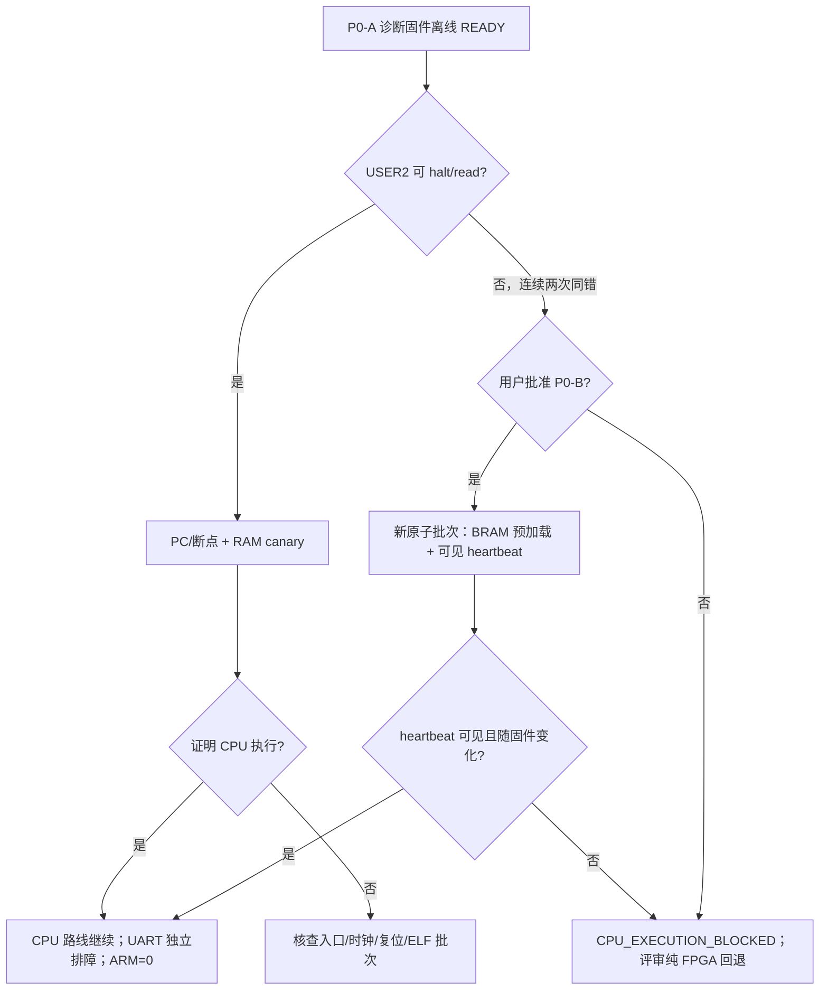

# P0/P1 无 UART CPU 生命证明与 F1 并行实施方案（已批准执行边界）

> 日期：2026-07-19（Asia/Shanghai）
>
> 状态：`APPROVED: P0-A + P1 HOST / P0-B PACKET PREPARATION ONLY / NO BOARD ACTION AUTHORIZED`
>
> 正式路线：单摄 J48/ch0；板上 CPU；`ARM_ENABLED=0`
>
> 适用分支：`codex/qzs-wsc-libaoxun-integration-20260718@a222ea64653a2232945342faacfb53a06ce50e42`

## 0. 2026-07-19 用户裁定

用户已要求按本方案完成分工前准备并直接进入 qzs/wsc 并行开工，因此本轮裁定为：

1. 批准立即开展 **P0-A 与 P1 Host 前置开发**；
2. 批准 qzs **仅准备** P0-B Review Packet；
3. 暂不批准 P0-B 构建、bitstream 生成或上板；
4. 暂不批准纯 FPGA 分类迁移；仅当 P0-A、经另行批准的 P0-B 都不能证明 CPU 执行时，再单独评审；
5. 本裁定不包含冻结接口修改口令，不授权 UART2/J52、机械臂查询或动作。
6. 用户后续明确收缩本轮派工：**只启动 qzs 与 wsc**。libaoxun 不接收本轮新提示词、不需要为本包拉取或审阅，继续其既有 UART1/USER2 攻坚；待其当前方向形成安全 checkpoint 后再另行协调。

直接开工入口与两份提示词见
[`P0_P1_PARALLEL_KICKOFF_INDEX_20260719.md`](P0_P1_PARALLEL_KICKOFF_INDEX_20260719.md)。

## 1. 建议结论

建议立即并行推进 P0 与 P1，但必须把“离线准备完成”“CPU 板上生命证明”和“F1 板级闭环”分成三个不同 Gate：

1. **libaoxun 继续以 UART1/USER2 执行链为主线**，不被 P1 日常开发打断。
2. **wsc 主责 P0 诊断固件和 P1 CPU/Host 参考实现**。
3. **qzs 主责 P0/P1 契约、证据、数据采集规范、Review Packet 和最终集成**。
4. P0/P1 中涉及 `top.v`、RTL testbench、Hard SoC IP、XML/peri.xml/SDC、BSP 或 bitstream 的最后一跳仍由 libaoxun 实施；wsc、qzs 不越权修改。
5. 当前不恢复 UART0，不进入纯 FPGA 分类，不接 UART2/J52，不做机械臂查询或动作。

这条路线的价值是：即使 UART1 始终无输出，仍可判断 CPU 是否取指、卡在哪一步；与此同时，F1 的算法、协议、标定、OSD 语义和 20 轮事务不因 Hello 阻塞而停工。

## 2. 当前事实基线

- UART1 Hard SoC 原子批次已经离线构建，但 `USER2`、PC、UART1 Hello/echo、APB MAGIC 均为 `NOT_VERIFIED`。
- 当前 Hello 不能作为唯一生命判据；UART 发送等待必须改为有界诊断，防止 CPU 已执行却永久停在 TX 状态轮询中。
- 单摄 feature tap 模块和 RTL testbench 已存在，但 `top.v` 中 `i_capture_enable=1'b0`，输出接到 `_unused`，真实 I1 尚未连接。
- CPU Host 基线已经有 classifier、F1、feature adapter、runtime/G2 测试，但 Host PASS 不证明 RISC-V、MMIO、APB、OSD 或板级闭环。
- 尺寸仍不可用；任务三、四不得产生执行授权。任务二的非正方体能力仍需实拍标定和混淆矩阵。
- OSD 当前只有设计/骨架资料，不能写成已实现。
- 当前 Hard SoC 应用预加载为 `APP_OVERWRITE=0`，片上 RAM 为同批 linker 所示的 16 KiB 区域。任何预加载设置变化都会形成新的原子硬件批次，使旧 bitstream 板级证据失效。

## 3. 三人总分工

| 人员 | 主责 | 本方案内允许交付 | 明确不做 |
|---|---|---|---|
| libaoxun | 继续打通 UART1/USER2；保持 Hard SoC 原子硬件真源 | 修复执行 runner；执行批准后的 P0-B 预加载/heartbeat 小批次；在 P1 Host 契约通过后接收成批 RTL 实装任务 | CPU 业务代码、qzs 治理文档、机械臂；未经 Packet 同时叠加多项硬件改动 |
| wsc | P0 诊断固件；P1 CPU/Host 参考实现与算法 | canary/阶段码、有界 UART probe、ELF/map/disassembly；fake transport、快照/ACK、事件、结果提交、分类/标定、20 轮回放 | RTL/XML/SDC/IP、冻结头文件无口令修改、状态治理文档、机械臂 |
| qzs | 方案、接口不变量、数据与证据、审查和最终集成 | Review Packet、测试矩阵、采集/标定规范、OSD/输入语义、证据 runner、范围/hash/freshness、结论转录 | CPU/RTL/Hard SoC 实现；无口令修改冻结接口；机械臂动作 |
| 用户 | 路线与硬件窗口决策 | 批准或拒绝 P0-B；若需改冻结接口，发送完整口令；决定 P0 失败后的最终回退 | 本方案不默认代替用户授权任何板上操作 |

### 3.1 资源占用原则

- libaoxun 的主要时间继续给 UART1/USER2；P0-B 未获批准前，不要求其新建 bitstream。
- wsc、qzs 先把可离线完成的输入全部准备好，再以 Review Packet 一次性交给 libaoxun，避免零散问答和反复改 `top.v`。
- 预计 P0/P1 前置开发工作量由 wsc、qzs 承担约 80% 以上；libaoxun 只承担无法绕开的硬件真源与构建工作。

## 4. P0：无 UART 的 CPU 生命证明

### P0 的目标

回答两个不同问题：

1. QCRV32 是否从当前 16 KiB 片上 RAM 入口取指并执行 C 程序？
2. 如果执行了，是卡在启动、UART 初始化、TX FIFO 等待，还是外设/APB 路径？

P0 不要求 UART 必须出字，也不要求实现完整 F1。

### P0-A：不改变 bitstream 的诊断固件和 USER2 观测准备

#### P0-A1 阶段 canary

**主责：wsc；审查/证据：qzs；配合：libaoxun 只继续修 USER2 runner。**

wsc 在其允许的 `cpu_bringup/uart1_hello_onchip/**` 内新增独立诊断程序，不覆盖 libaoxun 的 `embedded_sw/uart1_hello_onchip/**` 真源。程序维护一个 `volatile` canary 结构：

```text
magic       = 0x4350554C   // "CPUL"
schema      = 1
build_id    = 固件输入 hash 的短标识
write_count = 本次运行内每次更新阶段时递增
stage       = 当前阶段码
last_pc_tag = 静态阶段标签，不伪装真实 PC
uart_status = 最后一次 UART status 原始值
error       = 有界等待的错误码
heartbeat   = 主循环单调递增
checksum    = 其余字段校验
```

阶段码至少覆盖：

| 阶段码 | 含义 |
|---|---|
| `C001` | 进入 `main` |
| `C002` | `.data/.bss` 后的 C 环境可用 |
| `C003` | UART 初始化前 |
| `C004` | UART 配置寄存器写入后 |
| `C005` | 第一次 TX 尝试前 |
| `E101` | TX ready 有界等待超时 |
| `C0FF` | 进入无外设依赖 heartbeat 循环 |

实现约束：

- canary 用普通链接符号，由 map 文件给出真实地址；禁止凭旧批次硬编码绝对地址。
- 固件生成 ELF、map、readelf、objdump/disassembly 和输入 hash；qzs verifier 检查 canary 符号位于同批 16 KiB RAM 内，且不会覆盖栈、代码和数据。
- UART 所有轮询必须有界；超时后写 `E101` 并继续 heartbeat，不能在首字节前永久自旋。
- 诊断固件默认不写未知 APB 地址，不接机械臂，不触发复位。

**离线验收 `P0-A-READY`：**

- 严格编译通过；ELF 入口、LOAD 段、未定义符号、map 和尺寸检查通过。
- disassembly 证明 canary 的阶段写入发生在 UART 等待之前。
- Host/mock 负例证明 TX 永不 ready 时会进入 `E101`，而不是死循环。
- qzs 生成固定 SHA、命令、预期 canary 地址和停止条件操作卡。

#### P0-A2 PC/断点与 RAM canary 读取（未来协调，不在本轮派工）

**未来执行主责：libaoxun（USER2 runner）；固件：wsc；核验：qzs。当前不向 libaoxun 派发或请求审阅。**

在 USER2 可选择后，按同一次非动作批准窗口执行：

1. halt 后确认 PC 位于同批 RAM/程序合法范围；
2. 在入口、`main`、UART 前和 `E101` 设置断点或单步；
3. 读取 map 指定的 canary 地址两次，确认 `magic/schema/build_id/checksum`；
4. resume 一段受控时间后再次 halt，确认 `stage` 或 `heartbeat` 单调变化；
5. 保存 halt reason、PC、原始内存转储和命令日志。

**板级 PASS 判据：**命中当前 ELF 的入口/`main`，或读取到匹配 build_id 且阶段/heartbeat 有受控变化。满足任一项即可证明 CPU 执行；UART 仍可单独保持 FAIL/NOT_VERIFIED。

**不证明：**UART1 引脚/Type-C 通路、APB0、F1 或 OSD。

### P0-B：BRAM 预加载 + 可见 APB heartbeat（仅在 P0-A 被 USER2 长期阻塞时）

**触发条件：**P0-A 已 `READY`，但 USER2 选择链在两次修正后仍无法可靠 halt/read；用户批准建立新原子批次。

**前置分工：**

- wsc：提供不依赖 UART/JTAG 的最小 heartbeat 固件、ELF/hex、尺寸和访问序列。
- qzs：提供 P0-B Review Packet、原子输入清单、可见输出选择、板上操作卡、回滚点和证据模板。
- libaoxun：在 Efinity 中正式设置应用预加载并实现最小 heartbeat 硬件观察点，重跑完整原子构建。

#### 推荐最小实现

```text
上电/配置完成
→ 片上 RAM 预加载诊断固件
→ CPU 周期写 APB heartbeat/canary
→ FPGA APB 从机锁存 heartbeat
→ 映射到已经确认且不影响视频的现有用户 LED，或最小固定 OSD 色块
```

约束：

- 不新增顶层物理端口；LED/OSD 资源由 libaoxun依据当前顶层和管脚事实选择。
- heartbeat 使用新建并受审的最小寄存器语义，不从历史双摄 `register_map.md` 猜偏移。
- 若变更冻结接口，必须先获得完整口令：`确认接口文件修改，已经和wsc、libaoxun、qzs沟通。`
- `APP_OVERWRITE`、预加载路径、RTL/APB、IP settings、wrapper/BSP、bitstream 与固件作为一个原子批次；旧 UART1 bitstream/ELF 不继承 PASS。
- 观察序列必须能区分“FPGA 固定灯”与“CPU 在运行”，例如 heartbeat 单调计数分频产生稳定翻转，且复位后重新起始。

**板级 PASS 判据：**冷启动后，可见输出按设计周期持续变化；改变固件 heartbeat 周期后，新批次的输出周期随固件变化，并且输入/bitstream/固件 hash 匹配。若 USER2 同时恢复，再读回 APB 值作为第二证据。

### P0 决策树与停止条件



停止规则：同一失败现象只允许两轮有新假设/新证据的修正；第三轮前必须重新 Review。P0-B 新批次也失败，且 bitstream 身份、时钟、复位、预加载内容和可见输出均已独立核查后，才把 CPU 标为 `CPU_EXECUTION_BLOCKED`。不能仅凭 UART 0 字节下此结论。

## 5. P1：不依赖 Hello 的 F1 前置开发

### P1 的目标

在不依赖真实 MMIO、UART 或板上 CPU 的条件下，把将来 F1 板级接线前可完成的语义、参考模型、测试向量、标定和整场事务全部做完。P1 的离线完成状态命名为 `P1-HOST-READY`，不得写成 `F1-board PASS`。

### P1-0 语义冻结副本与测试矩阵

**主责：qzs；CPU 复核：wsc；硬件复核留待未来 H1 Packet，本轮不向 libaoxun 派发或请求审阅。**

qzs 从现有冻结文档提取只读实施清单，不修改冻结字段：

- I1：`frame_id/config_seq`、颜色/前景面积、ROI 像素数、亮度和 bbox、`source_flags`。
- I1 原子性：整帧锁存、读前后 frame_id 一致、同帧 ACK、overrun fail-closed。
- I2：staging → commit → frame-boundary active。
- I3：目标配置和操作事件分离；`event_seq + ACK`；重复/乱序/抖动不重复消费。
- I4：staging → commit/round_id → active；显示识别、判断、执行/不执行及理由；`arm_enabled=0`。

交付物：一张生产者/消费者/单位/位宽/有效条件/复位/异常/测试向量总表，以及一张“不允许从 C struct 推导 APB 地址”的待定 ABI 表。

### P1-1 特征 tap 黄金模型与向量

**主责：wsc；数据规范/证据：qzs；RTL 最终消费：libaoxun。**

wsc 在 `cpu/tests/**` 内建立与 feature tap 语义一致的 Host 黄金模型；qzs 在允许的 `competition_project_single_camera/tools/**` 或文档目录维护向量格式和证据。最低向量覆盖：

- 两像素/拍的 RGB 字节序；帧、行和 `de` 边界；ROI 包含端点。
- 红/蓝/黄 mask、前景阈值、白/黑亮度统计。
- 无前景 bbox=0；一像素 bbox；跨行 bbox；21/31 位边界与溢出。
- `raw_diag_en`、不稳定帧、非法 ROI、counter overflow、snapshot overrun。
- `SOURCE_CH0=1`，保留位为 0。

交付物为小型可审计 CSV/JSON/头文件向量及期望快照，不提交大体积原始视频。libaoxun 后续只需让现有 `feature_stats_tap_tb.v` 消费同一组向量，并接通 `top.v`。

### P1-2 snapshot/ACK/CDC Host 合同

**主责：wsc；不变量与 Gate：qzs。**

wsc 扩展 fake transport/adapter/runtime 测试，至少覆盖：

1. 稳定单槽快照成功读取与同帧 ACK；
2. 读前后 frame_id 撕裂，整帧拒绝且不 ACK；
3. config_seq 不匹配，保持 WAIT；
4. overrun/overflow/diag/非 ch0，fail-closed；
5. 结果锁存后的 idle-drain 只 release，不二次分类；
6. ACK 写失败、重复 ACK、错 frame_id ACK；
7. 16 位 frame_id/seq 回绕；
8. 复位和新一轮开始时不复用旧结果。

qzs 给每个不变量编号，建立 Host → RTL TB → 板级三层证据映射。Host 层 PASS 只允许写 `P1-I1-HOST-READY`。

### P1-3 固定结果 OSD 前置开发

**CPU 结果 pack/reference：wsc；显示语义/版式/验收：qzs；RTL：后续 libaoxun。**

先不做字体美化，固定最小字段：

```text
ROUND / FRAME / CONFIG
COLOR / SHAPE / SIZE(or N/A)
TARGET or NON_TARGET
EXECUTE_ARM_DISABLED or SKIP or WAIT
REASON
INPUT_FLAGS / ARM=0
```

wsc 实现抽象 32 位 word 的 staging/commit 参考 packer 和 round_id 去旧结果测试，但不猜 APB 偏移。qzs 定义每种状态的文字/颜色/保持/清屏规则，并生成固定结果测试表。实际寄存器布局、CDC 和像素渲染在 P1 硬件 Packet 中一次冻结。

### P1-4 拨码/按键目标输入前置开发

**事务模型：wsc；操作表/异常处理：qzs；消抖/RTL：后续 libaoxun。**

建议延续现有主方案的少量拨码 + 按键设计，但先只冻结语义：

- 持久配置：`task`、`target_color`、`reference_size_cm_x10`。
- 瞬时事件：`APPLY/PLACE/REMOVE/ABANDON/RESET`。
- 每个事件带 `event_seq`；CPU 对成功消费的序号 ACK。
- 按键抖动、长按、重复序号、乱序和复位均不得触发重复轮次。

wsc 用 fake input transport 完成状态机与负例；qzs 输出现场一页式操作卡和 20 轮输入脚本。物理按键编号、极性、消抖周期和 APB 地址在 libaoxun提供真实管脚/RTL事实后再定。

### P1-5 真实图像采样、任务二混淆矩阵与尺寸标定

**采集流程/数据质量：qzs；阈值/分类/矩阵：wsc；硬件原始特征导出：后续 libaoxun。**

qzs 固定相机高度、角度、焦距、补光、背景和摆放区域，定义每条样本记录：

```text
sample_id, object_id, color, shape, nominal_size_cm_x10,
lighting_id, position_id, frame_id, config_seq,
red/blue/yellow/foreground/roi/sum_luma/bbox_w/bbox_h/source_flags,
expected_label, observed_label, decision, reason, artifact_hash
```

建议最低数据集：5 色 × 3 形状 × 3 尺寸 × 3 次重复 = 135 个稳定样本，另加空场、偏位、遮挡和不稳定负例。时间不足时，先完成比赛高频的 5 色正方体，再补圆柱/锥体区分；不得用较小数据集宣称任务二完整。

wsc 输出：

- 颜色、形状、尺寸的逐类 precision/recall 和混淆矩阵；
- 任务二“正方体 vs 非正方体”单独矩阵；
- 2/2.5/3 cm 像素尺寸分布、阈值版本和不可判定区间；
- 参数越界/低置信度时保持 WAIT/SIZE_UNAVAILABLE 的 fail-closed 策略。

在真实 feature tap 尚未上板时，可先用 PC 从固定单摄画面产生开发期参考特征；必须标注 `HOST CALIBRATION PROVISIONAL`。只有同批 FPGA 原始快照重放后，才可升级参数证据等级。

### P1-6 20 轮无机械臂整场回放

**主责：wsc；场景/计时/证据：qzs。**

用 fake snapshot、fake input 和固定 `ARM_ENABLED=0` 跑四任务共 20 轮：

- 每轮只识别/判断一次；目标轮输出 `EXECUTE_ARM_DISABLED`，非目标轮输出明确 `SKIP + reason`。
- 无二次结果、无重复事件、无无限等待；支持 ABANDON、超时和 RESET 恢复。
- 结果保持到 REMOVE/下一轮确认；旧 round_id 不覆盖新轮。
- 生成逐轮输入、快照、结果、ACK、耗时和 hash 的证据 bundle。

`P1-HOST-READY` 的最低判据：全部 Host runner 严格 warning-as-error 通过；协议负例通过；20 轮 replay 完成；混淆矩阵和尺寸状态如实标注；OSD/输入语义表完整。该 Gate 不证明真实图像、APB、CDC 或 OSD 板级运行。

## 6. 给 libaoxun 的两个成批硬件交接窗口

### H0：P0-B 生命证明窗口（条件触发）

仅在 USER2 持续阻塞且用户批准时执行。范围只有：应用预加载、最小 heartbeat APB 从机、现有 LED/固定 OSD 色块观察点、完整原子重建与证据。不得顺手接 I1/I4。

### H1：P1 最小硬件闭环窗口（P1-HOST-READY 后）

qzs 提交一个 Review Packet，wsc 附全部黄金向量和参考 packer，由 libaoxun 分 checkpoint 实施：

1. feature tap 从 `_unused` 接通，但仍为只读旁路，先跑 RTL TB 与 HDMI 回归；
2. 单槽 snapshot + ACK + overrun + CDC；
3. CPU 可读取固定/真实快照；
4. CPU 固定结果 staging/commit 到最小 OSD；
5. 最后才接拨码/按键配置和事件锁存。

每一级都独立比较 Map/PNR/STA/CDC/warning/资源/视频现象；失败立即回退上一 checkpoint。不能把五步作为一个无法定位问题的大 diff。

## 7. 建议的 18 小时并行排程

| 时间槽 | libaoxun（本轮不派工） | wsc（P0/P1 实现） | qzs（P0/P1 治理与数据） | 决策点 |
|---|---|---|---|---|
| T0–T+2h | 继续既有 UART 对话；不拉取本包 | P0-A canary、阶段码、有界 UART probe | P0 观察矩阵、操作卡、verifier 规格 | P0-A 是否可编译/审查 |
| T+2–T+6h | 继续既有 UART 对话；不请求审阅 | 完成 P0-A Host 负例；启动 P1 snapshot/ACK 测试 | P1 不变量表、向量格式、OSD/输入语义 | **6h Gate：P0-A-READY；P0-B Packet 保持 HOLD** |
| T+6–T+12h | 继续既有 UART 对话；不接 P0/P1 新任务 | P1 黄金模型、输入事务、结果 packer | 采集治具/数据表、20轮脚本、证据 bundle 规格 | P0-A 离线证据是否 READY |
| T+12–T+18h | 继续既有 UART 对话；不接 H0 | P1 标定矩阵、20轮 replay | 汇总 P1-HOST-READY Packet；核查范围/hash | **18h Gate：只形成后续决策输入，不触发硬件派工** |

这不是要求连续工作 18 小时，而是按有效工时排序。未到 Gate 不提前叠加下游硬件。

## 8. 依赖与验收总表

| 交付 | 负责人 | 依赖 | 验收 | 允许得出的结论 |
|---|---|---|---|---|
| P0-A 固件/证据包 | wsc + qzs | 同批 BSP/linker | ELF/map/disassembly/有界负例 PASS | 可申请 PC/canary 验证 |
| P0-A 板级 PC/canary | libaoxun + qzs | USER2 runner 可用、用户窗口批准 | PC/断点或 canary/heartbeat 变化 | CPU 已执行；UART 可仍失败 |
| P0-B 原子批次 | libaoxun | P0-A READY、用户批准、Packet | 冷启动可见 heartbeat 随固件变化 | CPU 无 JTAG/UART 生命证明 |
| P1 黄金模型/Host 协议 | wsc | 冻结语义 | 严格编译、正负例、20轮 PASS | P1-HOST-READY |
| P1 数据/标定 | qzs + wsc | 固定治具/样本 | 数据 hash、矩阵、阈值版本 | 仅对应数据等级的识别能力 |
| H1 I1/I4 板级链 | libaoxun + wsc + qzs | P0 CPU PASS、P1-HOST-READY、ABI Packet | RTL/构建/CDC/板上原始证据 | F1-board，无机械臂 |

## 9. 风险矩阵

| 风险 | 概率/影响 | 规避与止损 |
|---|---|---|
| USER2 一直不可用，PC/canary 也无法读 | 高/高 | 不把 UART 当唯一证据；P0-A 准备完成后转 P0-B 预加载可见 heartbeat |
| BRAM 预加载改变 IP，导致新批次构建回归 | 中/高 | H0 范围极小；旧批次保留为回滚；完整 Map/PNR/STA/CDC/视频回归 |
| heartbeat 其实由 FPGA 固定逻辑产生，不能证明 CPU | 中/高 | 周期由固件常量控制；改固件得到不同周期；记录固件/bitstream hash |
| wsc/qzs 为赶进度越权修改 RTL/IP | 中/高 | 只交付参考模型、向量、Packet；硬件真源仍归 libaoxun |
| P1 Host 与真实 wire ABI 漂移 | 高/中 | Host 只冻结语义；地址/PSTRB/IRQ/复位待同批硬件事实；三层证据映射 |
| feature tap 接入影响 HDMI 主链 | 中/高 | 只读旁路、不回压；按 tap→snapshot→OSD 分级；每级 HDMI 回归 |
| 小样本标定造成任务二/尺寸虚高 | 高/高 | 逐类矩阵、不可判定区间、135 样本目标；数据不足时保持 BLOCKED/PROVISIONAL |
| 机械臂被“顺手”并入 | 中/高 | 全程 `ARM_ENABLED=0`；UART2/J52 独立 NO-GO；本计划没有任何动作授权 |

## 10. 可复用验证入口

P1 修改后至少重跑：

```powershell
powershell -ExecutionPolicy Bypass -File .\competition_project_single_camera\cpu\tests\run_single_camera_classifier_host.ps1
powershell -ExecutionPolicy Bypass -File .\competition_project_single_camera\cpu\tests\run_single_camera_f1_host.ps1
powershell -ExecutionPolicy Bypass -File .\competition_project_single_camera\cpu\tests\run_single_camera_feature_adapter_host.ps1
```

runtime/G2 使用独立证据目录：

```powershell
powershell -ExecutionPolicy Bypass -File .\competition_project_single_camera\cpu\tests\run_g2_host_evidence.ps1 -RunDir <new-evidence-dir>
```

最终治理检查：

```powershell
powershell -ExecutionPolicy Bypass -File .\tools\offline_presubmit.ps1
git diff --check
git status --short --branch
```

命令结果必须保留 exit code、原始日志、编译器版本、输入 SHA 和未验证项。新计数不能继承旧计数。

## 11. 用户需要裁定的三个点

1. 是否批准按本方案立即开展 **P0-A + P1 Host 前置开发**？这两项不授权板上动作，也不改冻结硬件接口。
2. 是否预授权 qzs **准备** P0-B Review Packet（只准备文档，不构建/不上板），以便 6 小时 Gate 后快速决定？
3. 若 P0-A、P0-B 都无法证明 CPU 执行，是否同意届时另开一次“纯 FPGA、无机械臂”的降级 Review，而不是现在立即把分类和四任务状态机迁入 RTL？

## 12. 推荐裁定

推荐批准第 1、2 项；第 3 项只批准“届时评审”，暂不批准实际迁移。原因是 P0-A/P1 的大部分成果即使最终切纯 FPGA 也能复用为黄金模型、测试向量、标定数据和 OSD/输入语义，而现在立刻纯 FPGA 化会同时违反当前架构边界、扩大 RTL 风险，并浪费尚未完成的 CPU 生命证明机会。
