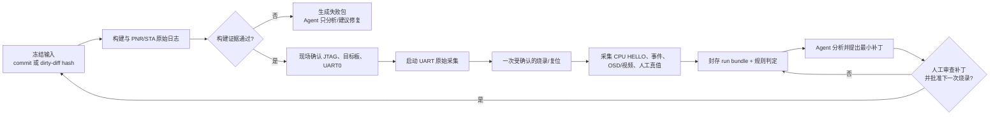

# 板上观测与日志闭环初步方案（赛前 F1/G4 优先）

> 日期：2026-07-15
> 状态：**初步方案，待实施；不表示 UART0、SoC、PNR、bitstream 或板级闭环已验证。**
> 优先级：P0 为可追溯的上板调试证据；P1 为 F1 识别/判断/SKIP 复盘；P2 才是受控的重复烧录。
> 上位约束：官方细则、`AGENTS.md`、`CURRENT_STATE.md`、`competition_score_maximization_execution_plan_20260712.md`。

## 1. 决策与边界

### 1.1 决策

赛前建设“**半自动观测闭环**”，不建设无人值守的“Agent 自改代码并连续烧录/动作”的全自动闭环。

第一阶段的目标是：一次上板实验能留下与源码、构建、烧录、UART、OSD/视频和人工真值一一对应的证据包；Agent 可以据此定位问题、给出最小修复建议和本地回归命令。每次真实烧录仍由现场人员确认，任何机械臂动作均保持在本方案外。

这直接服务于 F1：OSD 是评委主视图，UART 是其开发期调试与录像证据镜像；F1 不要求机械臂动作，且不得让未验证的硬件自动化拖慢单摄、CPU、OSD 与正确 SKIP 的保底闭环。

### 1.2 明确不做

- 不修改 `top.v`、`mem_test.xml`、`.peri.xml`、`constrain.sdc`、IP 或生成产物。
- 不把颜色、形状、尺寸、四任务判断、动作状态机放入 FPGA 日志 RTL；FPGA 仅保留其既定的视频/统计/OSD/物理通道职责。
- 不将 PC 采集器接入比赛正式识别或控制闭环；它仅服务开发期记录、分析和复盘。
- 不自动选择串口、自动接线、自动执行回环、自动控制 myCobot，或因为“烧录成功”自动开始机械臂流程。
- 不把既有 outflow、Host/QEMU 或候选 APB 契约当作当前源码的板级通过证据。

## 2. 现状基线与可复用资产

| 资产 | 已有能力 | 首版用法 | 仍缺失的闭环证据 |
|---|---|---|---|
| `cpu/app/src/main.c` | 人类可读的双路识别、融合动作、APB/commit 故障 UART 输出 | 首版采集器先兼容解析这类旧文本 | UART0 真实路由、波特率、板端输出 |
| `cpu/app/profiles/arm_bringup_main.c` | `CPU HELLO build=<id>`、`RESULT PASS/FAIL` | G4 三次冷复位的最小板端锚点 | 同批次实机三份原始 UART0 日志 |
| `fpga_robot_mcp` | 构建日志、Programmer 只读探测、受门控烧录日志、outflow 收集 | 作为 build/program 的执行与原始日志来源 | UART 流式捕获、run bundle 总控、真实 JTAG 可见性 |
| `verify_mycobot_g4_batch.py` | 检查同批次哈希、PNR/STA 文本断言和三份 `CPU HELLO` 证据 | 作为 G4 的下游校验器 | 不能自行生成/采集/证明硬件证据 |
| OSD/录像 | 主方案要求 OSD 与 UART 一致 | 每轮人工附上截图或短视频索引 | 采集卡、画面真值和自动视觉比对尚未建立 |

当前电脑只读探测到 COM10 为 `USB-SERIAL CH340`，且已被确认用于 myCobot；它**不得**被默认当作开发板 UART0。任何板端采集必须由现场人员显式指定端口，并通过 VID/PID、serial/HWID、描述和接线表核对。

## 3. 总体流程



`I → J → A` 是受控重复，不是自主自修改循环。每轮只允许一个明确假设，例如“验证 APB base/CPU Hello”或“校验红色阈值”，禁止同时修改 FPGA 时序、SoC 地址、分类参数和机械臂策略。

## 4. Run Bundle v1：唯一证据容器

建议所有开发期上板实验写入：

```text
final_project/docs/debug_sessions/evidence/board_runs/<run_id>/
  manifest.json               # 运行身份、输入哈希、端口身份、操作者确认
  preflight.json              # Efinity/JTAG/UART0 只读探测结果
  build.log                   # MCP 或人工 Efinity 原始 stdout/stderr
  map.log / pnr.log / sta.log # 原始工具日志；存在才纳入
  program.log                 # Programmer 原始日志；未烧录则明确 absent
  uart0.raw.log               # 原始字节解码文本，不覆写、不裁剪
  uart0.events.jsonl          # 主机解析出的结构化事件，每行可追溯 raw 行号
  osd/                         # 可选截图或视频索引，不伪造“自动判定”
  labels.csv                  # 人工记录的物体/目标/期望判断/实际结果
  verdict.json                # 自动规则判定、未验证项、Agent 分析入口
```

### 4.1 `run_id` 和 manifest 规则

建议格式：`YYYYMMDD_HHMMSS_<short-head>_<profile>_<purpose>`；例如 `20260716_093000_64260b6_arm_bringup_cpu_hello`。

manifest 至少包含：

- Git `HEAD`、当前分支、是否 dirty、受影响文件的 diff SHA-256；dirty 不是禁止条件，但必须被记录，禁止只写 commit 而遗漏脏改动。
- Efinity 版本、工程 XML、periphery XML、SDC、top、BSP/`soc.h`、ELF、bitstream 和 map/PNR/STA 日志的绝对/仓库相对路径及 SHA-256。
- profile/backend/`ARM_BUILD_ID`、目标板别名、JTAG Device ID、Programmer URL（若存在）。
- UART0 的显式端口、VID/PID、serial/HWID、描述、波特率、采集起止时间；不允许仅保存 `COMx`。
- 本轮唯一假设、预期事件、人工操作者、是否断开机械臂、是否允许烧录、OSD/视频/真值附件状态。

`mycobot-g4-batch-v1` 是 G4 的权威批次校验格式。本方案的 `manifest.json` 必须能导出或引用其中需要的字段，而不是另起不兼容的 G4 标准。

## 5. 日志分层与格式

### 5.1 板上 CPU：低干扰、稳定语义

保留既有人读文本，以免破坏已知调试方式；新增结构化事件时不在 CPU 端直接拼完整 JSON。建议使用固定 ASCII 记录，由 PC 采集器转换为 JSONL：

```text
@E,1,BOOT,build=<ARM_BUILD_ID>,profile=arm_bringup,backend=disabled
@E,2,FRAME,cam=0,frame=42,color=R,shape=C,size_mm=25,fg_area=1234
@E,3,DECISION,round=3,action=SKIP,reason=COLOR_MISMATCH,target=0
@E,4,FAULT,code=ERR_COMMIT_TIMEOUT,where=cam1_commit
@E,5,RUN_END,result=PASS
```

规则：

- `@E`、schema 版本和单调 `event_seq` 是必填；当前未验证板端毫秒时基，首版不伪造 `board_time_ms`。主机采集器另加 `host_time_utc` 与 raw 行号。
- `BOOT` 必须包含 build ID；与现有 `CPU HELLO build=<id>` 共存，直到 G4 实机验证完成后再考虑统一。
- `FRAME` 仅在稳定结果变化、故障、显式采样点或人工单轮确认时输出；默认不得逐像素或无节制逐帧刷 UART。实际节流阈值须根据已验证 UART0 速率和主循环时延测得后冻结。
- `DECISION` 只由 CPU 的任务/轮次语义层产生，至少含 action、reason、is_target/target、round；FPGA 不解释这些字段。
- `FAULT`、`RUN_END` 永不受普通采样节流抑制。日志开关默认关闭或最低级，比赛固件的 OSD 语义不得依赖 UART 是否连接。

### 5.2 PC 采集器：原始优先、可解析但不篡改

计划新增开发期工具 `final_project/tools/capture_board_uart.py`，首版职责仅为：

1. 接收显式 `--port`、`--baudrate`、`--expected-hwid`/`--expected-serial` 和 `--run-dir`；身份不匹配即退出。
2. 在烧录/人工复位前开始记录，原样保存 `uart0.raw.log`；换行、乱码和未知行均保留。
3. 解析既有 `CPU HELLO`/`RESULT`/`[FATAL]` 与新增 `@E`，输出带 raw 行号的 `uart0.events.jsonl`。
4. 到达预期事件、超时或人工停止时生成摘要，但绝不发送串口数据、复位开发板、控制机械臂或替用户选择端口。

PC 时间仅是采集证据时间；没有经审核的板端时钟前，不能用它证明 FPGA/CPU 的精确实时性能。

### 5.3 画面与人工真值

首版不依赖采集卡自动判图。`labels.csv` 由现场人员每轮填写：任务、目标、物体真实颜色/形状/尺寸、期望判定、实际 OSD、实际 UART、是否允许/执行动作、异常说明。OSD 截图或短视频只作为该行的附件索引。

这样可先把“没有真值无法判断识别误差”的问题消除；未来有稳定 HDMI 采集卡后，再增加画面 OCR/截图一致性检查，但不能以截图自动分析替代人工安全判断。

## 6. 自动判定边界

| 检查 | 首版自动判定 | 必须人工复核 |
|---|---|---|
| 输入一致性 | 路径存在、SHA-256、build ID、dirty diff、日志归属 | GUI 配置是否真正对应当前工程 |
| 构建 | 返回码、map/PNR/STA 关键断言、warning 清单存在 | warning 的工程含义、时序/CDC 是否可接受 |
| Programmer | JTAG 可见、有效 Device ID、`finished` 标记、原始日志保存 | 目标板、物理接线、烧录许可 |
| UART0 | 端口身份匹配、3 次 `CPU HELLO` 同 build ID、`FATAL`/缺事件 | 电平、波特率、串口线路和现场重启是否真实可靠 |
| F1 轮次 | 标签与 CPU/OSD/UART 的字段一致性、重复 event/action | 物体真值、画面可读性、评委口径与最终得分 |
| 修复闭环 | 生成最小差异建议、列出必须回归 | 合并代码、再次烧录、任何硬件副作用 |

任何 `unknown`、端口身份变化、哈希不一致、日志缺失或结构化解析错误都应为 `WARN/FAIL`，不得被“烧录返回 0”覆盖。

## 7. 分阶段实施与验收

### Phase L0：证据包骨架（现在，零硬件副作用）

- 新增 run bundle 目录规范、manifest 生成器和 `preflight.json`。
- 复用 `fpga_robot_mcp` 的 build/program 原始日志；仅调用 dry-run/只读探测。
- 用现有样例/伪日志测试：dirty 输入、混批 hash、缺失日志、错误 build ID 必须失败。

**验收：**不连板也能生成一个完整的失败包；现有 G4 verifier 能接收或引用同一批次字段。

### Phase L1：UART0 捕获与 G4 CPU Hello（G4 前置满足后）

- 实现只读 `capture_board_uart.py`，先解析现有 `CPU HELLO`、`RESULT`、`[FATAL]`，不改固件。
- 现场人员确认开发板 UART0 的端口身份、波特率和接线；采集器先运行，再由人员复位三次。
- 将三份原始日志与同一个 build ID 写入 run bundle，并调用现有 G4 verifier。

**验收：**三次独立复位均捕获相同 build ID，端口身份/构建哈希/PNR/STA 不混批；否则 G4 仍为 FAIL。

### Phase L2：低频结构化事件与 F1 轮次记录

- 在 SoC/UART0 真实路径已验证后，为 CPU 添加可关闭的 `@E` 事件；先完成 Host/RISC-V 编译和日志解析回归，再上板。
- 不接机械臂，先完成单摄真实物体 → CPU → OSD → UART 镜像的 20 轮人工标签测试。
- 每轮只验证一个明确假设；错误首先归类为输入/链路/特征/参数/匹配/OSD/状态机/证据缺失。

**验收：**20 行 `labels.csv`、20 个 OSD/UART 对照记录、无死锁/无重复语义事件，且总时长满足 F1 目标。

### Phase L3：受控重复烧录（F1 稳定后才评估）

前置条件为：当前源码能形成同批次 PNR/STA/ELF/bitstream，JTAG 只读探测通过，UART0 已绑定，回退 bitstream 已封存，且本轮不涉及机械臂、时钟/复位、SDC/XML/IP 或未审查 SoC 改动。

允许的自动化仅是“构建 → 生成待烧录计划 → 人工确认一次烧录 → 捕获 → 分析”。Agent 可提出补丁，但必须经 diff 审查后才能进入下一轮。涉及 `top.v`、SoC、CDC、APB、UART2/J52 或 myCobot 时，回退至 Review Packet 和逐门人工执行。

## 8. 主要风险与抑制

| 风险 | 影响 | 抑制措施 |
|---|---|---|
| UART 输出扰动主循环 | 误将日志开销当作算法/时序问题 | 默认低级或关闭；仅稳定变化/采样点输出；先测量再冻结阈值 |
| 混用旧 bitstream、ELF 或 outflow | 得到不可复现的假通过 | manifest 同时记录输入/制品 SHA-256、build ID、dirty diff；混批 fail closed |
| 误打开 myCobot COM10 | 占用或干扰机械臂链路 | 显式端口+HWID/serial allowlist；开发板 UART0 与 myCobot 端口物理/逻辑隔离 |
| JTAG/目标板错误 | 烧录错误设备或浪费现场时间 | 先只读 JTAG ID，显示目标板/bit hash/回退版本，等待本轮确认 |
| 没有视觉真值 | Agent 对“识别错”作错误归因 | 人工 `labels.csv`、OSD截图/短视频索引；未来再引入采集卡自动比对 |
| 自动修复扩大变更面 | 赛前引入新回归或安全风险 | 每轮单一假设、最小补丁、Host/编译回归、人工批准；关键硬件文件不进入自动循环 |
| 时间不足 | 日志系统反而挤占 F1 | L0/L1 先于 L2；L3 是可选项；任何阻塞立即回归 F1 最小手工证据流程 |

## 9. 首个实施任务卡

在不修改 RTL/工程文件、也不连接机械臂的前提下，下一轮只实施 L0：

1. 新增 manifest/run-bundle 生成与校验脚本，兼容现有 G4 批次字段。
2. 新增 UART 原始日志/旧文本解析的离线单元测试；尚不打开任何 COM 口。
3. 用受控伪日志生成 PASS、混批 FAIL、缺 `CPU HELLO` FAIL、端口身份不匹配 FAIL 四类样例。
4. 由 Codex 审查生成物字段、失败语义与现有 `verify_mycobot_g4_batch.py` 的兼容性后，再讨论 L1 的真实 UART0 采集。

本任务卡完成不代表 G4、PNR、烧录或板级日志闭环通过；它只把即将发生的现场实验变为可审计、可比较的输入。

## 10. 关联真源

- `CURRENT_STATE.md`：当前状态、阻塞和下一门。
- `docs/technical_plans/competition_score_maximization_execution_plan_20260712.md` §6、§21–23：OSD/UART 的现场证据分工、F1 保底与截止线。
- `docs/review_packets/mycobot_g4_evidence_contract_review_20260715.md`：同批次 manifest 与三次 UART0 `CPU HELLO` 约束。
- `tools/mcp/fpga_robot_mcp/src/fpga_robot_mcp/efinity_tools.py`：构建、Programmer 探测、烧录和日志收集能力。
- `cpu/app/src/main.c`、`cpu/app/profiles/arm_bringup_main.c`：现有 UART 文本锚点；真实 UART0 仍需上板证明。
