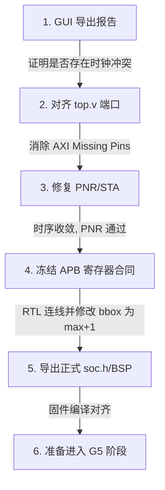

# 学习指南：Codex 评审意见深度拆解与 FPGA-CPU 决策指南

> 生成日期: 2026-07-14 | 对应分支: `codex/mycobot-g0-g3-bringup-20260714@d433bca`
> 预计阅读时间: 15 分钟 | 面向角色: A (FPGA与视频前端) & B (嵌入式CPU与通信控制)

---

## 1. 今日核心导读：为什么 Codex 踩了刹车？

在推进 **G3（纯软件）** 向 **G4（正式 SoC 综合）** 与 **G5（板上无臂模拟）** 演进的过程中，Codex 评审对我们给出了非常关键的“纠偏警示”。

在嵌入式与 FPGA 的“联合异构开发”中，任何轻微的“脑补”都可能导致硬件烧毁或系统彻底死锁。Codex 的介入不是为了阻碍进度，而是作为**“安全防线”**，将设计中的隐患消灭在纯软件阶段。

下面，我们将以**“生动的工程比喻”**结合**“严谨的源码证据”**，为您和 FPGA 队友一一剖析 Codex 提出的 6 大问题，并给出明确的判断建议。

---

## 2. 6 大核心问题“大白话”拆解与决策辅导

### 📌 问题一：PLL / SoC 时钟资源 —— “三岔路口错峰通车”
*   **Codex 意见**：
    当前工程是 `pll_inst1=PLL_BL1`、`LPDDR4=PLL_BL0`、`MIPI=PLL_BL2`，且 `soc_info` 为空，尚无“硬核 SoC 要占 `PLL_BL0`”的实证。
    [mem_test.peri.xml (line 216)](file:///D:/第十届集创赛-雄芯院材料/final_project/fpga/efinity/mem_test.peri.xml#L216)
*   **大白话比喻**：
    这就好比“在没有看交通地图前，就猜测主路被堵死，非要走小路”。我们之前凭感觉认为硬核 SoC 必须跟 LPDDR/视频去抢 `PLL_BL0`，但这只是猜测。
*   **严谨分析**：
    真实约束在 `mem_test.peri.xml` 中清晰定义。在未通过 Efinity GUI 导出一份真正的 **SoC/PLL 资源与时钟树报告** 之前，不能主观判定 PLL 冲突，更不能去胡乱修改物理时钟绑定。
*   **判断决策建议**：
    **【FPGA 队友行动】**：在 Interface Designer 中打开工程，导出时钟树资源报告，核实硬核 SoC 的总线时钟与视频时钟在物理上到底有没有发生碰撞。

---

### 📌 问题二：PNR IO 报错根因 —— “插头与插座孔数对不上”
*   **Codex 意见**：
    PNR 报告中缺少的并非“临时测试引脚”，而是 `axi1_RVALID` 等 AXI 接口引脚。应优先修正 periphery 自动生成代码与 `top.v` 的接口一致性。
    [place.rpt (line 23)](file:///D:/第十届集创赛-雄芯院材料/final_project/docs/evidence/configured_project_mem_test.place.rpt#L23)
*   **大白话比喻**：
    这就像“墙上的插座有 5 个孔，你却拿了个 3 脚插头去插，结果空出来的 2 个引脚被系统判定为悬空报错”。这根本不是我们调试用的临时测试线，而是 AXI 系统主总线缺了引脚绑定！
*   **严谨分析**：
    Titanium FPGA 的 PNR 工具非常严苛，任何顶层导出了但在 Interface Designer 里未分配（或者反过来）的总线信号，都会导致 PNR 报 `outpad` 错误。
*   **判断决策建议**：
    **【FPGA 队友行动】**：以 `.peri.xml` 生成的 periphery 接口为标准，逐个核对 `top.v` 里的端口声明，消灭 `axi1_RVALID` 等 AXI Missing Interface Pins，绝对不能盲目割线！

---

### 📌 问题三：APB 统计与 `top.v` 的“最后一公里”连线 —— “水管铺好，但没接龙头”
*   **Codex 意见**：
    用 sum/count 替代白黑面积的方向是合理的，但偏移地址目前尚未冻结，且 `top.v` 尚未连接 `sum_*` 输出到 APB 寄存器桥。
    [FPGA 确认清单 (line 19)](file:///D:/第十届集创赛-雄芯院材料/final_project/cpu/FPGA_CONFIRMATION_NEEDED.txt#L19)
*   **大白话比喻**：
    这就像是“自来水管道（统计模块）已经埋进了地里，水龙头（CPU 软件）也装好了，但中间的那根联通水管（RTL 连线）还没接上，所以 CPU 拧开水龙头什么水都接不到”。
*   **严谨分析**：
    CPU 目前在软件中通过 APB 接口读取累加数据，但在 RTL 顶层 `top.v` 逻辑中，特征提取模块生成的 `sum_r/g/b/y` 和 `roi_pixel_count` 信号并没有连到 `axi_reg_file`（APB 寄存器从机）。
*   **判断决策建议**：
    **【双人共同决策】**：先在 CPU 侧冻结 APB 寄存器地图（即确定 16-bit 还是 32-bit、溢出标志位等），然后由 **【FPGA 队友】** 在 `top.v` 中将累加结果连到 APB 寄存器中。

---

### 📌 问题四：调试阶段门禁的精确位置 —— “演习不能提早上战场”
*   **Codex 意见**：
    接线及物理调试的阶段号必须更正：UART2 无臂物理回环验证在 **G7 阶段**，真实机械臂只读监听在 **G8 阶段**，绝非早期的 G5/G6。
*   **大白话比喻**：
    这就像“新兵训练，演习还没结束就直接发实弹上战场，容易发生走火意外”。
*   **严谨分析**：
    在 G5 阶段，机械臂必须物理断开，保持悬空。这是为了防范 CPU 固件或 FPGA 端口因为配置错误，瞬间发出不可控的波特率或电平，损坏脆弱的机械臂控制板。
*   **判断决策建议**：
    **【双人共同决策】**：坚决遵守安全红线，G5 阶段绝对保持机械臂断开，将接线和电气调试推迟至 G7/G8 阶段。

---

### 📌 问题五：被否决的“软逻辑分频”时钟 —— “严防拖拉机拉高铁”
*   **Codex 意见**：
    【更正】不要采用“无 PLL 就用 FPGA 逻辑分频给硬核 SoC 总线”的降级方案。它不能替代 SoC/DDR/AXI 所需的受约束时钟、复位和 CDC 设计。
*   **大白话比喻**：
    这就像是“高铁需要专业的高压电网供电，你却用一台手扶拖拉机拉个发电机去给高铁当动力源”。用 Verilog 计数器写出来的软时钟抖动极大、偏斜严重，会让敏感的 AXI 总线和内存瞬间崩溃。
*   **严谨分析**：
    硬核 RISC-V SoC 极其依赖高质量的时钟、复位树以及严密的 **CDC（跨时钟域，俗称“隔洋通话”）** 设计。
*   **判断决策建议**：
    **【FPGA 队友行动】**：如果在 Interface Designer 中确认没有可复用的合法全局时钟域，**立刻停止架构评审并上报**，绝不允许用逻辑分频做降级！

---

### 📌 问题六：`roi_pixel_count` 与 `bbox` 的区间公案 —— “内圈还是外圈？”
*   **Codex 意见**：
    RTL 目前是对所有 `i_roi_hit` 像素累加 count 和 `sum_y`，不是亮度过滤；`bbox` max 坐标目前是最后命中坐标（闭区间），软件推荐的半开区间正确，但必须在 RTL 中修改、同步中心点计算并补仿真，不可称为“已兼容”。
    [feature_accumulator_2ppc.v (line 104)](file:///D:/第十届集创赛-雄芯院材料/final_project/fpga/rtl/feature_extract/feature_accumulator_2ppc.v#L104)
    [feature_accumulator_2ppc.v (line 120)](file:///D:/第十届集创赛-雄芯院材料/final_project/fpga/rtl/feature_extract/feature_accumulator_2ppc.v#L120)
*   **大白话比喻**：
    这就像“丈量跑道，CPU 认为应该量到外圈线（半开区间，宽 = max - min），而 FPGA 目前只量到内圈线（闭区间，宽 = max - min + 1）”。虽然只差 1 个像素，但这会导致几何中心计算和物体大小填充率发生偏差，导致识别算法“差之毫厘，谬以千里”。
*   **严谨分析**：
    在 [feature_accumulator_2ppc.v (line 104-118)](file:///D:/第十届集创赛-雄芯院材料/final_project/fpga/rtl/feature_extract/feature_accumulator_2ppc.v#L104-L118) 中：
    - 累加统计的是 `i_roi_hit0/1` 覆盖的全部像素，目前确实与 `sum_y` 集合一致。
    - 在 [line 120-130](file:///D:/第十届集创赛-雄芯院材料/final_project/fpga/rtl/feature_extract/feature_accumulator_2ppc.v#L120-L130) 中，`o_bbox_x_max` 锁存的是 `fg_x_max`，此为闭区间。
*   **判断决策建议**：
    **【双人共同决策】**：确定使用“半开区间”作为我们的标准。**【FPGA 队友】** 须在 RTL 中将输出修改为 `fg_x_max + 1`，并更新 FPGA 内部的中心点除法器，最后补齐仿真。

---

## 3. 给 FPGA 队友的黄金决策顺序（一图看懂）

为了平稳关闭 G4 门禁，请辅助您的 FPGA 队友按以下顺序逐步排查并解决：

> [!IMPORTANT]
> **绝对安全红线**：
> 只有当 **PNR/STA 成功通过**、**正式 `soc.h` 成功生成**、**`linker/startup` 文件一致** 且 **UART0 物理调试串口就绪** 后，我们才能讨论进入 G5。
> **绝不能仅因口头上达成一致，就盲目解除 CPU 固件中的 `BoardBuild` 阻断！**
