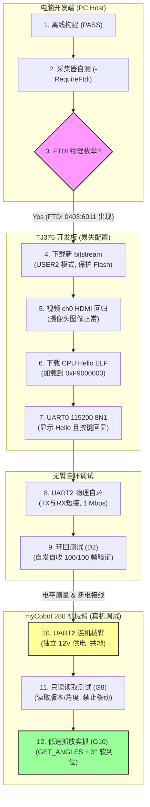

# 学习指南：单摄 M2 预飞行安全门与机械臂上板完整流程风险指南

> **生成日期**: 2026-07-16
> **预计阅读时间**: 15 分钟 | **面向角色**: 团队全体成员（特别是 C 轨系统集成与 B 轨嵌入式控制人员）
> **相关证据日志**: [m2_ftdi_enumeration_20260716_134713.txt](file:///D:/第十届集创赛-雄芯院材料/competition_project_single_camera/docs/debug_sessions/evidence/m2_ftdi_enumeration_20260716_134713.txt)
> **当前系统状态**: [CURRENT_STATE.md#L50](file:///D:/第十届集创赛-雄芯院材料/CURRENT_STATE.md#L50) 与 [m2_uart0_cpu_hello_preflight_20260716.md#L1](file:///D:/第十届集创赛-雄芯院材料/competition_project_single_camera/docs/debug_sessions/m2_uart0_cpu_hello_preflight_20260716.md#L1)

---

### 1. 用大白话说：我们现在到底走到了哪一步？

如果用一句话来概括我们目前的进度，那就是：**“图纸设计完全通过，准备开工，但还没找到大门的钥匙。”**

*   **离线构建 PASS（图纸盖章）**：在电脑的模拟环境里，我们的 FPGA 工程和 CPU 控制程序都已经顺利通过了编译。也就是说，代码语法没毛病、时序满足要求、跨时钟域（CDC）没有信号冲突。我们已经把新版的设计制品（[mem_test.bit](file:///D:/第十届集创赛-雄芯院材料/competition_project_single_camera/outflow_m2_cpuhello_20260716_1730/mem_test.bit) 硬件文件和 `uart_hello_onchip.elf` 软件固件）生成并保存在电脑里了。
*   **物理连接 FAILED（找不到大门钥匙）**：但是，当电脑准备把这些图纸“灌”进开发板时，却发现**连不上开发板**。我们执行了设备枚举检查，电脑反馈只看到了两个蓝牙口和机械臂的串口，代表开发板的专用转换通道（FTDI 0403:6011 芯片）完全没有在 Windows 系统里露面（原因：开发板目前正被队友占用进行其他调试，并未连接到我们的 PC）。

---

### 2. 机械臂上板的“十二步”完整流程

为了保证硬件安全，避免机械臂“失控撞墙”或板卡“短路冒烟”，整个调试过程被严密拆分为 12 个递进步骤。我们**绝对禁止跨步骤推进**。

*   **当前所处位置**：我们当前停留在 **步骤 3 (FTDI 物理枚举)**。因为开发板不在线，前置条件无法满足，自动阻断在 `PRE-FLIGHT HOLD`。

---

### 3. 上板重难点盘点

在整个上板调试中，有四个物理与通信上的“重难点”，是导致我们必须小步慢跑的原因：

#### 🔍 重难点一：COM 端口混淆与“指鹿为马”
*   **物理现实**：Windows 系统下的 COM 端口号是动态分配的。目前 PC 上连接着机械臂的控制串口 `COM10`（CH340 芯片）。
*   **调试难点**：如果不通过自动化工具进行精准的 VID/PID 识别，极其容易在软件下载或串口终端里将 `COM10` 误选为开发板端口。
*   **致命风险**：由于机械臂波特率是 1 Mbps，板卡 Hello 串口是 115200 bps。乱码或错误的二进制流在没有安全隔离的情况下发送到机械臂，会导致**机械臂失控爆冲，夹爪猛烈撞击桌面或台面，引发机械损坏**。

#### ⚡ 重难点二：物理接口的“电气倒灌”与“共地安全”
*   **物理现实**：开发板的 J52 接口包含 UART2 (FPGA_UART2_TXD/RXD) 和电平域。
*   **调试难点**：如果开发板未上电，但机械臂处于通电状态，两端直连会导致信号线产生“电气倒灌”现象（电流从信号引脚流向未供电芯片的内部二极管）。
*   **致命风险**：极易**瞬间击穿 FPGA 的 I/O 端口或烧坏板载 FTDI 转换芯片**。因此，接线、断开、电平测量必须在断电下双人复核，且引脚 VCC 必须悬空，必须共地（GND-GND）。

#### 📡 重难点三：到位判定“睁眼瞎”与“无 ACK”通信
*   **物理现实**：官方 myCobot 串口协议中，发送移动角度（`0x22`）或控制夹爪（`0x66`）是**没有应答（无 ACK）**的。数据发送成功只代表“发出了字节”，不代表机械臂收到了或者运动到位了。
*   **调试难点**：我们不能采用延时盲等的方式。必须实现 **Single-flight（单发单收）** 机制——发送动作后，以 750 ms 周期轮询发送 `GET_ANGLES`（`0x20`）并查询 `IS_MOVING`（`0x2B`）。
*   **到位标准（软到位）**：只有读回的实际关节角度与目标角度的残差连续稳定在允许的软容差（如 $\le 3^\circ$）内时，系统才能判定“动作完成”，从而进入状态机下一步。

#### 🏗️ 重难点四：机械底座微倾与刚性残差
*   **物理现实**：PC 联调中发现，机械臂本体与乐高底座的卡扣连接会在运动中产生微小倾斜。
*   **调试难点**：这种物理微倾是无法通过 `get_coords()` 进行算法测量的。它会导致原本计算好的空间抓取点产生数厘米的偏移。
*   **应对措施**：必须在真机测试前进行多点物理刚性加固，标定抓取高度时必须预留平面缓冲残差。

---

### 4. 进展诊断：已解决 vs 亟待解决

为了便于后续与 Codex 的工作交接与成果审查，我们清点了两端的任务列表：

#### ✅ 当前已经解决的问题
1.  **离线制品生成完毕**：新 bitstream [mem_test.bit](file:///D:/第十届集创赛-雄芯院材料/competition_project_single_camera/outflow_m2_cpuhello_20260716_1730/mem_test.bit) 时序（Setup `+1.742 ns` / Hold `+0.018 ns`）与 CDC（无警告）签核通过。
2.  **CPU Hello 固件就绪**：入口 `0xF9000000` 的 2.6KB 固件 ELF 审计通过，保证在片上 RAM 运行，绝对不会越界覆盖 Flash。
3.  **FTDI 枚举采集器开发完毕**：完成了 `capture_m2_ftdi_preflight.ps1` 编写，并在无板环境下完成了 fail-closed 负向自测（未检测到板卡时自动抛出 exit 2 阻断执行）。
4.  **PC 端路径与指令验证**：通过 Python (`pymycobot`) 实现了 180° 抓放点位的初步示教与重放，确定了以 $\le 3^\circ$ 软到位容差作为板上移植的收敛判据。

#### ❌ 当前亟待解决的问题（等板卡归还后立即执行）
1.  **物理 FTDI 设备枚举（步骤 3）**：需要连接板子 USB/JTAG 并供电，运行采集器输出 JSON，获取合法的板载 COM 端口。
2.  **SRAM 比特流配置与视频回归（步骤 4-5）**：将 `mem_test.bit` 通过 USER2 写入 FPGA，物理验证 HDMI 屏幕能正常输出 ch0 的摄像头图像。
3.  **片上 RAM CPU Hello 验证（步骤 6-7）**：将 ELF 下载至 `0xF9000000`，用串口终端（115200 8N1）验证完整横幅和按键回显。
4.  **J52/UART2 板端电平与线序确认（步骤 10 前置）**：使用示波器或万用表实际测量 J52 引脚上 1 Mbps 波形与空闲电平，严防倒灌。
5.  **UART2 串口本地物理环回（步骤 8-9）**：将开发板 UART2 TX 与 RX 物理短接，由板上 CPU 进行自发自收测试，确保板载 1 Mbps 串口驱动在大吞吐下不丢包。
6.  **底座及摆放区物理固定**：对乐高连接处和目标物摆放平面进行结构刚性锁定。
