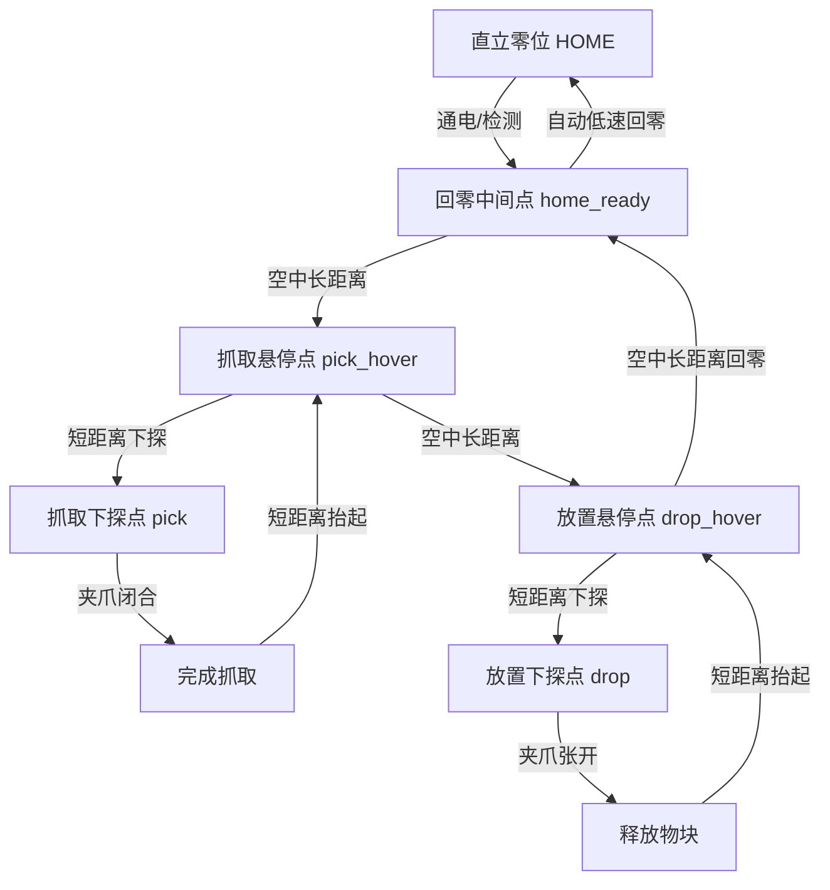

# myCobot 机械臂关节示教回放与安全控制调试指南

本指南基于 PC 端最新联调脚本 [teach_replay_pick_return_ready.py](file:///d:/%E7%AC%AC%E5%8D%81%E5%B1%8A%E9%9B%86%E5%88%9B%E8%B5%9B-%E9%9B%84%E8%8A%AF%E9%99%A2%E6%9D%90%E6%96%99/mycobot_pc_tests/teach_replay_pick_return_ready.py) 编写，旨在为开发者提供一个**循序渐进的实验开发与调试步骤指南**。通过对该脚本的核心控制算法、安全门控决策以及底层串口通信特性的深度剖析，辅助您全方位理解并学习机械臂在 AI 运动决策和异常控制中的开发实践。

---

## 1. 系统架构与设计决策

### 1.1 软硬件分工与 PC 联调定位
根据分赛区决赛实施开发路线，本项目采用 **“FPGA 视频前端特征提取 + 板上 RISC-V CPU 识别决策与运动控制”** 的闭环架构：
* **FPGA 硬件侧**：负责高速 MIPI 视频接入、RAW/ROI 提取、统计特征计算、OSD 显示叠加，并为 CPU 运行提供硬件接口。
* **板上 CPU 侧（RISC-V）**：运行目标识别决策逻辑，解析数据并封包下发串口指令，直接驱动机械臂。
* **PC 联调端（本脚本）**：利用 `pymycobot` 库在 PC 上完成通信、动作调试、滤波及安全门控算法的验证。**PC 端脚本不参与决赛闭环运行**，但其内部的状态机设计、参数逻辑、防跌落安全机制是板上 CPU 固件开发的重要算法来源。

### 1.2 为什么基于关节角（Angles）驱动而非笛卡尔坐标（Coords）？
在早期开发（如 `run-5` 阶段）中，若直接通过笛卡尔坐标指令（如发送 X, Y, Z, Rx, Ry, Rz）驱动机械臂，经常会遇到以下问题：
1. **逆运动学多解与边界熔断**：在靠近臂展边缘（如 $R > 250\text{ mm}$）或腕部翻转边界时，机械臂固件在进行逆运动学（IK）解算时可能会求解出奇异姿态，甚至因为无解而直接抛出异常、切断动力，导致“跌落”事故。
2. **关节大幅度摆动**：从一个坐标过渡到另一个坐标时，固件解算出的相邻关节角可能发生了翻转（例如第 6 轴自转 180°），导致机械臂在运动中产生剧烈晃动，极其危险。

因此，**最新版本采用关节角（Angles）作为主驱动模式**：
* 示教时同时记录关节角（Angles）和笛卡尔坐标（Coords）。
* 自动回放时，使用关节角作为动作命令下发给机械臂，保证运动插值轨迹的平滑性。
* 笛卡尔坐标仅在动作到位后进行**只读校验**（`verify_coords_near`），不参与任何轨迹规划与控制。

---

## 2. 五点示教模型与物理意义

脚本引进了 **五点示教流程**，相比传统的四点示教，它在“放置”与“直立回零”之间增设了安全过渡，有效解决了机械臂直接拉直导致的撞击风险。



### 五个示教点的详细定义：
1. **抓取悬停点 (`pick_hover`)**：位于抓取物块正上方的安全悬停位置，用于过渡长距离空中运动。
2. **抓取下探点 (`pick`)**：实际执行夹取的位置。夹爪需包络住物块，且高度需能够平稳抓起目标。
3. **放置悬停点 (`drop_hover`)**：位于目标放置区域正上方的悬停位置。
4. **放置下探点 (`drop`)**：物块与接触面贴合的释放位置。
5. **回零中间点 (`home_ready`)**：**V2/V2.1 引入的核心点位**。它是处于 `drop_hover` 与直立零位之间的空中安全过渡姿态（夹爪朝前或略微向下，大臂尽量拉直）。

---

## 3. 核心安全与滤波控制算法解析

### 3.1 时序抖动滤波算法
机械臂在通过串口返回角度和坐标时，可能会因为信号干扰或固件延迟产生错误的随机数值（如突发的大偏差读数）。脚本中实现了**时序抖动滤波器**（以 `get_filtered_angles` 为例）：

```python
def get_filtered_angles(mc, retries=ANG_RETRIES, stable_tol=ANG_STABLE_TOL):
    valid = []
    for _ in range(retries):
        try:
            angles = mc.get_angles()
        except Exception as e:
            # 异常捕获，避免串口单次抖动导致流程崩溃
            time.sleep(0.15)
            continue

        if isinstance(angles, list) and len(angles) >= 6:
            vals = list(angles[:6])
            # 数值类型与物理限位校验
            if all(isinstance(v, (int, float)) and math.isfinite(v) for v in vals):
                if all(-180.0 <= v <= 180.0 for v in vals):
                    valid.append(vals)
                    if len(valid) >= 2:
                        prev = valid[-2]
                        cur = valid[-1]
                        # 核心校验：连续两次读数之差的最大值必须在容差 stable_tol (3.0°) 内
                        delta = max(abs(cur[i] - prev[i]) for i in range(6))
                        if delta <= stable_tol:
                            return cur
        time.sleep(0.15)
    return None
```
**设计意图**：不仅过滤掉非有限值和超出物理限制的野值，还要求**连续两次读取的角度极为接近**，从而保证读取到的机械臂当前状态真实可靠。

### 3.2 业务级安全门控与底层有效性解耦
脚本将安全判定拆分为两个层次，互不干扰：
1. **底层有效性校验 (`is_valid_coord_reading`)**：判断传感器读数本身是否正常（例如 $X, Y \le 500\text{ mm}$，$-100 \le Z \le 500\text{ mm}$）。由于直立高位时 Z 轴坐标可达约 $417\text{ mm}$，此处的 Z 轴上限设为 $500\text{ mm}$，防止回零过程中的正常数据被当成异常野值过滤掉。
2. **业务级安全门控 (`is_safe_coord`)**：针对 `pick/drop` 动作区域，执行更严格的范围限制（如 $Z \le 280\text{ mm}$，防止过高碰撞；$R \ge 60\text{ mm}$，防止离底座过近导致自我撞击；$R \le 280\text{ mm}$，防止拉伸过载）。该门控不适用于处于直立状态下的 `home_ready`。

### 3.3 关节空间连续性与分支分集门
为防止手动示教时，`hover` 点与 `down` 点意外落在不同的逆运动学（IK）解空间分支（回放时会导致大范围甩臂或腕部翻转），脚本提供了**短距离关节差预校验**：
* **校验函数**：`validate_short_angle_pair(pick_hover, pick)`
* **安全门限**：大臂 1-5 轴单轴最大变化 $\le 30.0^\circ$，第 6 轴变化 $\le 45.0^\circ$。
* 对于回零过渡过程（`drop_hover -> home_ready`），由于需要大幅度构型拉直（J3 会从 $-70^\circ$ 拉至 $0^\circ$ 附近），故放宽为宽松的**安全防反转门**（大臂 $\le 90.0^\circ$，第 6 轴 $\le 120.0^\circ$），仅用于拦截极端错误的翻面异侧过渡。

### 3.4 软到位 (Soft Success) 决策门
由于机械臂舵机存在死区且受重力影响，同步角度下发指令 `sync_send_angles` 有时会返回 `0`（表示机械臂未完全到达固件规定的静止精度），这常会导致整个控制链发生超时抛错。
脚本通过 `checked_short_angles` 引入了**软到位成功判定**：
* 当固件返回未到位（非 `1`）时，读取实际关节角和实际坐标。
* 计算实际角度与目标角度的差距。若**关节最大偏差 $\le 3.0^\circ$**，且**坐标三维偏差 $\le 25.0\text{ mm}$**，则判定机械臂物理上已完成运动，标记为“软通过”，允许程序正常往下走。
* **设计意图**：兼顾了安全（若差得太远依然拦截报错）与工程可用性（解决固件死区未到位造成的死锁）。

### 3.5 自动回零安全门与两级容差（V2.1 改进）
安全回零策略 `safe_return_home` 规定：
* **直立零位定义**：`HOME_ANGLES = [0, 0, 0, 0, 0, 0]`。
* **大臂安全门限**：大臂 1-5 轴的最大偏差 `arm_max_diff` 必须 $\le 45.0^\circ$。满足此条件，允许软件直接发送关节回零指令。若超出，为了防止直接高速动作造成剧烈摆动、撞线或跌落，**强行拦截，进入人工扶正流程**。
* **V2.1 推荐门设计**：由于软到位判定可能会带入最高 $3^\circ$ 的物理偏差。为了防止示教的 `home_ready` 刚好卡在 $43^\circ$ 附近（如 `run-10` 阶段），在回放阶段被软到位推到 $45.4^\circ$ 从而再次触发人工扶正，V2.1 对示教的 `home_ready` 点位引进了**两级容差机制**：
  * **$\le 40.0^\circ$（推荐）**：留足至少 5° 的软到位容差，必能自动回零。
  * **$40.0^\circ \sim 45.0^\circ$（警告允许）**：软件会进行强警告提示，要求最好重新示教，但仍可通过。
  * **$> 45.0^\circ$（禁止）**：硬拦截，禁止保存，防止自动回零失效。

---

## 4. 循序渐进调试与实操步骤

请遵循以下五个步骤开展实验，特别注意环境安全，首次实操建议在**无物块空载状态下**运行。

### 步骤一：硬件安全物理准备
1. 将 myCobot 280 用夹具稳固固定在水平桌面上，确保底座稳固，无晃动。
2. 摆放好抓取物块和放置目标位置。
3. **注意理线**：把机械臂尾部 Type-C 串口线、电源线妥善理顺，确保机械臂转动 $180^\circ$ 时不会被线缆缠绕或拉扯。

### 步骤二：软件启动与串口检测
1. 在终端运行脚本：
   ```powershell
   python mycobot_pc_tests/teach_replay_pick_return_ready.py
   ```
2. 观察串口自动扫描结果，通常 CH340 或 CP210x 设备会被自动识别出来，直接回车或输入对应序号即可。

### 步骤三：手动拖动五点示教（重点）
机械臂掉电变软后，依次手动移动机械臂关节并按下回车保存。
* **手动操作要领**：用一只手扶住机械臂大臂（第 2/3 轴），另一只手移动末端（第 5/6 轴及夹爪）。
1. **示教 `pick_hover`**：拖动到抓取点正上方，R 保持在 $250\text{ mm}$ 以内。
2. **示教 `pick`**：垂直往下探（J2 下弯，保持 J6 方向不变）。注意在抓取深度让夹爪指尖能包络物块。
3. **示教 `drop_hover`**：水平转动到放置区上方，R 尽量在 $250\text{ mm}$ 以内。
4. **示教 `drop`**：往下探到能将物块平放于桌面的位置。
5. **示教 `home_ready`（核心）**：拖动到 `drop_hover` 往直立位置中间的过渡态（大臂抬起直立，大臂 1-5 轴相对直立零位的差值需保持在 $\le 40^\circ$）。
   * 💡 **观察输出**：此时屏幕会实时输出 `arm_max_diff`。若满足 $\le 40^\circ$，终端会提示通过推荐余量门；若在 $40^\circ \sim 45^\circ$，请选择重新示教以使角度更直立。

### 步骤四：自动回放与坐标一致性诊断
1. 示教结束后，双手移开机械臂，按回车键，机械臂将上电并回零。
2. 再次按回车，开始自动抓放测试。
3. **诊断机制观察**：
   * 动作回放时，屏幕将输出诸如 `verify_coords_near` 校验输出。
   * 如果 J2/J3 舵机因为阻力发生偏差，触发了软到位，您会在终端看到 `[软通过] xxxx: 固件返回 0，但实际姿态已在容差内` 的提示。

### 步骤五：安全回零与人工扶正状态机测试
1. 在回放完成或触发 Ctrl+C 中断时，程序将接管回零。
2. **主动模拟大偏差异常**（仅为调试测试）：如果在回零时，大臂 1-5 轴与直立零位偏差大于 45°（可以通过在空中用手扶稳后强行搬动，或是在回零前通过 Ctrl+C 中断并手动搬偏）：
   * 程序将检测到 `arm_max_diff > 45`，并拒绝直接动作。
   * 终端打印 `【警告】当前大臂 1-5 轴与零位偏差较大`。
   * 进入人工扶正状态机：提示您“用手扶稳机械臂”，按 Enter 键，舵机松开，提示“手动扶正到夹爪尖端朝前预回零姿态”，扶好后按 Enter 重新上电并读取，重新计算偏差，通过后方以 $15\%$ 的低速慢回 HOME 零位。

---

## 5. 参数微调要点手册

在实际部署或针对不同物理负载进行优化时，可以针对以下参数进行针对性微调：

| 参数变量名 | 默认值 | 调优场景与物理依据 |
| :--- | :--- | :--- |
| `ANG_REPLAY_SPEED` | `20` | 关节角回放速度。**建议不要超过 25**，以保证长距离过渡的惯性在安全可控范围内。 |
| `SHORT_DOWN_SPEED` | `12` | 下探过程速度。重力辅助下探，为防止撞击桌面，速度设低（$\le 12$）。 |
| `SHORT_UP_SPEED` | `16` | 抬起过程速度。由于要克服重力和负重物块的阻力，速度适当设高（$16 \sim 20$）。 |
| `SOFT_ANGLE_SUCCESS_TOL` | `3.0` | 软到位关节角差值上限。如果经常因为差一点到位抛错，可微调至 `4.0`，但**不建议超过 5.0**（防止偏差太大产生物理撞击）。 |
| `ARM_MAX_DIFF_SAFE` | `45.0` | 自动回零大臂安全门阈值。**禁止修改此值**。45° 是通过连杆机构受力分析得出的最大安全仰角，放宽会导致跌落风险骤增。 |
| `HOME_READY_TARGET_ARM_MAX` | `40.0` | home_ready 示教推荐门。配合软到位差值，确保 $40^\circ + 3^\circ < 45^\circ$。若软到位容差调大，本值必须等额调小。 |

---

## 6. 常见异常排查 Checklist

当联调或运行中出现故障时，可对照下表快速定位并排除问题：

### 🚨 异常 1：运行瞬间抛出 `RuntimeError: xxx 无法读取稳定关节角`
* **可能原因**：
  1. 串口连线松动，信号通信中断。
  2. 机械臂供电电源松动或未开启，舵机控制板未通电。
* **排除步骤**：
  1. 检查物理接线，确认电源指示灯常亮。
  2. 检查串口，尝试在终端重新启动并手动输入确切的串口设备名称。
  3. 确认没有其他进程（例如 `myBlockly` 或其他 Python 控制台）独占占用此串口。

### 🚨 异常 2：自动回放阶段在 pick_hover 到 pick 下探时返回 `关节动作超时或失败`
* **可能原因**：
  1. 机械臂下行遇到物理阻挡。
  2. `SHORT_DOWN_TIMEOUT`（10s）过小，导致还未收敛到设定位置即超时。
* **排除步骤**：
  1. 检查物理抓取位置是否太低，导致触碰桌面。
  2. 观察终端输出，看实际角度与目标角度的偏差大小。如果偏差确实很大，说明舵机力矩不足，可适当将速度调大或清理滑轨。如果偏差在 3° 左右，可将 `SOFT_ANGLE_SUCCESS_TOL` 调大至 `3.5`。

### 🚨 异常 3：回放完成或中断回零时，每次都会进“人工扶正流程”，无法全自动完成
* **可能原因**：
  1. 示教的 `home_ready` 点本身不符合直立规范，偏差过于贴近 45°。
  2. 自动回放中，由于惯性或带载导致实际回放到 `home_ready` 时的到位角度产生了较大偏移。
* **排除步骤**：
  1. 在第一阶段示教时，重新拖动 `home_ready`，使大臂尽量向上笔直拉起，观察终端输出，使 `arm_max_diff` 的数值保持在 **35°** 左右的最优状态。
  2. 保持 `HOME_READY_TARGET_ARM_MAX = 40.0` 严格门，强制重示教。
  3. 检查 V2.1 增加的第 10 步自动重试机制是否触发，并观察低速重试后是否成功收敛到 45° 以内。
