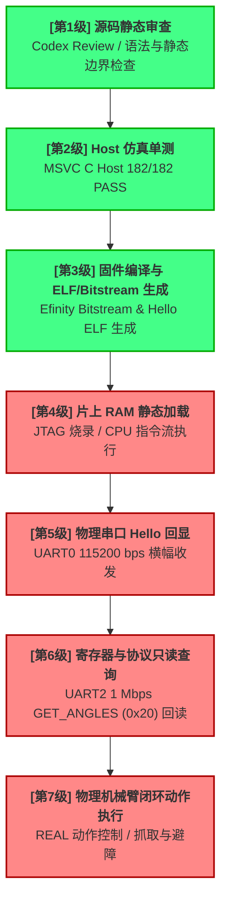

# 无板 myCobot 与项目维护学习指南（2026年7月17日版）

> **⚠️ 注意：** 本指南以根目录下的 [CURRENT_STATE.md](file:///d:/第十届集创赛-雄芯院材料/CURRENT_STATE.md) 和真实源码为事实锚。请读者时刻注意：**当前状态快照会随着合并和板级进展而更新，任何与板级相关的结论必须在阅读当日复查 `CURRENT_STATE.md`。** 本指南专为暂时无法拿到物理开发板和机械臂、但需要参与系统调试与项目维护的成员编写。

---

## 目录
1. [证据阶梯：为什么“测试通过”仍不能直接上板](#1-证据阶梯为什么测试通过仍不能直接上板)
2. [串口的三层语义：物理、参数与协议帧](#2-串口的三层语义物理参数与协议帧)
3. [协议健壮性：Single-flight、Deadline 与 Fail-closed](#3-协议健壮性single-flightdeadline-与-fail-closed)
4. [唯一动作原则：状态机的最后一关物理保险](#4-唯一动作原则状态机的最后一关物理保险)
5. [项目维护即安全工程：如何防范“文档带错路”](#5-项目维护即安全工程如何防范文档带错路)
6. [针对性巩固练习题与原理详解](#6-针对性巩固练习题与原理详解)

---

## 1. 证据阶梯：为什么“测试通过”仍不能直接上板

在嵌入式与系统集成项目中，非现场或无板成员最容易陷入的思维误区是：**“我的 Host 单元测试通过了，所以在板上也一定能跑通。”**

然而，在硬件系统工程中，“测试通过”并不是一个一维的布尔值，而是一个**分层的“证据阶梯”**。这就如同“登月任务”：在地球上用超级计算机模拟了 10,000 次完美的降落轨道（Host 模拟测试），绝不代表飞船上的发动机管路没有漏气（电气层），更不代表月球表面的物理阻抗符合预期（板级物理执行）。

我们必须通过一个清晰的阶梯模型来理解我们当前所处的验证状态：



### 证据层级分析（能证明什么 VS 不能证明什么）

1. **[第1-2级] 源码静态审查与 Host 仿真单测**：
   - **能证明**：证明了 CPU 的逐轮状态机逻辑跳转（[round_controller.c](file:///d:/第十届集创赛-雄芯院材料/final_project/cpu/app/src/round_controller.c)）在逻辑上自洽；证明了在 fake 模拟驱动上 20 次 Host 事务所产生的响应和 ACK 结果符合 L0 观测性规范（运行时 assertions 达到 `182/182`）。
   - **不能证明**：不能证明 SoC 芯片内部 RISC-V 固件 the 真实链接情况、APB 总线时钟、片上 MMIO 寄存器地址映射是否对齐，也不证明任何物理外设。
2. **[第3级] 交叉编译与冷构建（当前 G1 的离线 PASS 状态）**：
   - **能证明**：证明了硬件输入基线在 Efinity 软件下成功生成了 bitstream（哈希匹配为 `A897E335...`），且 STA 约束通过；证明了 `Hello_World` ELF 文件成功编译（哈希匹配为 `E5BC80A2...`）且位于 `0xF9000000` 片上 RAM 静态加载范围。
   - **不能证明**：由于尚未执行板级物理测试，它**不证明**板上 CPU 实际能够完成取指、**不证明** `USER2` 接口物理工作、**不证明** APB 能够实读。
3. **[第4-5级] 片上 RAM 加载与物理串口回显（NEXT_GATE 的目标）**：
   - **能证明**：证明 CPU 的片上 RAM 取指、时钟复位、调试串口 UART0 的物理电平（115200 bps）与信号输出正常。
   - **不能证明**：不能证明 UART2 (1 Mbps) 的物理通路，也不证明机械臂连接。
4. **[第6-7级] 协议只读查询与物理执行**：
   - 这是走向物理闭环的最终门槛。只有在此阶段，才能证明机械臂的供电、TTL 共地、波特率稳定性、Basic/Atom 两端固件版本兼容性、以及实际抓取精度的安全可控。

**结论**：Host/fake transport 测试通过，只能说明“大脑”逻辑健全，但不能证明“神经”和“肌肉”在物理上存在或能动。无板成员在编写代码时，必须清醒地知道哪些模块属于“未验证边界”，并严防在文档中给出“代码通过编译即等于板测通过”的乐观误导。

---

## 2. 串口的三层语义：物理、参数与协议帧

在调试机械臂串口通信时，新手常犯的致命错误是：**“我用 C 语言打印了 `FE FE 02 20 FA` 发送日志，所以机械臂应该已经动了。”**

我们将串口通信拆解为**“电气物理层”**、**“波特率参数层”**和**“应用协议层”**三层语义。这三层就如同“两个人跨越山谷打电话”：

```
+-------------------------------------------------------------+
| 第三层：应用协议层 (说话的语法 - FE FE LEN CMD PAYLOAD FA)   |
+-------------------------------------------------------------+
                            |
                            V
+-------------------------------------------------------------+
| 第二层：波特率参数层 (说话的语速 - 1 Mbps / 115200 bps)    |
+-------------------------------------------------------------+
                            |
                            V
+-------------------------------------------------------------+
| 第一层：物理电气层 (声波介质/连线 - TTL 3.3V / 共地 GND)     |
+-------------------------------------------------------------+
```

### 1. 第一层：物理电气层（声波介质与电压）
电气层是通信的底座。
- **TTL 电平**：myCobot 使用的是 3.3V TTL 信号。这意味着信号线上 `3.3V` 代表逻辑 `1`，`0V` 代表逻辑 `0`。严禁将 RS232（正负 12V 甚至更高）或 5V 电平信号在没有电平转换的情况下直接接入，否则会瞬间烧毁芯片。
- **TX/RX 交叉连接**：CPU 的发送引脚（TX）必须物理连接到机械臂的接收引脚（RX），反之亦然。如果接成 TX-TX，就相当于两人的嘴巴贴在一起，完全没有听众。
- **共地（GND）的重要意义（“隔洋通话，必须共地”）**：两个设备通信，其电平必须有**共同的参考基准**。如果 CPU 的 GND 没有与机械臂的 GND 物理连接在一起，双方对于“0V”和“3.3V”的定义就会产生巨大偏差，串口线上将充斥着由于电势差引起的杂波噪声，导致物理层彻底无法解析任何数据（俗称“不共地，听天书”）。

### 2. 第二层：波特率参数层（语速）
波特率决定了每一位数据传输的时间宽度。
- **参数解耦与隔离**：在我们的项目中，**UART0 调试串口固定为 `115200 bps` 8N1**，而 **myCobot 控制串口固定为 `1000000 bps` (1 Mbps) 8N1**。
- 这两个串口是彻底隔离的两个硬件 Gate。因为 1 Mbps 速度极快，对信号完整性、线缆长度、共地阻抗的要求极高。绝对不能因为 UART0 可以在 115200 bps 下输出 Hello，就推断出 1 Mbps 串口链路一定稳定。两者不能互相外推。

### 3. 第三层：应用协议层（语法）
协议帧定义了字节流的语义，防止乱码数据被解释为危险动作。
- myCobot 采用的帧结构为：`0xFE 0xFE LEN CMD PAYLOAD... 0xFA`
  - `LEN` 的计算规则为：`payload_len + 2`（覆盖 CMD 与结尾 0xFA，不覆盖帧头和 LEN 本身）。
  - 以读取关节角度（`GET_ANGLES`，命令字 `0x20`）请求为例：
    - 该请求没有 payload，即 `payload_len = 0`。
    - `LEN = 0 + 2 = 2`。
    - 物理帧为：`FE FE 02 20 FA`。
  - 以它的响应帧为例：
    - 响应返回 6 个关节的角度。每个角度是一个 16 位有符号大端整数（`deg_x100`，即真实角度乘以 100），共计 12 字节的 payload。
    - `LEN = 12 + 2 = 14 = 0x0E`。
    - 响应帧为：`FE FE 0E 20 [12 字节角度] FA`。

**安全警示**：哪怕你的应用协议层构造出完美的 `FE FE 02 20 FA` 字节，但如果物理电气层没有共地、或者串口线过长导致阻抗失配，物理层接收到的将是一串错误的乱码，机械臂绝不会响应。

---

## 3. 协议健壮性：Single-flight、Deadline 与 Fail-closed

在没有高层确认的原始串口环境下，软件协议层必须通过极其严密的状态管理来确保通信不会失控。在 [mycobot_transaction.c](file:///d:/第十届集创赛-雄芯院材料/final_project/cpu/app/src/mycobot_transaction.c) 中，设计了三项核心健壮性机制：

### 1. Single-flight（单在途请求）
myCobot 协议的线协议中**没有事务 ID（Transaction ID）**或**序号（Sequence ID）**。这就导致了一个根本性问题：如果 CPU 同时发送了两个请求（请求 A 读取角度，请求 B 读取夹爪状态），而串口由于干扰或缓冲延迟，返回的数据帧发生乱序，CPU 将完全无法分辨哪一个返回帧对应哪一个请求。

因此，代码中实现了严格的 Single-flight 限制：
- 任何时候，**在途只能有一个活跃事务**（`transaction->active == 1`）。
- 在调用 `mycobot_transaction_begin` 时，如果检测到 `transaction->active` 已经为 1，系统将直接拒绝发送新的请求，并增加 `single_flight_reject` 计数器：
  ```c
  if (transaction->active) {
      transaction->counters.single_flight_reject++;
      return 0u;
  }
  ```
- 只有当前事务收到匹配响应（通过 `mycobot_transaction_accept_frame`）或者超时释放后，才允许开启下一个事务。这彻底规避了帧错位导致的语义误判。

### 2. Deadline（绝对截止时间）与时基回绕处理
为了防止由于丢包导致状态机无限期死等响应，必须引入超时退出机制。项目将单次响应的超时限制为 `750 ms`（500 ms 官方相应上限 + 250 ms 调度与缓冲裕量）。

然而，CPU 的毫秒计数器（`now_ms`）是一个 32 位无符号数，大约在 49.7 天时会发生 `0xFFFFFFFF -> 0` 的**溢出回绕（Wrap-around）**。如果恰好在临界点启动事务，简单的 `now_ms > deadline_ms` 判断就会彻底失效，导致严重的逻辑混乱。

代码中使用了一种极其严谨的**有符号强转减法性质**（“智能沙漏”）来实现超时判定：
```c
static uint8_t deadline_reached(uint32_t now_ms, uint32_t deadline_ms)
{
    return (uint8_t)((int32_t)(now_ms - deadline_ms) >= 0);
}
```
**数学原理说明**：根据二补码（Two's Complement）的算术规则，在无符号数相减后，将结果强制类型转换为 `int32_t`。只要两者的绝对时间差小于半个周期（即小于 $2^{31}$ 毫秒，约 24.8 天）：
- 若 `now_ms` 未达到 `deadline_ms`，则二补码减法结果对应的有符号最高位为 `1`（负数，$\Delta < 0$）。
- 若 `now_ms` 达到或超过 `deadline_ms`，则减法结果对应的有符号最高位为 `0`（正数或零，$\Delta \ge 0$）。
- 这保证了即使发生溢出回绕，时间先后的相对正负号依然绝对正确，彻底规避了溢出误超时的系统死锁风险。

### 3. Fail-closed（失败即安全锁死）
通信异常是常态。当面临以下情形时，状态机如何自处？
- 收到非期待指令响应（`frame->command != transaction->expected_command`） -> 计数 `bad_command`。
- 长度不匹配（`frame->payload_len != transaction->expected_payload_len`） -> 计数 `bad_length`。
- 解码后的数据超出了物理安全限位（[mycobot_protocol_notes.md](file:///d:/第十届集创赛-雄芯院材料/final_project/integration/mycobot_protocol_notes.md) 中的 J1..J6 绝对限位） -> 计数 `bad_domain`。
- 超过 750 ms 未收到数据 -> 计数 `timeout`。

在以上任一错误发生时，`mycobot_transaction_accept_frame` 都会返回相应的错误状态，且清零 `active = 0u`，**彻底中断状态机推进，关闭抓取动作下达通道**。系统宁可因为通信错误丢分，也绝不容许机械臂执行任何未知或失控的动作（“保险丝复位”逻辑）。

---

## 4. 唯一动作原则：状态机的最后一关物理保险

在 [round_controller.c](file:///d:/第十届集创赛-雄芯院材料/final_project/cpu/app/src/round_controller.c) 中，管理着逐轮的“识别-判断-执行”状态机。比赛中每个单轮的评分规则是极其严苛的：识别占 25%、判断占 25%、执行占 50%。

为了防止软件层胡乱发出动作指令导致跌落或碰撞，状态机在 `ROUND_STATE_EXECUTE_OR_SKIP`（执行或跳过）阶段，实施了**“唯一动作原则”**。

这可以用战斗机的“火控保险”来比喻：

```
+------------------------------------------+
| 视觉分类正确 (observation_valid = 1)     |  ---> 锁定了敌机 (识别)
+------------------------------------------+
                     |
                     V
+------------------------------------------+
| 决策匹配成功 (decision_action = GRAB)    |  ---> 下达开火命令 (判断)
+------------------------------------------+
                     |
                     V
+------------------------------------------+
|  物理安全联锁 (arm_enabled && !arm_busy)  |  ---> 火控物理保险开关 (执行)
+------------------------------------------+
                     |
         +-----------+-----------+
         |                       |
      [是]                    [否]
         |                       |
         V                       V
+-------------------+   +---------------------------------------------+
|  发送物理抓取指令  |   | 动作强制降级为 MATCH_ACTION_NONE            |
|  (request_arm_grab) |   | 状态机安全进入 ROUND_DONE                    |
+-------------------+   | 记录原因码 REASON_ARM_NOT_READY (安全锁死)   |
                        +---------------------------------------------+
```

### 源码级防御性实现分析

让我们看看 [round_controller.c](file:///d:/第十届集创赛-雄芯院材料/final_project/cpu/app/src/round_controller.c#L207-L226) 中的具体实现：
```c
    case ROUND_STATE_EXECUTE_OR_SKIP:
        if (rc->decision_action == MATCH_ACTION_GRAB) {
            /* 机械臂不可接收动作时（未使能 或 正忙）不得发起新抓取。
             * 此时采取保守策略：识别/判断结果已锁存，但本轮不执行动作，
             * 直接进入 ROUND_DONE 并以 ARM_NOT_READY 说明原因。
             * 保留 is_target=1，动作降级为 NONE，绝不 request_arm_grab。 */
            if (!in->arm_enabled || in->arm_busy) {
                make_result(rc, MATCH_ACTION_NONE, 1u, REASON_ARM_NOT_READY);
                enter_state(rc, ROUND_STATE_ROUND_DONE, now_ms);
            } else {
                if (!rc->arm_request_sent) {
                    rc->arm_request_sent = 1u;
                    request_arm_grab = 1u;
                }
                enter_state(rc, ROUND_STATE_WAIT_ARM_DONE, now_ms);
            }
        } else {
            enter_state(rc, ROUND_STATE_ROUND_DONE, now_ms);
        }
        break;
```

**关键设计思想**：
1. **降级（“软到位，硬闭锁”）**：即使我们判定目标正确，一旦 `in->arm_enabled == 0`（物理急停开启或机械臂未就绪）或 `in->arm_busy == 1`（机械臂正在进行上一次的物理复位，尚未停稳，即“到位振荡”晃动期间），系统绝不会允许向串口发送抓取字节。而是通过 `make_result` **强制将本轮动作修改为 `MATCH_ACTION_NONE`**，并归因于 `REASON_ARM_NOT_READY`。
2. **防重复触发**：通过 `rc->arm_request_sent` 锁，确保 `request_arm_grab` 脉冲信号在整个状态机生命周期中只会在就绪瞬间发出一次，彻底避免串口缓冲堆积导致的重复执行。

---

## 5. 项目维护即安全工程：如何防范“文档带错路”

随着团队协作的深入，多分支并行开发和 Handoff 交接越来越频繁。如果在项目维护中只凭脑力记忆和口头沟通，极易发生“用旧固件去测试新功能”、“文档和代码哈希对不上”甚至物理接线烧毁的重大事故。

在雄芯院项目中，我们构建了以下几道**“系统级安全防护网”**：

### 1. 唯一事实锚与 freshness 检查
在本地开发时，任何成员合并分支后，必须立即执行以下三步：
1. 阅读根目录下的 [CURRENT_STATE.md](file:///d:/第十届集创赛-雄芯院材料/CURRENT_STATE.md)，它是唯一的权威基线，记录了当前已验证的 Gate、禁止项、以及精确的文件哈希。
2. 运行 `tools/agent_handoff_health_check.ps1` 校验 Handoff 交接完整性。
3. 运行 `tools/project_freshness_check.ps1` 检查代码和元数据是否发生不匹配。

### 2. 文档冲突的处理路径与优先级
**假设场景**：你正在阅读一份半年前归档的“机械臂控制方案.md”，里面声称 J52 端口可以直接开启 1 Mbps 串口测试。然而你打开 [CURRENT_STATE.md](file:///d:/第十届集创赛-雄芯院材料/CURRENT_STATE.md)，却发现上面用粗体写着：“禁止 UART2/J52、机械臂接线和物理动作”。

此时的正确处理顺序是：
1. **立刻中止**：停止一切物理连接相关的操作，严禁盲目下载固件。
2. **权威优先级对齐**：当文档存在冲突时，必须无条件遵循以下优先级标准：
   $$\text{用户当前指令} > \text{官方比赛细则} > \text{CURRENT\_STATE.md 快照事实} > \text{历史交接文档}$$
   旧文档的结论在 `CURRENT_STATE.md` 面前自动失效。
3. **提交 [Contradiction Report]（矛盾报告）**：如果不一致性涉及硬件接线、电平、地址或控制流等安全边界，必须提取双方的冲突细节、受影响的源文件、以及潜在的烧录损坏风险，写成 Review Packet 并提交给用户或 Codex 评审门裁定，在冲突被正式关闭并更新 `CURRENT_STATE.md` 之前，物理开发保持 Fail-closed。

---

## 6. 针对性巩固练习题与原理详解

---

### 练习题 1：手算 GET_ANGLES 的数据帧长度与隐式校验机制

<details>
<summary><b>📚 基础知识讲解：数据帧构造原理（点击展开）</b></summary>

在没有高层校验协议（如 CRC-16）的串口通信中，接收方必须依赖数据帧的静态结构来过滤乱码。
myCobot 串口协议 of 帧结构由以下 5 部分组成：
1. **帧头**：固定为 2 字节的 `0xFE 0xFE`。用于指示一个新帧的开始。
2. **长度字节 (LEN)**：占 1 字节。计算公式为：
   $$\text{LEN} = \text{payload\_len} + 2$$
   即 `LEN` 覆盖了命令字（CMD）和帧尾（0xFA），但**不包括**帧头和它自身。
3. **命令字 (CMD)**：占 1 字节。用于指示本次操作的动作码（如 `GET_ANGLES = 0x20`）。
4. **数据载荷 (PAYLOAD)**：占 `payload_len` 字节。
5. **帧尾**：固定为 1 字节的 `0xFA`。指示一帧的结束。

为了进行有效性校验，通用 C 解析器会执行多重条件匹配。只有同时通过“双帧头 + 帧尾匹配 + 长度一致 + 命令码预期值域”五重关卡，一帧数据才会被判定为合法。
</details>

**题目**：
1. 请根据协议公式，分别手算并写出 `GET_ANGLES`（命令字 `0x20`）的**请求帧**与**响应帧**（返回6个关节的 `int16_t` 大端角度数据）的 `LEN` 字段值及完整的十六进制字节流。
2. 即使协议没有使用校验和（Checksum）或循环冗余校验（CRC），为什么我们依然说它在软件层实现了结构性校验？它是如何阻断干扰帧的？

<details>
<summary><b>🔑 答案与解析（点击展开）</b></summary>

#### 1. 帧结构手算
- **`GET_ANGLES` 请求帧**：
  - 没有数据载荷，所以 $\text{payload\_len} = 0$。
  - 计算 $\text{LEN} = 0 + 2 = 2$（十六进制为 `0x02`）。
  - 完整请求字节流：`FE FE 02 20 FA`。
- **`GET_ANGLES` 响应帧**：
  - 响应返回 6 个关节的角度。每个角度是一个 16 位（2 字节）有符号大端整数。
  - $\text{payload\_len} = 6 \times 2 = 12$ 字节（十六进制为 `0x0C`）。
  - 计算 $\text{LEN} = 12 + 2 = 14$（十六进制为 `0x0E`）。
  - 假设 6 个角度值分别为 $\theta_1.. \theta_6$，完整响应字节流为：
    `FE FE 0E 20 [Joint1_H] [Joint1_L] ... [Joint6_H] [Joint6_L] FA`。

#### 2. 隐式校验机制分析
协议虽然没有 CRC，但通过以下静态结构形成了闭环约束：
1. **帧头帧尾双锚定**：首尾必须严格匹配 `0xFE 0xFE` 和 `0xFA`，否则视为错位帧直接抛弃。
2. **预期长度强核对**：在 [mycobot_transaction.c](file:///d:/第十届集创赛-雄芯院材料/final_project/cpu/app/src/mycobot_transaction.c#L81-L85) 中，程序会核对响应帧的 `frame->payload_len` 是否等于当前事务预期的长度：
   `frame->payload_len != transaction->expected_payload_len`。
   如果因为线路噪声丢失了某个字节，导致整个帧缩短或变长，长度校验会立即报错并累加 `bad_length`，防止乱码被当作角度解析。
3. **命令字状态匹配**：如果接收到的帧 `CMD` 并非预期的命令字，或者在未发起请求时收到响应（[mycobot_transaction.c](file:///d:/第十届集创赛-雄芯院材料/final_project/cpu/app/src/mycobot_transaction.c#L72-L75) 处于非活跃状态），系统会作为迟到帧/干扰帧丢弃。
4. **物理值域过滤**：解析出角度后，必须经过 `mycobot_validate_response_payload` 的物理限位校验，非物理的过大数值会被判为 `bad_domain` 过滤。
</details>

---

### 练习题 2：分析超时截止时间（Deadline）的边界与时基回绕

<details>
<summary><b>📚 基础知识讲解：有符号减法在无符号溢出下的数学特征（点击展开）</b></summary>

在 32 位嵌入式系统中，时基计数器（如 `now_ms`）在累加到 $2^{32}-1$（即 `4294967295`，十六进制 `0xFFFFFFFF`）后，下一毫秒会自然回绕到 `0`。
如果在超时判定中简单使用不等式：
`if (now_ms >= deadline_ms)`
当 `deadline_ms` 因为累加而溢出（例如当前 `now_ms = 4294967000`，超时时间为 `750` ms，则计算出的 `deadline_ms = 4294967750` 即 `454`）。
此时，由于 `now_ms (4294967000) >= deadline_ms (454)` 恒成立，系统会**立刻误判为超时**，导致整个通信链路瘫痪。

为了解决这个问题，标准 C 语言利用了**补码减法的特性**（“留号排队”式非阻塞等待边界）：
- 在 32 位二进制补码中，两个无符号数相减后强制转换为 `int32_t`：
  $$\Delta = (\text{int32\_t})(\text{now\_ms} - \text{deadline\_ms})$$
- 只要两次采样的绝对时间差小于半个周期（即小于 $2^{31}$ 毫秒，约 24.8 天）：
  - 若 $\text{now\_ms}$ 未达到 $\text{deadline\_ms}$，则 $\Delta$ 的二进制最高位（符号位）必为 `1`（即 $\Delta < 0$）。
  - 若 $\text{now\_ms}$ 达到或超过 $\text{deadline\_ms}$，则 $\Delta$ 的最高位必为 `0`（即 $\Delta \ge 0$）。
  - 这保证了即使发生回绕，时间先后的相对正负号依然绝对正确。
</details>

**题目**：
已知系统单次事务的超时上限为 `750 ms`。请通过 16 进制二补码计算（写出详细的减法步骤和最高符号位状态），说明在以下三种情形下，`deadline_reached` 函数如何进行判定（设开始事务的时刻为 `start_ms`，即 `deadline_ms = start_ms + 750`）：
1. **情形 A（未超时）**：`start_ms = 0x10000000`，当前 `now_ms = 0x100002EC`（即流逝了 748 ms）。
2. **情形 B（已超时）**：`start_ms = 0x10000000`，当前 `now_ms = 0x100002EE`（即流逝了 750 ms）。
3. **情形 C（时基发生回绕）**：`start_ms = 0xFFFFFFF0`，当前 `now_ms = 0x000002DD`（即流逝了 749 ms）。

<details>
<summary><b>🔑 答案与解析（点击展开）</b></summary>

#### 1. 情形 A：未超时（流逝了 748 ms）
- $\text{deadline\_ms} = 0\text{x}10000000 + 750 = 0\text{x}100002\text{EE}$
- $\text{now\_ms} = 0\text{x}100002\text{EC}$
- 进行无符号减法：
  $$\text{now\_ms} - \text{deadline\_ms} = 0\text{x}100002\text{EC} - 0\text{x}100002\text{EE} = 0\text{x}FFFFFFFF\text{ }(-2)$$
- 转换为有符号 `int32_t`：`0xFFFFFFFE` 即 $-2$。
- 判断条件：$-2 \ge 0$ 为假。
- 结论：**判定未超时**，函数返回 `0`。

#### 2. 情形 B：已超时（流逝了 750 ms）
- $\text{deadline\_ms} = 0\text{x}10000000 + 750 = 0\text{x}100002\text{EE}$
- $\text{now\_ms} = 0\text{x}100002\text{EE}$
- 进行无符号减法：
  $$\text{now\_ms} - \text{deadline\_ms} = 0\text{x}100002\text{EE} - 0\text{x}100002\text{EE} = 0\text{x}00000000$$
- 转换为有符号 `int32_t`：`0x00000000` 即 $0$。
- 判断条件：$0 \ge 0$ 为真。
- 结论：**判定已超时**，函数返回 `1`。

#### 3. 情形 C：时基发生回绕（流逝了 749 ms）
- $\text{start\_ms} = 0\text{xFFFFFFF0}$
- 计算截止时间（发生无符号加法溢出回绕）：
  $$\text{deadline\_ms} = 0\text{xFFFFFFF0} + 750 = 0\text{x}000002\text{DE}$$
- $\text{now\_ms} = 0\text{x}000002\text{DD}$
- 进行无符号减法（发生了减法借位回绕）：
  $$\text{now\_ms} - \text{deadline\_ms} = 0\text{x}000002\text{DD} - 0\text{x}000002\text{DE} = 0\text{x}FFFFFFFF$$
- 转换为有符号 `int32_t`：`0xFFFFFFFF` 即 $-1$。
- 判断条件：$-1 \ge 0$ 为假。
- 结论：**判定未超时**，函数返回 `0`。这证明了即使跨越了 32 位无符号数的最大边界，该算法依然能准确无误地做出未超时的判断。
</details>

---

### 练习题 3：16 位事件序号的滑动窗口与回绕校验

<details>
<summary><b>📚 基础知识讲解：16 位序列号差分判定（点击展开）</b></summary>

在比赛控制台和 CPU 之间的命令交互中，通常会使用一个 16 位的事件序列号（`event_seq`，范围 `0..65535`）来确保每一次下发的控制事件（如启动、复位、暂停）不被漏执行，且不被网络重传或串口抖动所导致的重复帧多次执行。
在 [round_controller.c](file:///d:/第十届集创赛-雄芯院材料/final_project/cpu/app/src/round_controller.c#L57-L61) 中，判定新序列号是否有效的逻辑为：
```c
static int seq_is_newer(uint16_t seq, uint16_t last)
{
    uint16_t delta = (uint16_t)(seq - last);
    return (delta != 0u) && (delta < 0x8000u);
}
```
该逻辑基于**滑动窗口判定**：
- 如果 $0 < \text{delta} < 32768$（即小于二进制半空间 `0x8000`），说明新接收的序号在时间轴上处于旧序号的“前方”（属于合法的向前更新，包含回绕，相当于“差之厘毫，殊途同归”的相对排序）。
- 如果 $\text{delta} = 0$，说明序号重复。
- 如果 $\text{delta} \ge 32768$，说明序号倒退，可能是由于网络延迟导致的旧包重传，属于过期指令。
</details>

**题目**：
系统当前记录的最后一个事件序列号为 `last = 65535`。请通过 16 位无符号数运算分析以下三种输入事件序列号 `seq` 时的系统处理行为，并写出详细的 `delta` 计算步骤：
1. 输入 `seq = 0`。
2. 输入 `seq = 32767`。
3. 发生重传，再次收到 `seq = 65535`。

<details>
<summary><b>🔑 答案与解析（点击展开）</b></summary>

#### 1. 输入 `seq = 0`
- 运算步骤（16位无符号减法，发生回绕）：
  $$\text{delta} = (\text{uint16\_t})(0 - 65535) = 1$$
- 判定：$\text{delta} = 1 \ne 0$，且 $1 < 0\text{x}8000$ (即 $1 < 32768$)。
- 结论：**判定为向前的新序号**。系统接受此事件，状态机进行响应，并将 `last_event_seq` 更新为 `0`。

#### 2. 输入 `seq = 32767`
- 运算步骤：
  $$\text{delta} = (\text{uint16\_t})(32767 - 65535) = (\text{uint16\_t})(-32768) = 32768\text{ }(0\text{x}8000)$$
- 判定：$\text{delta} = 32768$，不满足条件 $\text{delta} < 0\text{x}8000u$。
- 结论：**判定为倒退/过期序号**。系统拒绝消费该事件，不发出 ACK，不更新序列号，状态机保持 Fail-closed 静止。

#### 3. 再次收到 `seq = 65535`
- 运算步骤：
  $$\text{delta} = (\text{uint16\_t})(65535 - 65535) = 0$$
- 判定：由于 $\text{delta} == 0$，不满足条件 $\text{delta} \ne 0$。
- 结论：**判定为重复序号**。系统直接丢弃该包，防止由硬件抖动导致的重复动作。
</details>

---

### 练习题 4：基于 G2 Host 证据的“证明力”思辨

<details>
<summary><b>📚 基础知识讲解：软件仿真环境与板载物理环境的鸿沟（点击展开）</b></summary>

在芯片与软硬件协同开发中，进行 Host（PC 主机端）仿真测试能够极大加快控制状态机和协议解析逻辑的迭代。但要特别注意，仿真测试是通过**插桩（Stub）**或**伪驱动（Mock/Fake）**来实现的。
在 G2 阶段的冷测试中，所有的 MMIO 操作都是通过 [single_camera_fake_transport](file:///d:/第十届集创赛-雄芯院材料/final_project/docs/review_packets/g2_cpu_observability_review_packet_20260717_025111.md#L29) 注入测试矢量（Test Vector）来进行的。它和板上运行存在巨大鸿沟。
我们必须清晰地区分哪些是“已被仿真证明的逻辑事实”，哪些是“完全未经验证的物理硬伤”。
</details>

**题目**：
当前 G2 分支在 PC 端的测试报告显示：` assertions 182/182 passed, python regression 3/3 passed`。请分别罗列出这项测试报告：
1. **能证明**的 3 项软件系统逻辑事实。
2. **绝对不能证明**的 3 项板载物理/硬件事实。

<details>
<summary><b>🔑 答案与解析（点击展开）</b></summary>

#### 1. 能证明的 3 项事实
1. **状态机跳转逻辑正确性**：证明了状态机在正常抓取、跳过、超时、异常 Fault 等情况下的跳转路线是完全自洽的。
2. **事件序列解析及观测协议完整性**：证明了 `@E` 格式的日志字段、以及 offline 离线数据束生成的格式完全符合 L0 观测规范。
3. **协议健壮性边界的软件防御**：证明了 `mycobot_transaction` 的 single-flight、bad_command 过滤和 deadline 超时递增等软件逻辑在模拟的异常流中表现正确。

#### 2. 绝对不能证明的 3 项物理事实
1. **RISC-V 取指与内存映射**：不能证明 RISC-V 交叉编译出来的二进制文件在 SoC 片上 RAM 上的取指正确性，以及 MMIO 寄存器（如 APB 候选地址 `0xE8100000`）的实际物理总线读写是否畅通。
2. **串口电气安全与波特率偏差**：不能证明板上 J52 TTL 接口与机械臂底部接口连接的物理线序、共地是否正确，也不能证明 1 Mbps 波特率在板上晶振下的波特率偏差是否在容差内。
3. **物理机械臂的闭环运动与到位表现**：不能证明真实机械臂 Basic 与 Atom 固件对指令的解析行为，不能证明到位振荡（物理抖动）是否会在 1 s 内停稳，也不能证明夹爪的物理抓取力度是否能稳固夹持物体。
</details>

---

### 练习题 5：为 UART0 Hello 调试门建立最小证据包

<details>
<summary><b>📚 基础知识讲解：硬件发布证据的原子性要求（点击展开）</b></summary>

在硬件与嵌入式项目中，任何微小的构建参数变化都会使原本测试通过的物理结论彻底失效。因此，在开启下一个受限调试门（NEXT_GATE）之前，必须由持板开发成员提供一份具备**“原子发布特征”**的最小证据包。
对于 UART0 Hello 调试门而言，我们的目标是仅在 `USER2` 端口上加载二进制 ELF 文件到片上 RAM `0xF9000000`，并在串口助手上抓取 `115200` bps 的 Hello 横幅，以证明 CPU 核心逻辑已存活。
</details>

**题目**：
假设你是现场持板联调的成员，为了向全队证明“SoC CPU 已成功存活并能通过调试串口回显”，你需要提交一份最小证据表，请根据 [CURRENT_STATE.md](file:///d:/第十届集创赛-雄芯院材料/CURRENT_STATE.md) 和 [Review Packet](file:///d:/第十届集创赛-雄芯院材料/final_project/docs/review_packets/g1_g2_g3_final_integration_review_20260717_130553.md) 中的硬事实，列出该证据表中必须包含的 **6 个关键数据锚点（包含具体哈希或范围值）**。

<details>
<summary><b>🔑 答案与解析（点击展开）</b></summary>

这份最小证据表必须包含以下 6 个绝对事实锚点：
1. **工程代码输入基线 SHA**：必须严格等于 `489ab5b0c1773bfcb776cedd9f39b3f088fb4a0f`（证明源头未被改动）。
2. **Efinity Bitstream 镜像文件哈希**：必须匹配 SHA-256 为 `A897E33514A1079BB1B46C02C464B0BD679AF551CEFCB67C4A0EBD5B8FCD1ACD`（证明 FPGA 镜像完全一致）。
3. **Hello ELF 固件文件哈希**：必须匹配 SHA-256 为 `E5BC80A2F18A7E2951D53DA539BE2FC61AAECFA90C5CDADB29E65FFC6141928A`（证明 CPU 固件完全一致）。
4. **静态加载地址范围**：必须明确指出加载到了片上 RAM 范围 `0xF9000000..0xF9000A30`（且未使用被禁止的 Flash 烧录或外部 DDR）。
5. **硬件管脚端口**：必须指明仅通过 FPGA 的 `USER2` 端口进行静态加载与观测。
6. **UART0 物理串口日志截图与波特率配置**：必须提供在 `115200 bps` 下捕获到 CPU 输出 "Hello, World!" 的 ASCII 字符流串口日志，且包含捕获时间戳。
</details>

---

### 练习题 6：项目维护与版本治理冲突下的优先级响应

<details>
<summary><b>📚 基础知识讲解：安全工程的版本权威机制（点击展开）</b></summary>

在复杂工程的联合攻关阶段，由于文档的多源性（历史方案、合并简报、个人交接、正式快照），Agent 或开发成员极易面临不一致的信息流。
为了防止旧文档中的错误结论导致硬件调试走弯路甚至损坏设备，项目治理树立了**“唯一事实源”**机制：
- 任何历史文档（包括 handoff）只能代表当时的历史结论。
- `CURRENT_STATE.md` 是动态更新的唯一权威快照。
- 一旦发生冲突，严禁擅自选择“看似简单或更乐观的路线”，必须执行严格的“矛盾上报”流程。
</details>

**题目**：
在进行某次功能合并前，你发现：
- 协作成员留下的 `SESSION_HANDOFF.md` 提到：“G1 构建未跑通，暂时先用之前的历史 bitstream.bin 烧录 USER1 进行测试”。
- 但你在项目主线的 `CURRENT_STATE.md` 中看到：“Efinity 2025.2 冷构建已 PASS，哈希已固定，且禁止使用 USER1 和 Flash 擦写”。
请问，你应当如何处理这一冲突？请给出**严谨的执行步骤顺序（包括优先级的应用和矛盾报告流程）**。

<details>
<summary><b>🔑 答案与解析（点击展开）</b></summary>

你应当严格按照以下步骤执行安全响应，决不能直接采信旧交接包的错误建议：
1. **安全中止**：物理层面的操作立即进入 Fail-closed 状态。停止任何 JTAG 烧录动作，更不允许尝试写入被禁止的 `USER1` 和 Flash。
2. **应用权威优先级**：对照项目维护规范的优先级：
   $$\text{用户当前指令} > \text{官方比赛细则} > \text{CURRENT\_STATE.md} > \text{历史交接文档}$$
   判定 `CURRENT_STATE.md` 中关于“冷构建已通，禁止使用 USER1”的结论具有绝对压倒性，自动推翻交接文档中“烧录 USER1”的历史错误建议。
3. **发起矛盾报告（Contradiction Report）**：在不修改源码和进行硬件操作的前提下，整理出一份冲突报告，标明：
   - 冲突来源：`SESSION_HANDOFF.md` 与 `CURRENT_STATE.md`。
   - 风险分析：若越界烧录 `USER1` 或 Flash，可能导致时钟混乱、物理管脚冲突或芯片物理损坏。
   - 请求裁定：请用户或 Codex 评审门对当前的物理烧录路径进行重新授权。
4. **获取批准并归档**：在用户确认新的 Gate 范围（例如通过新的 Review Packet 并更新 `CURRENT_STATE.md`）后，重新核对 bitstream 匹配哈希，并在 `maintenance_manifest.json` 中登记校验，方可推进到下一步的物理烧录，同时将本次冲突处置过程归档至交接记录中。
</details>

---

## 本地参考阅读顺序

为了进一步加深理解，建议按照以下顺序深入研读本地源码与工程设计：
1. [CURRENT_STATE.md](file:///d:/第十届集创赛-雄芯院材料/CURRENT_STATE.md)：了解当前受限物理 Gate 的最新控制边界。
2. [mycobot_protocol_notes.md](file:///d:/第十届集创赛-雄芯院材料/final_project/integration/mycobot_protocol_notes.md)：掌握关节绝对限位和串口帧定义。
3. [mycobot_transaction.c](file:///d:/第十届集创赛-雄芯院材料/final_project/cpu/app/src/mycobot_transaction.c)：分析 single-flight 锁、溢出超时判断及 fail-closed 软件防御实现。
4. [round_controller.c](file:///d:/第十届集创赛-雄芯院材料/final_project/cpu/app/src/round_controller.c)：研究比赛控制状态机的阶段跳转和唯一动作联锁。
5. [g2_cpu_observability_review_packet_20260717_025111.md](file:///d:/第十届集创赛-雄芯院材料/final_project/docs/review_packets/g2_cpu_observability_review_packet_20260717_025111.md)：查看 Host 端 assertions `182/182` 测试的生成事实及 offline 仿真细节。
