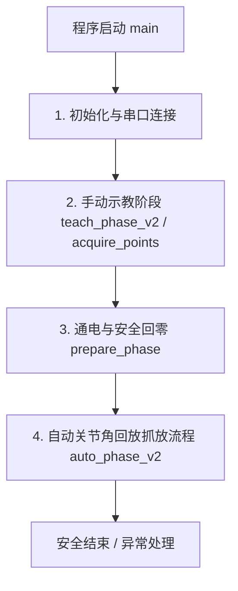

# myCobot 调试脚本代码逻辑与关键部分讲解（初学者友好版）

本指南专门针对初学者，深入浅出地讲解 [teach_replay_pick_return_ready.py](file:///d:/%E7%AC%AC%E5%8D%81%E5%B1%8A%E9%9B%86%E5%88%9B%E8%B5%9B-%E9%9B%84%E8%8A%AF%E9%99%A2%E6%9D%90%E6%96%99/mycobot_pc_tests/teach_replay_pick_return_ready.py) 脚本的代码逻辑与核心技术。

---

## 1. 整体代码架构与模块化分工

该脚本的执行流程可以划分为三个核心阶段，以及一套贯穿始终的安全与滤波机制：



为了让初学者更直观地理解，我们将脚本中各个函数的作用和逻辑关系进行了分类整理：

### 核心函数速查表

| 函数名称 | 核心职责 | 初学者理解要点 |
| :--- | :--- | :--- |
| `get_port()` | 自动检测或让用户选择机械臂的串口 | 通过查找 CP210 / CH340 芯片识别 USB 转串口设备。 |
| `get_filtered_angles()` | 读取并过滤不稳定的关节角数据 | 连续读取两次，只有在差值极小时才算“稳定”，防止抖动。 |
| `get_filtered_coords()` | 读取并过滤不稳定的笛卡尔坐标数据 | 同上，为防止数据野值干扰到位校验。 |
| `record_teach_point()` | 指导并记录某一个抓取/放置点的位姿 | 让机械臂掉电，用户拖动到目标点后读取并作安全校验。 |
| `record_return_ready_point()`| 记录空中安全过渡点 `home_ready` | 专为回零准备的过渡姿态，必须足够直立才能通过安全门。 |
| `checked_short_angles()` | 安全地回放一小段关节角动作 | **最核心的移动函数**。只发关节角度，避开坐标逆运动学解算。 |
| `_soft_refine()` | 软到位后微调精细对齐 | 动作虽结束但有微小偏差时，低速小幅微调以确保高精度抓取。 |
| `safe_return_home()` | 智能安全回零状态机 | 大臂偏差小则自动回零，偏差大则提示用户人工扶正，防止跌落。 |

---

## 2. 关键代码段深度解析

### 2.1 时序抖动滤波：为什么不能直接用 `mc.get_angles()`？
在串口通信中，由于电磁干扰、波特率高达 1000000 的传输抖动等原因，单次读取的角度可能会产生突变错误（野值）。
**代码实现与逻辑：**
```python
def get_filtered_angles(mc, retries=ANG_RETRIES, stable_tol=ANG_STABLE_TOL):
    valid = []
    for _ in range(retries):
        try:
            angles = mc.get_angles() # 向机械臂请求当前关节角度
        except Exception as e:
            time.sleep(0.15)
            continue

        if isinstance(angles, list) and len(angles) >= 6:
            vals = list(angles[:6])
            # 1. 基本合法性校验：不能是无穷大或 NaN，必须在物理范围 [-180, 180] 内
            if all(isinstance(v, (int, float)) and math.isfinite(v) for v in vals):
                if all(-180.0 <= v <= 180.0 for v in vals):
                    valid.append(vals)
                    # 2. 差分稳定性滤波器：必须连续两次读取的差值极小才确信
                    if len(valid) >= 2:
                        prev = valid[-2]
                        cur = valid[-1]
                        delta = max(abs(cur[i] - prev[i]) for i in range(6))
                        if delta <= stable_tol: # stable_tol 默认为 3.0°
                            return cur # 只有两次读数极接近时，才返回当前角度
        time.sleep(0.15)
    return None
```
> [!NOTE]
> **滤波器的本质**：利用了“时间局部性”原理。如果机械臂在静止，前后相隔 150ms 读取的角度应该几乎一致；如果差很多，说明其中至少一次读数受到了串口噪声的干扰。

---

### 2.2 绕过固件逆运动学（IK）解算：`checked_short_angles()`
如果指挥机械臂去某个笛卡尔坐标（例如 `mc.send_coords([X, Y, Z, Rx, Ry, Rz])`），机械臂的内部固件会将该三维空间坐标实时换算成 6 个关节的角度。这种数学计算叫**逆运动学（IK）**。
当机械臂伸得太直或形态别扭时，IK 会产生“奇异点”导致计算崩溃，机械臂会瞬间断电跌落。

**解决策略：**
脚本在自动回放时**彻底抛弃了坐标指令驱动**，只发角度指令 `sync_send_angles()`。但舵机存在死区导致其经常卡在离目标 1~2° 处不动，固件认为没到位，程序就会超时卡死。
为此，脚本编写了**“软到位判断机制”**：
```python
# 核心逻辑简写：
res = mc.sync_send_angles(target_angles, speed, timeout=timeout)
if res == 1:
    return True # 固件认为完美到位，直接通过

# 固件返回了 0 (表示超时未静止到位) -> 启动软到位诊断
actual_angles = get_filtered_angles(mc)
if actual_angles:
    max_angle_delta = max(abs(actual_angles[i] - target_angles[i]) for i in range(6))

    # 软到位门槛：关节偏差 <= 3.0°，且三维空间位置偏差 <= 25.0 mm
    if max_angle_delta <= SOFT_ANGLE_SUCCESS_TOL:
        # 如果提供了预期的坐标，也去比对一下实际坐标差
        if expected_coords and actual_coords:
            coord_delta = max(abs(actual_coords[i] - expected_coords[i]) for i in range(3))
            if coord_delta <= SOFT_COORD_SUCCESS_TOL:
                # 触发 V2.2 引入的二次微调，尝试在安全范围内纠偏精度
                if max_angle_delta > SOFT_REFINE_ANGLE_TRIGGER:
                    _soft_refine(...)
                return True # 允许软通过，程序继续，不抛出异常崩溃
```
> [!TIP]
> **工程智慧**：在硬件达不到完美精度时，利用软件层面的“合理容差”放行，是保证自动化工业流水线稳定不卡死的重要工程手段。

---

### 2.3 智能回零状态机：`safe_return_home()`
回零（即让机械臂完全笔直站立）是测试结束后的标准动作。如果机械臂大臂倾斜得很厉害（比如弯到了桌面上），直接给它发回零指令，由于力矩原因，它会因惯性猛烈下砸，导致滑轨受损。
**安全回零控制逻辑：**
1. 读取当前的大臂关节角（主要关注 1-5 轴），计算它们和直立零位的差值。
2. **安全门门限** `ARM_MAX_DIFF_SAFE` 设定为 **45°**：
   * **偏差 $\le 45^\circ$**：动作安全，低速直接回零（`HOME_RETURN_SPEED = 20`）。
   * **偏差 $> 45^\circ$**：动作危险！强行拦截，进入**人工扶正流程**。
3. **人工扶正流程（主动安全）**：
   * 打印警告，要求用户“用手扶稳”。
   * 掉电释放舵机（`release_all_servos`），此时舵机变软，用户可以轻松将它扶到接近直立状态。
   * 用户操作完毕后，重新通电抱死舵机（`power_on`），并等待 1.5 秒读取稳定数据。
   * 再次校验大臂偏差是否小于 45°，直到安全后，再执行低速自动回零。

---

## 3. 常见初学者疑问与解答 (FAQ)

#### Q1: 为什么有 `is_safe_coord` 和 `is_valid_coord_reading` 两个安全校验，它们有什么区别？
* `is_safe_coord` 是**业务级安全校验**。只在抓取和放置等动作区间生效。它规定了 Z 轴高度上限为 280mm（防止撞到上面的支架），R 工作半径至少 60mm 等。
* `is_valid_coord_reading` 是**读数有效性校验**。用来拦截串口通信产生的野值。因为机械臂站直时高度 Z 能够达到 417mm 左右，如果在这里套用 `is_safe_coord` 的 280mm 限制，站直时的正常坐标就会被误认为是野值而过滤掉。

#### Q2: 什么是空中安全过渡点 `home_ready`？为什么非要示教这个点？
在回放流程的最后，机械臂抓完放完物体后，处于 `drop_hover` 姿态（大臂一般倾斜角接近 70°）。
* **如果不经过 `home_ready`**：直接从倾斜 70° 回零，偏差 $70^\circ > 45^\circ$，安全回零函数会判定当前处于危险状态，**每次都会强行打断流程进入人工扶正**，无法实现自动化。
* **如果经过 `home_ready`**：在 `drop_hover` 和直立零位之间设置一个过渡点。先走到这个过渡点（它足够直立，偏差 $\le 40^\circ$），然后再执行回零。这样回零前偏差仅 $\le 40^\circ < 45^\circ$，就能完美避开人工扶正，全自动安全回零。

---

## 4. 深入专题一：逆运动学（IK）奇异点与关节角驱动科普

对于初学者来说，机械臂是如何根据我们的指令动起来的，往往是一大难点。这里我们用最通俗的语言解释为什么脚本要采用**关节角（Angles）驱动**。

### 4.1 正运动学 (FK) vs 逆运动学 (IK)
* **正运动学 (Forward Kinematics, FK)**：
  * **通俗解释**：已知 6 个关节分别旋转了多少度，去计算机械臂最末端的夹爪在三维空间中的具体位置 $(X, Y, Z)$。
  * **数学特点**：这是一个“单值映射”，也就是关节角度一旦确定，夹爪位置就是唯一的。计算非常简单直接，在任何姿态下都能百分百算出来，**永远不会报错**。
* **逆运动学 (Inverse Kinematics, IK)**：
  * **通俗解释**：已知目标位置是 $(X, Y, Z)$，反过来去计算 6 个关节各转多少度，才能让夹爪刚好到达这个点。
  * **数学特点**：计算极其复杂（涉及大量非线性的三角方程和矩阵乘法）。它不仅可能有多组解（比如你可以手肘朝上夹取，也可以手肘朝下夹取），甚至在很多地方是**无解**的。

### 4.2 什么是“奇异点 (Singularity)”？
当机械臂在进行逆运动学（IK）解算时，如果机械臂完全伸直，或者两个旋转轴重合在了一条直线上，在物理上机械臂会**失去某个方向的活动自由度**（比如此时无论关节怎么转，夹爪都无法沿着伸直的方向再前进一毫米）。

在数学上，这种情况对应着“雅可比矩阵行列式为 0”。此时如果夹爪还要继续微调位置，公式计算出来的某些关节旋转速度就会趋近于**无穷大**。机械臂固件为了防止马达烧毁，会**触发软硬件熔断保护**——即切断电机供电。这时，失去动力的机械臂就会从空中直接跌落，摔伤外设或自身。

### 4.3 为什么关节角驱动对初学者更友好？
* **规避数学奇异点**：既然我们直接下发角度（例如 `[10, -20, 30, 0, 0, 0]`），机械臂内部的电机就直接转到对应的角度，**根本不需要解任何逆运动学方程**。这就从根本上杜绝了因为奇异点计算报错而导致的“跌落”和“疯摆”事故。
* **运动路径可控**：两组角度之间的过渡是简单的线性插值，动作极其顺滑平稳，不会产生“腕部突然剧烈自转 180°”这种奇异翻转。

---

## 5. 深入专题二：如何在板上 CPU (RISC-V) 端用 C/C++ 实现类似的通信与安全逻辑

由于 PC 端脚本只用于调试，决赛中我们必须把这套逻辑移植到板上的 **RISC-V CPU** 中，使用 C/C++ 语言直接控制机械臂。下面是核心逻辑在 C/C++ 下的移植参考。

### 5.1 C/C++ 封装串口命令下发
myCobot 使用标准串口通信（115200 或 1000000 波特率）。数据包具有严格的帧格式：
* **帧头**：`0xfe 0xfe`
* **长度**：后面跟随的数据字节数
* **命令字**：例如下发关节角的命令是 `0x22`
* **数据**：具体关节角度值（通常需要将角度浮点数转换为整型或定点数发送，具体视协议定义）
* **校验/帧尾**：`0xff`

**发送关节角（Angles）的 C 语言实现示例：**
```c
#include <stdint.h>
#include <string.h>

// 假设我们通过串口发送数据的底层函数是 uart_send(uint8_t *data, uint16_t len)
void send_angles_to_mycobot(float *angles, int speed) {
    uint8_t tx_buf[20];
    tx_buf[0] = 0xfe; // 帧头1
    tx_buf[1] = 0xfe; // 帧头2
    tx_buf[2] = 16;   // 长度：数据包总长度（除去帧头和自身）
    tx_buf[3] = 0x22; // 命令字：写入关节角度 (Write Angles)

    // myCobot 串口协议中，角度需要乘以 100 并转换为 16 位有符号整型发送
    for (int i = 0; i < 6; i++) {
        int16_t angle_val = (int16_t)(angles[i] * 100.0f);
        tx_buf[4 + i * 2]     = (uint8_t)((angle_val >> 8) & 0xff); // 高8位
        tx_buf[5 + i * 2]     = (uint8_t)(angle_val & 0xff);        // 低8位
    }

    tx_buf[16] = (uint8_t)speed; // 运动速度
    tx_buf[17] = 0xff;           // 帧尾

    // 调用底层 UART 硬件驱动发送数据帧
    uart_send(tx_buf, 18);
}
```

### 5.2 在 RISC-V 裸机/RTOS 下实现“时序抖动滤波器”
在嵌入式端，由于没有 Python 方便的 list 操作，我们需要手动维护一个双缓冲区或简单的状态变量来做差分校验。

```cpp
#include <cmath>
#include <stdbool.h>

#define STABLE_TOL 3.0f   // 关节角稳定性容差（3.0度）
#define MAX_RETRIES 8

// 假设读取关节角的底层函数（从串口接收并解析数据包）为 read_angles_from_uart
bool get_filtered_angles_cpp(float *out_angles) {
    float prev_angles[6];
    float cur_angles[6];
    bool has_prev = false;

    for (int retry = 0; retry < MAX_RETRIES; retry++) {
        // 从串口尝试读取当前角度
        if (read_angles_from_uart(cur_angles)) {
            // 合法性校验：角度不能越界
            bool valid = true;
            for (int i = 0; i < 6; i++) {
                if (cur_angles[i] < -180.0f || cur_angles[i] > 180.0f || std::isnan(cur_angles[i])) {
                    valid = false;
                    break;
                }
            }

            if (valid) {
                if (has_prev) {
                    // 差分滤波器核心：计算两次读取的最大偏差
                    float max_diff = 0.0f;
                    for (int i = 0; i < 6; i++) {
                        float diff = std::abs(cur_angles[i] - prev_angles[i]);
                        if (diff > max_diff) {
                            max_diff = diff;
                        }
                    }

                    // 连续两次偏差足够小，认为数据稳定可信
                    if (max_diff <= STABLE_TOL) {
                        std::memcpy(out_angles, cur_angles, sizeof(cur_angles));
                        return true;
                    }
                }
                // 保存当前角度为上一轮历史
                std::memcpy(prev_angles, cur_angles, sizeof(cur_angles));
                has_prev = true;
            }
        }
        // 延时 150 毫秒，等下一次机械臂内部数据刷新
        delay_ms(150);
    }
    return false; // 多次尝试无法读取稳定角度
}
```

### 5.3 在 C/C++ 中实现安全门控与动作拦截
要在 RISC-V 端部署安全防护（如 `safe_return_home`），我们需要实时计算当前大臂相对于直立状态的偏移量，并在超限时切断舵机动力（通过串口下发释放指令，如命令 `0x13` 释放所有关节）。

```cpp
#define ARM_MAX_DIFF_SAFE 45.0f

// 零位参考值
const float HOME_ANGLES[6] = {0.0f, 0.0f, 0.0f, 0.0f, 0.0f, 0.0f};

// 安全校验回零
bool check_and_return_home_cpp() {
    float current_angles[6];

    // 1. 读取稳定关节角
    if (!get_filtered_angles_cpp(current_angles)) {
        // 读不到稳定角度时拒绝运动，直接释放舵机以防飞车
        release_all_servos_cpp();
        return false;
    }

    // 2. 计算大臂（1-5轴）偏差
    float arm_max_diff = 0.0f;
    for (int i = 0; i < 5; i++) {
        float diff = std::abs(current_angles[i] - HOME_ANGLES[i]);
        if (diff > arm_max_diff) {
            arm_max_diff = diff;
        }
    }

    // 3. 安全决策分支
    if (arm_max_diff <= ARM_MAX_DIFF_SAFE) {
        // 安全：下发回零动作，速度为 20%
        send_angles_to_mycobot(HOME_ANGLES, 20);
        return true;
    } else {
        // 危险：大臂倾角过大！立即释放舵机，让机械臂处于阻尼卸力状态，防止剧烈砸落
        release_all_servos_cpp();
        // 并在 RISC-V 控制台串口输出强警告，请求人工扶正
        printf("⚠️ [WARNING] arm_max_diff = %.1f > %.1f! Servos released for safety.\n",
               arm_max_diff, ARM_MAX_DIFF_SAFE);
        return false;
    }
}
```

> [!IMPORTANT]
> **状态机非阻塞设计**：在 RISC-V RTOS 环境中，以上代码通常会作为一个独立的**高优先级监控任务**循环运行（如每 50ms 校验一次安全状态）。一旦在自动抓放期间大臂发生剧烈晃动导致 `arm_max_diff > 45`，监控任务会立即夺取控制权下发 `release` 指令，从而在硬件底层实现主动安全防御。

---

## 6. 推荐后续学习与实验任务
1. **观察串口输出**：尝试使用串口助手观察 `get_angles()` 返回的原始字符串，理解滤波器的必要性。
2. **微调软到位参数**：修改 `SOFT_ANGLE_SUCCESS_TOL`，感受容差对机械臂到位率和动作耗时的实际影响。
3. **理解预设加载**：运行 `python ... --preset <name>`，观察其如何跳过示教流程，但在后台依然一丝不苟地执行各种安全门校验。
