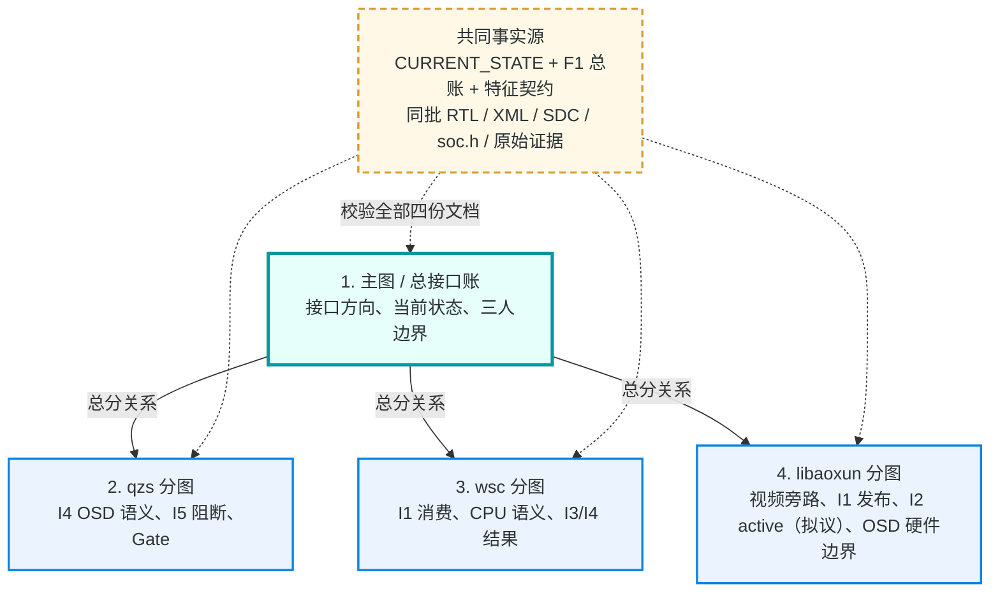
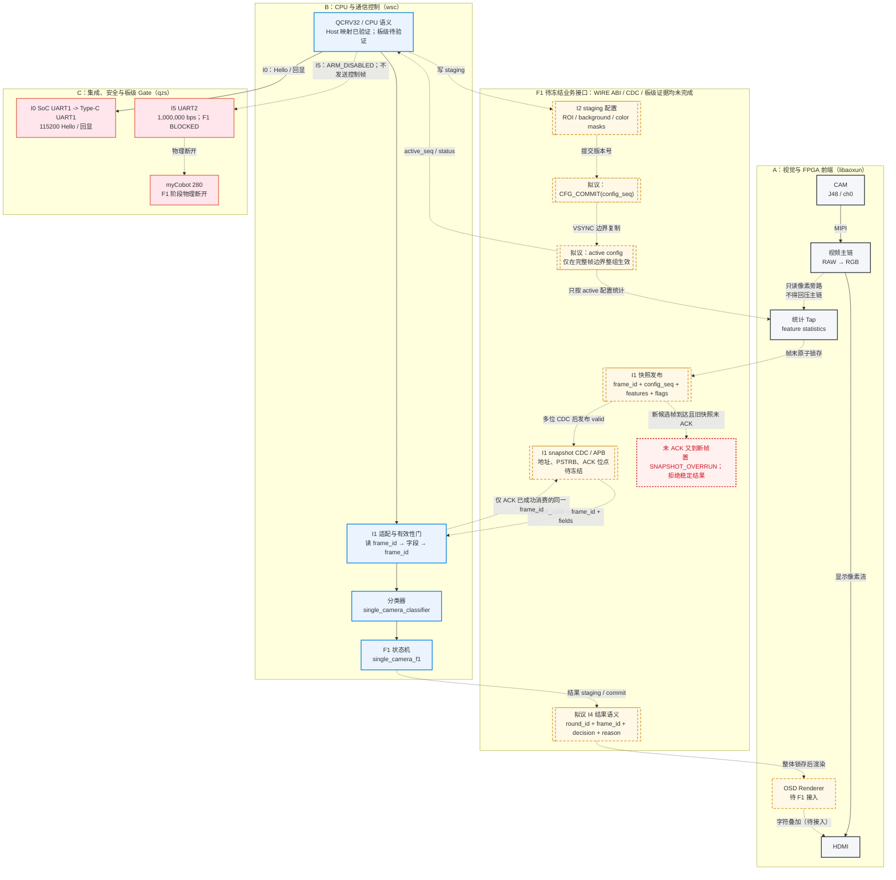
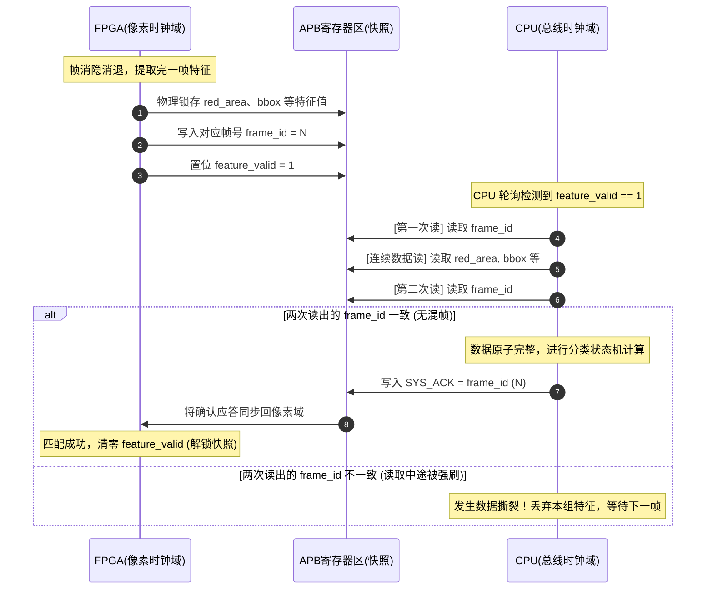

# 1. 项目数据链路与三人分工对齐指南

本指南配合正式单摄视频/识别工程（[competition_project_single_camera](../../competition_project_single_camera/)）的冻结标准，详细拆解单摄 F1 阶段的系统级数据链路传输规则，并明确团队三位成员（A: libaoxun, B: wsc, C: qzs）的唯一写入边界。原双摄方案已取消。

---

## 目录
0. [四份文档的总分导航与共同核对](#0-四份文档的总分导航与共同核对)
1. [白话背景：为什么采用旁路 Tap 与 Valid-ACK？](#1-白话背景为什么采用旁路-tap-与-valid-ack)
2. [项目整体数据传输链路与队员分工图示](#2-项目整体数据传输链路与队员分工图示)
3. [单摄 F1 接口清单（I0 - I5）详细对齐](#3-单摄-f1-接口清单i0---i5-详细对齐)
4. [核心握手机制深度剖析（防撕裂与原子配置）](#4-核心握手机制深度剖析防撕裂与原子配置)
5. [三位成员 15 分钟联合调试极速核对清单](#5-三位成员-15-分钟联合调试极速核对清单)

---

## 0. 四份文档的总分导航与共同核对

本文件是**总图与共同协议入口**；其余三份是从总图各自拉出的责任分图。阅读顺序固定为：先读本主图确认接口方向和状态，再读自己负责的分图，最后用共同核对表回到源文件。不允许分图单独“补齐”未冻结的硬件事实。

🔍 点击展开/收起：总分导航图专有名词释义

*   **主图 / 总接口账 (Master Guide)**：本系列的指挥部，统一规定系统的所有数据流向、接口协议（I0-I5）与当前的 Gate 状态，是协作的第一真理入口。
*   **分图 (Role Guides)**：分别对应三位队员（qzs、wsc、libaoxun）的“战术放大图”，将总图中的某一条支路进行超高清的局部细节展示。
*   **共同事实源 (Common Source of Truth)**：指项目中的权威物理边界（如 [CURRENT_STATE.md](../../CURRENT_STATE.md)、[AGENTS.md](../../AGENTS.md) 和同批编译产生的 `soc.h` 等），任何文档在描述硬件和状态时，都必须以此为最高基准。

📖 点击展开/收起：总分导航图图文对照生动表述

本图犹如一张**“联合作战图纸”**。最中央的指挥官就是**“主图/总接口账”**，它决定了前线所有的防区方向（I0-I5）与当前的停火/交战状态（Gate）。主图下方派生出三张分图，分别分发给负责不同防区的三位战士：**qzs** 负责防守机械臂命令的安全铁闸与 OSD 战报屏幕显示；**wsc** 负责在大脑（CPU）中接收前线情报并制定分类决策；**libaoxun** 负责在流水线（FPGA）上安装只读的高速照相机进行前线拍照。而整张地图的边界和底线，由隐藏在幕后的“共同事实源”这本“战争大纲”随时校准，防止任何战士凭空臆造前线情况。

| 文档 | 谁先读 | 从主图放大的支路 | 必须保留的结论 |
|---|---|---|---|
| [1. 主图](1_project_data_link_and_roles_guide.md) | 全员 | 全链路与 I0-I5 | 实线不是板级 PASS；虚线接口仍待 F1 ABI 审查 |
| [2. qzs 分图](2_qzs_role_data_link_and_control_logic.md) | qzs/全员 | `CTRL → I4 → OSD`、`I5`、G1/F1 Gate | OSD 未实现；UART2/J52 与机械臂在 F1 阶段阻断 |
| [3. wsc 分图](3_wsc_cpu_semantics_and_interface_guide.md) | wsc/全员 | `I1 → ADAPT → CLS → CTRL → I4` | Host/fake transport 不是真实 MMIO；不稳定快照不产生稳定业务结论 |
| [4. libaoxun 分图](4_libaoxun_fpga_video_and_feature_interface_guide.md) | libaoxun/全员 | `视频主链 → Tap → I1`、`I2 → active config → Tap` | Tap 只读不回压；当前顶层 feature 仍禁用且未接 CPU |

### 全队每次接口变更前必须一起核对

| 要确认的问题 | 共同文件 | 谁给出结论 |
|---|---|---|
| 当前 Gate、禁止项和板级证据边界是什么？ | [CURRENT_STATE.md](../../CURRENT_STATE.md) 与当前批次操作卡 | qzs 组织，三人确认 |
| I1/I2/I3/I4/I5 的语义、状态和所有权是什么？ | [F1_INTERFACE_ALIGNMENT_DRAFT.md](../../competition_project_single_camera/integration/F1_INTERFACE_ALIGNMENT_DRAFT.md) | 三人共同确认 |
| 特征字段、flags、ACK/overrun、I2 active 规则是什么？ | [single_camera_feature_contract.md](../../competition_project_single_camera/integration/single_camera_feature_contract.md) | libaoxun + wsc |
| 一次硬件改动会失效哪些构建/证据？ | 同批 `top.v`、`mem_test.xml`、`mem_test.peri.xml`、`constrain.sdc`、IP、BSP/`soc.h` 和 Review Packet | libaoxun 提供输入，qzs 记录，wsc 复核 ABI |

### 交给 Gemini 的全局不可修改边界

Gemini 只能做 Mermaid 布局美化、视觉分层、类比和知识点扩写；不得修改四份文档中的接口方向、当前状态、字段/flags、所有权、Gate、文件链接、`NOT VERIFIED`/`未实现`结论或任何安全禁止项。尤其不得新增地址、端口、时钟/复位、PSTRB、IRQ、I3 输入来源、UART2 操作或机械臂步骤；不得改动源码、XML/peri、SDC、IP、BSP、构建制品、操作卡和 `CURRENT_STATE.md`。任何事实性变更必须先以同批真源 and Review Packet 复核。

---

## 1. 白话背景：为什么采用旁路 Tap 与 Valid-ACK？

在分析数据链路前，为了降低全员的理解负担，我们先用两个生动的工程直觉比喻来解释系统底层的设计意图：

*   **旁路形式 (Tap) ── “自来水管的旁路流量计”**：
    *   *直觉比喻*：如果我们在水管的主干管道上加装一个阀门，阀门一旦卡死，整栋楼就停水了。因此我们在主干管道旁边接了一个极小的分流细管，装了个流量表（只读 Tap）。主管道继续源源不断流向 HDMI 屏幕，流量表只默默读取数据，无论流量表出什么故障，都不会影响主水管的流速。
    *   *严密工程定义*：FPGA 的视频采集与 HDMI 显示通路为主链路，特征统计模块以只读旁路方式挂载。特征模块不阻碍、不背压像素时钟域的主像素流，从而保证画面显示的绝对流畅度与零延迟。
*   **Valid-ACK 握手 ── “快递自提柜的签收机制”**：
    *   *直觉比喻*：快递员（FPGA）把快递放入快递柜，发个短信说“已放入，验证码是 N”（`feature_valid=1`, `frame_id=N`）。收件人（CPU）必须输入正确的验证码把快递拿走（读取完毕），并回传一个签收单给快递员（写入 `SYS_ACK = frame_id`）。如果收件人没有签收，快递员绝对不会强行塞入新的快递，而是直接拒收新快递并标记“快递柜已满”（`SNAPSHOT_OVERRUN=1`）。
    *   *严密工程定义*：为了防止 CPU 读取大容量特征时跨时钟域（CDC）产生数据撕裂（前半段读到第 1 帧，后半段读到第 2 帧），采用 Valid-ACK 强互锁机制。未收到 ACK 前，FPGA 锁存特征快照寄存器，不予覆盖更新。

---

## 2. 项目整体数据传输链路与队员分工图示

下图把**已经存在的主视频旁路原则与 Host 语义**和**尚待 F1 ABI 审查的业务接口**分开画出：实线表示已有结构/已对齐语义，虚线表示尚未冻结寄存器地址、CDC 或板级证据的 F1 目标链路。这样不会把 I1/I2/I4 误读为已经可用的 APB 外设。

🔍 点击展开/收起：项目整体链路专有名词释义

*   **CAM / J48 / ch0**：摄像头输入通道，即单路视频采集流起点。
*   **RAW $\rightarrow$ RGB**：图像传感器输出的原始彩色滤镜数据（RAW 格式）经过 Debayer 算法插值还原成我们能看懂的 RGB 彩色图像。
*   **HDMI**：高清晰度多媒体接口，用于实时无卡顿显示摄像头采集到的高清画面。
*   **Tap 旁路 (feature statistics tap)**：从高速视频流中旁路“只读监听”出特征数据，不介入视频主干，不会造成画面卡顿。
*   **QCRV32 CPU**：板上运行的 32 位轻量级 RISC-V CPU 软核，用于运行 C 程序分类器和控制状态机。
*   **OSD (On-Screen Display)**：未来的屏幕字符显示叠加器。拟议职责是在 HDMI 输出上绘制可解释文字；目标框、字体、清屏和像素渲染细节均尚未冻结或实现。
*   **I0 UART1**：SoC UART1 路由到板载 Type-C UART1（RX=`GPIOR_96/B12`、TX=`GPIOR_100/D12`），115200bps，用来让 CPU 向上位机电脑“自证存活”。UART0/R0 仅作历史证据。
*   **UART2**：机械臂控制串口（1000000bps），用于发送 myCobot 的控制指令帧。
*   **myCobot 280**：六轴桌面机械臂，执行最终的分拣物块抓取和轻拿轻放动作。
*   **CDC (Cross Clock Domain，跨时钟域)**：在不同频率时钟电路（如视频像素时钟域与 APB 总线时钟域）之间进行安全的信号同步与传输。

📖 点击展开/收起：项目整体链路图文对照生动表述

把这个系统比喻为**“一家自动化的智能港口分拣中心”**：
1.  **A区（流水线前端）**：摄像头是入库货物扫描口，把像素流送往 HDMI 这个“货物出港大门”。传送带旁已有只读 Tap RTL/testbench；但顶层使能固定关闭，因此当前没有可供 CPU 读取的统计数据。未来 Tap 只允许旁路统计，不得反向影响视频主链。
2.  **F1 调度层（数据暂存柜）**：I1 快照、Valid-ACK 与 I2 暂存—提交—完整帧生效，是待 F1-ABI 审查冻结的协议模型，不是当前 APB 接口。它们的目的，是避免 CPU 读到撕裂快照或统计途中切换配置。
3.  **B区（调度大脑）**：wsc 已有 Host/fake-transport 下的分类与状态机语义。未来仅在 I1 ABI 冻结后，才可按双读 `frame_id` 等规则消费硬件快照；尺寸目前不可用，不能据此授权任务三、四或机械臂执行。
4.  **C区（执行与安全防线）**：qzs 负责冻结展示需求、审查 Gate 和保存安全证据。I4 的文字显示是拟议 OSD 链路；F1 只要求 `arm_enabled=0` 语义且 UART2/J52 信号线保持断开，不据此声称 OSD 或机械臂已经可用。

---

## 3. 单摄 F1 接口清单（I0 - I5）详细对齐

在摄像头采用单路分工（ch0）的配置下，接口的详细规则如下：

### 3.1 I0: CPU 生命证明（QCRV32 SoC UART1 $\rightarrow$ Type-C UART1）
*   **提供方**：CPU (B 负责固件，C 负责测试与串口采集)
*   **消费方**：Host 主机 / 调试串口助手
*   **物理层**：RX=`GPIOR_96/B12`、TX=`GPIOR_100/D12`，`115200 8N1`。
*   **功能**：CPU 启动后通过 UART1 打印首字符及 Hello 横幅，并回显单字符。同一固定输入 hash 可在一次批准窗口内继续只读 APB MAGIC；这只关闭 I0-SMOKE，不自动授权 I1-I4 业务 MMIO。

💡 点击展开/收起：I0 接口生动形象中文介绍

这就像是**“初生婴儿的第一声啼哭”**，或者是**“潜水员入水后拉了拉绳子自证还活着”**。它只是最纯粹、最简单的心跳证明。虽然它大声朝串口喊了一声“Hello！我正常取指运行了！”，但你可千万别以为它能马上搬砖（进行外设读写）或者开起重机（控制机械臂）。只有这一声啼哭被主控台确认听到后，我们才敢放心允许后续的总线操作，防止一上电就脑死亡（总线异常死锁）却无处报错。

### 3.2 I1: 特征快照（FPGA $\rightarrow$ CPU，只读）
*   **提供方**：FPGA (A 负责) $\rightarrow$ **消费方**：CPU (B 负责)
*   **线 ABI 状态**：寄存器偏移未冻结，基于 [single_camera_feature_adapter.h](../../competition_project_single_camera/cpu/include/single_camera_feature_adapter.h) 进行语义提取。
*   **特征定义**：
    1.  `frame_id` (16-bit)：FPGA 输出帧编号，用于丢帧和数据撕裂检测。
    2.  `config_seq` (16-bit)：本帧特征计算时，硬件实际采用的配置序列号。
    3.  `red_area` / `blue_area` / `yellow_area` (32-bit)：ROI 内过滤出的三色面积像素值。
    4.  `foreground_area` (32-bit)：ROI 内的前景总面积（即偏离背景的像素数）。
    5.  `roi_pixel_count` (32-bit)：物理 ROI 框内的像素总数。
    6.  `sum_luma` (32-bit)：ROI 区域内 $R+G+B$ 累积和，用于计算平均亮度。
    7.  `bbox_width` / `bbox_height` (16-bit)：前景的最小包围盒宽度与高度。
    8.  `source_flags` (8-bit)：状态标志字节。
        *   `SC_FEATURE_FLAG_FRAME_STABLE` (0x01)：帧信号稳定。
        *   `SC_FEATURE_FLAG_ROI_VALID` (0x02)：当前 ROI 配置合法。
        *   `SC_FEATURE_FLAG_STATS_VALID` (0x04)：提取到的特征有效。
        *   `SC_FEATURE_FLAG_DIAG_ACTIVE` (0x08)：诊断模式开启。
        *   `SC_FEATURE_FLAG_COUNTER_OVERFLOW` (0x10)：累加器溢出故障。
        *   `SC_FEATURE_FLAG_SNAPSHOT_OVERRUN` (0x20)：CPU 消费不及时导致丢帧。
        *   `SC_FEATURE_FLAG_SOURCE_CH0` (0x40)：当前通道为 ch0。

💡 点击展开/收起：I1 接口生动形象中文介绍

这就像是**“前线侦察兵拍下的敌情快照照片”**。里面塞满了红、蓝、黄各色面积以及物块的长宽边界（特征统计值）。为了防止长官看报告看到一半时，侦察兵强行塞过来一张新战况，导致长官把前一战的照片拼到这一战中（数据撕裂），我们把照片放进“防弹保险箱”并置位有效。长官看完了确认无误，把写有相同照片编号的“收单（ACK）”扔回前线，保险箱才能开箱存下一张照片。如果长官看太慢，前线的新照片直接扔掉并亮起红灯警告（SNAPSHOT_OVERRUN）。

### 3.3 I2: 统计配置（CPU $\rightarrow$ FPGA，写暂存区）
*   **提供方**：CPU (B 负责) $\rightarrow$ **消费方**：FPGA (A 负责)
*   **功能**：CPU 调节物块分拣参数。包括 ROI 坐标 `{x0, y0, x1, y1}`、背景参考 RGB 均值、三色过滤阈值、`config_seq` 版本号。

💡 点击展开/收起：I2 接口生动形象中文介绍

这就像是**“指挥部下发给前线侦察兵的夜视仪调焦指令”**。如果指挥官调参数时，写一个生效一个，前线士兵就会因为夜视仪焦距忽近忽远而瞬间晕厥（产生数据过滤畸变）。所以我们设计了暂存箱：指挥官写新参数时先全部写在草稿纸上（Staging 暂存），只有等到两场战役交接的休战期（VSYNC 场消隐消退边界），前线才一次性把草稿纸誊写在设备上（Active 生效），保证哪怕在换参数，一帧的累计也是基于同一套调焦标准。

### 3.4 I3: 轮次目标与操作事件（输入侧 $\rightarrow$ CPU，待设计）
*   **定义**：当前只有 CPU Host/fake-transport 事务语义，尚未定义外部按键、UI 或总线事件来源。Host 测试事件不代表已有板级输入，不得沿用旧双摄字段。

💡 点击展开/收起：I3 接口生动形象中文介绍

这就像是**“红头文件下达的今日剿匪目标任务”**。它明确指示大脑“今天我们只抓正方体”或者“今天抓红色正方体”。由于我们目前还没有物理上的通信员（尚未定义外部物理输入形式），所以文件只能由 Host 模拟产生，切不可假定前线已经焊好了红色开始按钮（无板级物理目标输入）。

### 3.5 I4: 结果与 OSD 语义（CPU $\rightarrow$ FPGA OSD，写暂存区）
*   **提供方**：CPU (B 负责) $\rightarrow$ **消费方**：FPGA OSD 渲染器 (A 负责 OSD，C 负责展示要求与测试)
*   **拟议功能**：未来 CPU 结果语义可包含颜色、形状、尺寸可用性、`decision` 与 `reason`，由未来 OSD 链路渲染为可解释文本。**禁止直接显示不可解释的寄存器裸值；不得把该语义模型写成已存在的 OSD 寄存器。**

💡 点击展开/收起：I4 接口生动形象中文介绍

这就像是**“港口总部的电子大喇叭公告牌”**。可千万别把一堆只有机器能看懂的十六进制裸寄存器扔在大屏幕上，让评委老师猜这代表什么。电子大喇叭需要把战报翻译成人话：“当前第 2 轮”、“检测到红色圆柱体”、“跳过不抓，因为形状不符”。这块屏幕是调试的“大眼睛”，而且只有在大脑把字全部写完、确认拉起有效旗帜后，大屏幕才会一次性刷新渲染，防止写字写到一半造成大屏幕字符闪烁或重叠。

### 3.6 I5: 机械臂命令（CPU $\rightarrow$ myCobot，彻底阻断）
*   **F1 安全要求**：UART2/J52 到 myCobot 的信号线保持断开；语义结果固定 `arm_enabled = 0`，只允许 `EXECUTE_ARM_DISABLED`，禁止发送任何 myCobot 控制帧。该要求不证明机械臂、UART2 或电气状态已经验证。

💡 点击展开/收起：I5 接口生动形象中文介绍

这是一条**“双重隔离线”**：F1 以软件语义 `arm_enabled=0` 和“不初始化、不发 UART2 帧”为第一层限制；现场还必须以接线照片、操作卡和用户确认核实 UART2/J52 信号线保持断开。它降低未经批准动作的风险，但不替代后续独立 Gate 的电气、线序、急停与动作验证。

---

## 4. 核心握手机制深度剖析（防撕裂与原子配置）

### 4.1 I1 双读防撕裂时序与 Valid-ACK 握手
为解决 CPU 总线时钟与 FPGA 像素时钟“隔洋通话”（异步 CDC）可能导致的数据撕裂，系统遵循以下握手时序：

🔍 点击展开/收起：I1 握手时序专有名词释义

*   **frame_id**：图像统计特征的帧流水号，由 FPGA 依次递增生成。
*   **feature_valid**：物理握手信号，为 1 时指示寄存器中的特征快照已被锁存，等待 CPU 读取。
*   **SYS_ACK**：系统确认应答，CPU 写回该寄存器以告知硬件当前帧特征已被成功读取消费。
*   **数据撕裂 (Tearing)**：由于读取总线与写入总线异步，在读取中途发生数据覆盖，导致读出一半新数据、一半旧数据的混合失真状态。

📖 点击展开/收起：I1 握手时序图文对照生动表述

本图展示了**“带着指纹确认的自提柜取件流程”**：
1.  **放件**：快递员（FPGA）把特征包裹塞入快递柜（REG），同时贴上条形码（frame_id = N），并在外面挂牌“快递已到（feature_valid = 1）”。
2.  **取件**：客户（CPU）来取件。为了防止取件取到一半时柜门没锁，快递员又塞入新快递（数据撕裂），客户执行**“双读条码”**操作：开柜前看一眼条形码（第一次读 `frame_id`），把红蓝黄面积拿出来，关柜门前再看一眼条形码（第二次读 `frame_id`）。
3.  **验签**：如果两次看到的条形码一致，说明中间没人动过包裹，客户签字画押签收（写 `SYS_ACK = N`）。快递员收到签收单，把柜门锁上并摘牌（feature_valid 清零），开始准备下一次投递。如果两次条形码不一样，客户判定包裹被动过，直接拒收（丢弃重来）。

### 4.2 I2 暂存-提交机制 (Staging-Commit)
为了防止 CPU 在写多个配置（如 ROI 的四个坐标）时“写一个生效一个”，导致 FPGA 在中间状态下计算出错误的特征，系统采用原子生效机制：

1.  **Staging 暂存**：CPU 将新配置参数分别写入暂存寄存器，此时 FPGA 并不实际采用这些参数。
2.  **Commit 提交**：CPU 将配置递增的版本号写入 `CFG_COMMIT = config_seq`。
3.  **Active 生效**：FPGA 像素处理模块等到**场消隐 (VSYNC) 边界**时，一次性把暂存寄存器的内容全部搬移到实际工作寄存器（Active Shadow）中，并回传 `active_seq` 给 CPU。这保证了一帧像素的提取始终基于同一套参数。

---

## 5. 三位成员 15 分钟联合调试极速核对清单

### A：FPGA与视频前端负责人 (libaoxun) 的“硬关口”
*   [ ] **CDC 隔离审查**：I1 特征快照在跨时钟域（Pixel clk $\rightarrow$ APB clk）时，是否使用了异步 FIFO 或握手 CDC 方案？（严禁多位总线直接用两级触发器同步）。
*   [ ] **原子锁存**：`frame_id`、`red_area` 与包围盒宽高在帧末尾是否是在同一拍像素时钟物理写入快照寄存器？
*   [ ] **Overrun 置位逻辑**：若 `feature_valid` 仍为 1 且新帧到达，状态机是否能物理丢弃新帧统计并把 `SNAPSHOT_OVERRUN` 状态位置 1？

### B：嵌入式 CPU 与通信控制负责人 (wsc) 的“软件关口”
*   [ ] **双读校验语义**：在 [single_camera_feature_contract.md](../../competition_project_single_camera/integration/single_camera_feature_contract.md) 与 [single_camera_runtime.c](../../competition_project_single_camera/cpu/src/single_camera_runtime.c) 中，是否保持“读前后 `frame_id` 一致才消费、同帧才 ACK”的语义？真实 MMIO backend 当前仍 fail-closed。
*   [ ] **故障拦截**：在分类器入口中，是否严格拦截了 `STATS_VALID == 0`、`COUNTER_OVERFLOW == 1` 和 `SNAPSHOT_OVERRUN == 1` 的异常状态？
*   [ ] **降级保护**：当 `foreground_area == 0`（前景模块未就绪）时，软件分类器是否能通过三色面积之和 `(red_area + blue_area + yellow_area)` 进行估算降级，避免分类瘫痪？

### C：机械臂控制调试与项目系统维护负责人 (qzs) 的“安全与集成关口”
*   [ ] **物理断线确认**：UART2（J52）控制线与 myCobot 机械臂是否已完全拔除？
*   [ ] **F1 安全语义确认**：I4 的拟议结果语义是否保持 `arm_enabled=0` 与 `EXECUTE_ARM_DISABLED`？这不是已存在的 OSD 回写结构体，更不代表 UART2 已初始化。
*   [ ] **板级 Gate 推进**：是否先固定 I0-BUILD 输入/hash，再在一次批准窗口内按 USER2 $\rightarrow$ UART1 Hello $\rightarrow$ 只读 APB MAGIC 连续完成 I0-SMOKE？（禁止对未由新 `soc.h` 证明的 MMIO 地址试探读写）。
