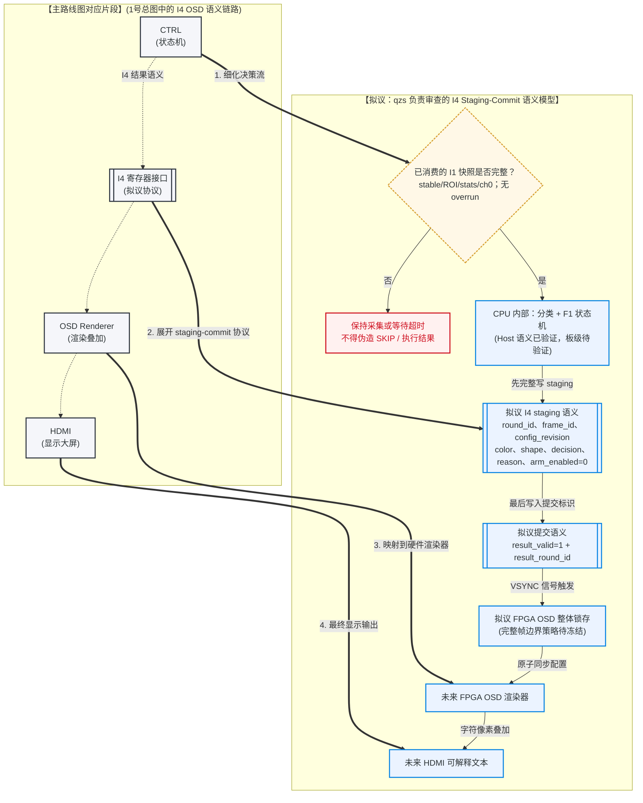
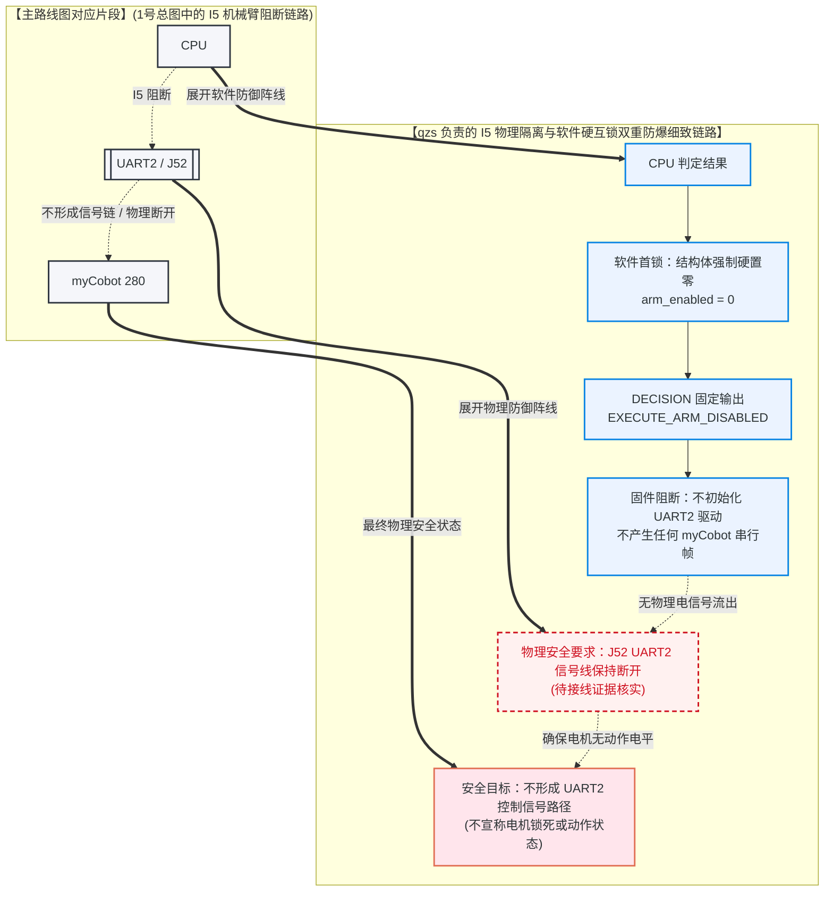
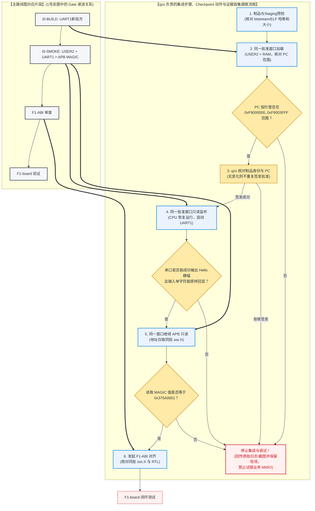

# 2. QZS 视角：I4 OSD、I5 安全与 Gate 控制链路

本指南是 [主图：项目数据链路与三人分工](1_project_data_link_and_roles_guide.md#2-项目整体数据传输链路与队员分工图示) 的**局部放大图**。它只展开主图中的三条 qzs 责任支路：

1. `CTRL → I4 → OSD → HDMI`：CPU 结果语义到 OSD 的**拟议**提交协议；
2. `CPU → I5 → UART2/J52 → myCobot`：F1 阶段必须保持阻断的安全边界；
3. `I0 / G1 → F1-ABI → F1-board`：按当前批次证据推进、不得越级的 Gate 链。

> **当前状态（2026-07-18 实读）**：单摄已固定为正式视频/识别路线；I0 UART1 路由已冻结但尚未生成，I4 为 `SEMANTICS PROPOSED`，I5 为 `OUT OF F1 / BLOCKED`。业务 APB、CDC、ACK、result/OSD 均未实现，板级特征与 OSD 均未验证。原双摄方案取消。

权威事实以 [CURRENT_STATE.md](../../CURRENT_STATE.md)、[F1 接口对齐总账](../../competition_project_single_camera/integration/F1_INTERFACE_ALIGNMENT_DRAFT.md) 与 [单摄特征快照契约](../../competition_project_single_camera/integration/single_camera_feature_contract.md) 为准。

---

## 目录

1. [qzs 的当前职责与边界](#1-qzs-的当前职责与边界)
2. [主图 I4 支路细节：结果语义到 OSD](#2-主图-i4-支路细节结果语义到-osd)
3. [主图 I5 支路细节：F1 阶段的机械臂阻断](#3-主图-i5-支路细节f1-阶段的机械臂阻断)
4. [主图 Gate 支路细节：当前批次递进验证](#4-主图-gate-支路细节当前批次递进验证)
5. [qzs 的停止条件与排障卡](#5-qzs-的停止条件与排障卡)

---

## 1. qzs 的当前职责与边界

qzs 在 F1 中负责集成、安全、证据和文档一致性，而不是越过 Gate 实现尚未冻结的硬件接口。

| 主图支路 | qzs 当前应做 | 当前不得做 |
|---|---|---|
| I4 OSD | 冻结可解释展示需求，核对 `round_id + frame_id + reason` 可追溯性，组织 I4 Review Packet | 宣称已有 result/OSD APB、要求板上清屏或把 OSD 当作已验证功能 |
| I5 myCobot | 确认 F1 不接 J52、不发帧、不初始化真实 transport；保存安全与 Gate 证据 | 接线、测量/试探 UART2、发送 `GET_ANGLES` 或任何动作帧 |
| I0 / F1 Gate | 固定新 UART1 批次 hash 后，一次批准连续完成 USER2、UART1 Hello、APB MAGIC并收集原始证据 | 以离线构建、Hello 或 Host 测试外推业务 APB、OSD 或机械臂能力 |

尺寸目前必须保持不可用；因此任何 F1 结果即使目标条件命中，也只能表达 `EXECUTE_ARM_DISABLED`，不得借由 OSD 文案暗示已经执行机械臂动作。

---

## 2. 主图 I4 支路细节：结果语义到 OSD

### 2.1 这张图放大了主图的哪一段？

它对应主图的 `CTRL -.-> I4 结果语义 -.-> OSD Renderer -.-> HDMI` 虚线支路。以下图示将主路线图对应片段截出，并在其基础上展开扩展了 OSD 的 Staging-Commit 生效控制逻辑。

🔍 点击展开/收起：I4 OSD 协议图专有名词释义

*   **I1OK 门控判定**：CPU 在输入侧进行的首道防线校验，确保输入的图像帧特征（I1 快照）绝对稳定且未发生丢帧故障，否则拒绝分类。
*   **Staging 暂存区 (PAYLOAD)**：拟议回写协议中，为避免显示字段撕裂而设置的语义缓冲区；尚不是已实现寄存器。
*   **LATCH 整体锁存**：拟议由 OSD 在完整帧边界加载同一结果；具体边界、跨域与实现均待 I4 Review Packet 冻结。
*   **result_valid (COMMIT)**：拟议原子回写提交标识。`1` 的提交语义和 `0` 时显示“等待”、保留或清屏的行为均待冻结。
*   **arm_enabled=0**：F1 阶段的软件防暴冲红线配置，强制将动作权限锁定为禁用。

📖 点击展开/收起：I4 OSD 协议图图文对照生动表述

以下是**拟议的“学校黑板报出图与课间操更新流程”**，用于解释 I4 语义，不代表已存在 OSD 硬件：
1.  **判定**：宣传委员（CPU）首先判定前线的情报是否合格（I1OK）。如果不合格（如 stats_valid 异常），宣传委员只在旁边静静等待，绝不乱写。
2.  **设计（Staging）**：判定合格后，宣传委员开始构思黑板报（PAYLOAD 结果 staging 字段）。他在小草稿纸上设计好轮次、帧号、物块颜色和“原地立正（arm_enabled=0）”的决策，在这个阶段，操场上的学生（HDMI 屏幕）是什么都看不见的。
3.  **交稿（Commit）**：写完草稿后，宣传委员盖上红章并挂起通知牌（置 `result_valid = 1`，表示草稿已完成）。
4.  **誊抄与广播（Latch & Render）**：若未来 Review Packet 冻结完整帧锁存策略，FPGA OSD 才能整体接收草稿并更新 HDMI；具体 VSYNC/帧边界、清屏和渲染行为不得由本图预设。

💡 点击展开/收起：I4 接口语义中文生动折叠介绍

I4 接口被称为**“中控室的大液晶公告屏”**。它的任务就是把 CPU 判定出来的复杂结论，用“评委老师和队友能看懂的人话”投射到大屏幕上。我们坚决拒绝在屏幕上显示看不懂的十六进制裸寄存器数。它必须明确标出：“第几轮”、“用的是哪一帧”、“检测出颜色是什么”、“做出了什么动作 decision”以及“为什么要跳过该物块的 reason”。它在大脑写完数据前保持静默，写完的瞬间整体刷屏，防止文字闪烁。

### 2.2 qzs 应核对的语义，不是寄存器地址

1. **输入可追溯**：结果必须带 `round_id`、已消费 I1 的 `frame_id` 与 `config_revision`；否则屏幕上的“跳过/目标命中”不能追溯到哪一轮、哪一帧和哪一套配置。
2. **拒绝输入不伪装成业务结论**：I1 的 `STATS_VALID=0`、诊断、溢出、overrun 或 ch0 不匹配时，CPU 不得生成稳定识别，更不得把异常写成 `SKIP` 或 `EXECUTE_ARM_DISABLED`。
3. **提交须原子**：拟议实现中，CPU 先写同一结果的 staging 字段，再用 `result_valid + result_round_id` 提交；FPGA 只整体锁存新轮次。不能把 C 结构体直接 `memcpy` 到未来 APB 窗口，因为 ABI 尚未冻结。
4. **不预设清屏行为**：`result_valid=0` 时显示“等待”、保留上次结果还是清屏，均待 I4 Review Packet 决定；当前没有 OSD 从机可供验证。

### 2.3 何时才可把虚线变成实现？

必须同时具备：新 UART1 批次 I0-SMOKE、用户批准的 I4 原子批次 Review Packet、同批 `soc.h`/RTL/CDC/寄存器定义，以及独立的 result/OSD RTL 与板级原始证据。此前只能做 Host 语义和文档审查。

---

## 3. 主图 I5 支路细节：F1 阶段的机械臂阻断

### 3.1 这张图放大了主图的哪一段？

它对应主图的 `CPU -.-> I5：ARM_DISABLED -.-> UART2/J52 -.-> myCobot` 虚线支路。以下图示将主路线图中的这一段阻断链路截出，并在此基础上拓展展示了“软件硬互锁 + 物理断开”的双重防御机制。

🔍 点击展开/收起：I5 阻断机制专有名词释义

*   **EXECUTE_ARM_DISABLED**：CPU 内部硬编码的动作决策值，指示系统哪怕分类成功也必须“静止待命”。
*   **UART2 / J52**：板卡上用于向机械臂底端控制器发送控制命令的串行物理接口。
*   **物理隔离**：F1 的现场安全要求是 UART2/J52 信号线保持断开，并用接线照片、操作卡和用户确认核实；它不等价于已验证机械臂电机状态。

📖 点击展开/收起：I5 阻断机制图文对照生动表述

把这一安全阻断机制比喻为**“核弹发射架的双重安全锁”**：
1.  **软件首锁（大锁栓）**：F1 语义要求结果保持 `arm_enabled=0`，并禁止初始化 UART2 真实 transport 或发送 myCobot 帧；这不表示已经形成了可运行的 UART2 控制程序。
2.  **物理底锁（断开信号线）**：现场必须以接线照片、操作卡和用户确认核实 J52 串口信号线保持断开。该措施是动作 Gate 之前的风险隔离，不能据此推断机械臂已锁死、处于特定姿态或完成任何安全验证。

💡 点击展开/收起：I5 接口语义中文生动折叠介绍

I5 是系统的**“受独立 Gate 管理的物理动能控制边界”**。其目标串口为 1M，与 I0 UART1 独立；但 F1 阶段定义为 `BLOCKED`，不得接 UART2/J52 信号线、不得发送任何命令帧。后续任何真实接线、查询或动作均须经过独立 Gate、用户确认和安全 Review Packet。

### 3.2 qzs 的 F1 安全核对

- 操作卡、接线照片和现场口头确认均应一致：当前没有 UART2/J52 到 myCobot 的信号线，也没有可发送 of myCobot 帧。
- Host/fake transport 的通过，只能证明离线语义和 fail-closed 行为；不能外推真实 UART2、板级 MMIO 或机械臂安全。
- 发生任何非预期的机械臂运动或接线状态不明时，按用户已确认的急停/断电方式处置，保持信号线断开并保留现场证据；不要在 F1 阶段用“补发查询帧”排障。
- `GET_ANGLES`、电平测量、线序验证和真实 transport 都属于后续独立 Gate，不能因本图出现而提前执行。

---

## 4. 主图 Gate 支路细节：当前批次递进验证

### 4.1 这张图放大了主图的哪一段？

它对应主图的 I0 与 F1 待冻结接口前置 Gate。以下图示将 1 中主路线图的 Gate 递进关系截出，并在其基础上展开扩展了 qzs 在集成测试与调试现场**每一步具体需要收集什么证据、验证什么指标、在何处必须停止**的详细动作逻辑。

🔍 点击展开/收起：Gate 递进验证图专有名词释义

*   **同窗加载与 PC 核对**：在已核对的同一制品 hash 下，将 ELF 下载到 QCRV32 片上 RAM 并核对 PC 是否落在合法范围。无输入或故障变化时，不再为 Resume、UART1、APB 分别重复签发批准。
*   **UART1 Hello（自证存活）**：CPU 恢复运行并执行 `main` 中的首发 UART1 字符，证明 CPU 的取指、时钟和 Type-C UART1 物理链路能跑通。
*   **APB MAGIC（总线只读）**：在同一次 I0-SMOKE 中，CPU 只按新批次 `soc.h` 读取 APB0 幻数寄存器；不得沿用旧地址猜测。
*   **F1-ABI 审查**：在物理总线调通后，由全队成员对齐具体的寄存器地址偏移量、位宽及 CDC 时序的软件与 RTL 对齐过程。

📖 点击展开/收起：Gate 递进验证图图文对照生动表述

把这个递进验证流程比喻为**“航天火箭发射前的分级安全点检”**：
1.  **火箭就位（同窗加载）**：把卫星（ELF 文件）装入整流罩，核对制品 hash 与 PC 合法范围；通过后沿同一批准窗口继续，不再逐步等待二次确认。
2.  **无线电心跳（UART1）**：CPU 运行后经板载 Type-C UART1 输出 Hello 并回显。这只证明 CPU 和基础链路存活，不能外推机械臂或 OSD 已可用。
3.  **舱内雷达只读测试（APB MAGIC）**：紧接着按同批 `soc.h` 只读 APB MAGIC。正确后进入 F1-ABI；错误则停止并保留一次完整证据。

### 4.2 Gate 的准确解释

| Gate | 当前最小观察 | 仅能证明 | 仍不能证明 |
|---|---|---|---|
| I0-BUILD | 新 UART1 原子批次冷构建、匹配 `soc.h`、bitstream/ELF hash | UART1 已真实生成且制品身份一致 | CPU、UART1、APB 已板上运行 |
| I0-SMOKE | 一次批准连续完成 USER2、RAM、UART1 115200 Hello/回显、APB MAGIC | 当前 CPU/ELF/Type-C UART1/APB0 基础链 | I1-I4 业务寄存器、OSD、UART2、机械臂 |
| F1-ABI | 同批 RTL、CDC、SoC、BSP、寄存器和测试审查 | 可以开始受审实现 I1-I4 | HDMI 或板级业务闭环 |
| F1-board | 原始特征/ACK/结果/OSD 证据，机械臂继续断开 | 无机械臂 F1 闭环 | myCobot 动作能力 |

新 UART1 批次的 APB0 基址只能从同批 `soc.h` 读取；`0x375A0001` 是现有 magic RTL 的值。旧批次地址不是 I1-I4 的已冻结业务地址，也不能在新 `soc.h` 生成前被试探性访问。

---

## 5. qzs 的停止条件与排障卡

| 现场现象或问题 | 当前安全结论 | qzs 应做 | 不应做 |
|---|---|---|---|
| 同窗加载时 hash、USER2、PC 范围或 warning 任一不符 | 当前批次身份不成立 | 停止并回传原始截图、console、hash 与 batch ID | Resume、换 USER1/SoftTap、猜 PC/地址或改工程输入重试 |
| UART1 无 Hello、乱码或 reset 异常 | I0-SMOKE 失败，不能进入 APB | 停止，保存 Type-C 枚举、115200 只读日志和批次 hash | 回退 UART0、启用业务 MMIO、把 Host 通过当作板级通过 |
| APB MAGIC 值异常 | 不能从单个返回值诊断 PSEL、CDC 或复位根因 | 停止并以同批 `soc.h`、RTL、BSP 与 I0 Review Packet 审查 | 根据 `0xFFFFFFFF`/`0x00000000` 直接下硬件结论或写业务寄存器 |
| HDMI 有画面但无 OSD | 在当前阶段属预期：I4/OSD 未实现且未板级验证 | 记录为 F1-board 前置未关闭，回到 I4 ABI/RTL Review Packet | 用 `result_valid`、ROI 或未来 APB 地址做板上试探 |
| 发现 UART2/J52 接线、机械臂反应或状态不明 | F1 安全边界已被破坏 | 按已确认急停/断电方案处置，断开信号线、保留证据并停止 | 发查询/动作帧、临时接 USB-TTL、在带电状态下改变接线 |

**一句话记忆**：qzs 的价值不是让尚未实现的接口“看起来能跑”，而是让每一条未来接口在真正接入前都有可追溯语义、独立 Gate、原始证据和可停止的安全边界。

---

## 6. 交给 Gemini 的编辑边界

Gemini 可以美化这三张分图、补充安全类比或扩写不改变结论的学习说明，但**不得**：

- 修改 I4 为 `SEMANTICS PROPOSED`、I5 为 `OUT OF F1 / BLOCKED`、业务 APB/CDC/result/OSD 未实现、板级未验证等当前事实；
- 增加 result/OSD 的地址、位宽、清屏行为、UART2 命令、J52 接线、机械臂查询/动作或任何未经 Gate 允许的操作；
- 删除 I0-BUILD 制品身份、UART1/APB只读证据、停止条件和“不得外推能力”的限制；
- 修改 `CURRENT_STATE.md`、操作卡、F1 总账、特征契约、RTL/XML/SDC/IP/BSP 或把 Host/离线证据写成板级通过。

涉及事实或安全边界的改动必须先由 qzs、wsc、libaoxun 回到同批真源和 Review Packet 共同复核。
