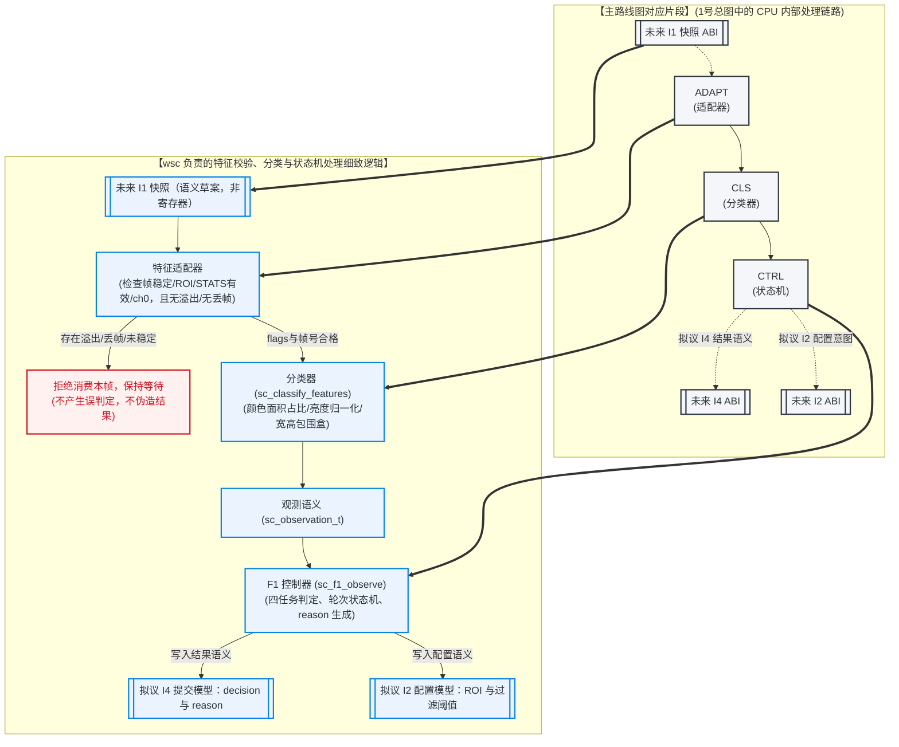

# 3. WSC 视角：CPU 语义、I1 消费与 I4 结果链路

本指南是 [主图：项目数据链路与三人分工](1_project_data_link_and_roles_guide.md#2-项目整体数据传输链路与队员分工图示) 的 **CPU 细节补充**。它放大主图中的 `I1 → ADAPT → CLS → CTRL → I4` 支路，并说明 CPU 对 I2、I3、I0 的边界。

> **当前状态（2026-07-18 实读）**：CPU 的 Host/fake-transport 语义、分类器和 F1 状态机已存在；真实 MMIO transport 对所有操作 fail-closed。I1 的线 ABI、I2 配置写入、I3 外部事件、I4 result/OSD 仍未冻结或未实现；当前 Host 通过不等于 RISC-V、APB、OSD 或板级闭环通过。

事实源优先级： [CURRENT_STATE.md](../../CURRENT_STATE.md) → [F1 接口对齐总账](../../competition_project_single_camera/integration/F1_INTERFACE_ALIGNMENT_DRAFT.md) → [单摄特征快照契约](../../competition_project_single_camera/integration/single_camera_feature_contract.md) → 同批 CPU 源码与测试。

---

## 1. 这份图放大主图的哪一段？

以下图示将主路线图中对应的这一段 CPU 内部处理链路截出，并在其基础上展开扩展了 wsc 负责的详细特征检疫、化验分类以及状态机调度逻辑。

🔍 点击展开/收起：WSC CPU语义图专有名词释义

*   **ADAPT (特征适配器)**：CPU 侧的第一道过滤门，负责将原始总线特征转化为结构化的快照，并审查帧是否稳定、有无溢出、帧号是否一致。
*   **CLS (分类器/Classifier)**：大脑逻辑的数值加工厂，把底层的像素面积和边界包围盒等转换为对红、黄、蓝、黑、白以及圆柱、正方、锥体的“纯语义结论”。
*   **CTRL (F1 控制器)**：系统的大脑总调度，根据当前的比赛模式（任务一到四）和下达的目标物，判定眼前物块是否匹配，产生控制决策。
*   **MMIO (Memory-Mapped I/O)**：通过 CPU 内存地址映射访问硬件外设总线寄存器的读取方式，目前设计为 fail-closed 阻断状态。

📖 点击展开/收起：WSC CPU语义图图文对照生动表述

本图展示了**“海关货物智能鉴定与决策分流流程”**：
1.  **申报（I1）**：前线港口运来一个装有特征包裹的箱子。
2.  **检疫（ADAPT）**：海关质检员（ADAPT 适配器）对箱子进行扫描。如果发现箱子在运输中被强行打开过（两次 frame_id 校验不符）或者箱子有破损溢出（flags 带有溢出或 overrun），质检员立刻把箱子丢弃，全队在大厅静静等待下一箱（WAIT），绝不伪造放行。
3.  **化验（CLS）**：检验合格后，分析师（CLS 分类器）把红蓝黄像素比例和外包装宽高（Features）送入实验室，化验得出这其实是一个“红色正方体（Observation）”。
4.  **决策（CTRL）**：海关总长（CTRL 控制器）在 Host 模拟的 I3 任务语义下写出“目标命中（reason=TARGET_MATCH）”等结果候选。F1 语义要求结果保持 `arm_enabled=0`；I3 的真实输入来源和 I4 的上屏 ABI 都尚未定义或实现，不能把这个比喻当成已存在的外设链路。

实线是当前 CPU 内部可审计的 Host 语义；虚线是未来硬件接口或尚未定义的事件来源。CPU 不能因为内部结构体已有字段，就把它当成 APB 布局或可用的板级地址。

---

## 2. WSC 的职责边界

WSC 负责软件逻辑的正确性与防撕裂保护，确保对 I1 到 I4 的各个接口有着明确的语义边界。

| 接口/层 | WSC 负责的事实与产出 | 必须等待谁确认 | 当前不得做 |
|---|---|---|---|
| I1 消费 | 根据 `source_flags`、`frame_id`、`config_seq` 和字段语义拒绝不可靠快照；只对成功消费的同一帧提出 ACK 语义 | libaoxun 冻结 CDC/APB/ACK 的真实线 ABI；qzs 审核 Gate | 猜寄存器偏移、PSTRB、IRQ 或把 Host snapshot 当作板级数据 |
| 分类与 F1 | `sc_features_t → sc_observation_t → decision/reason`；保持尺寸未标定时的安全结论 | I1 真实字段、I3 事件来源、任务/标定证据 | 将尺寸不可用的任务三/四解释为可执行，或把拒绝输入写成业务 `SKIP` |
| I2 配置意图 | 给出 ROI/background/color masks/`config_seq` 的语义与版本规则 | libaoxun 的 active/CDC/SoC 设计 and 同批 `soc.h` | 实现生产 MMIO 或假定“写入即生效” |
| I3 事务 | 描述 `task`、目标、PLACE/ABANDON、乱序/超时/ACK 的 CPU 语义 | 全队在 Review Packet 中冻结外部来源与编码 | 把 Host 测试事件写成已存在按键/APB 输入 |
| I4 结果语义 | 生成可追溯的 `round_id + frame_id + reason` 结果候选；F1 固定 `arm_enabled=0` | qzs 的展示/安全要求，libaoxun 的 OSD ABI | 直接写 OSD 寄存器或宣称 OSD 板级可见 |
| I0 / G1 | 维护 Hello 与 Host/固件入口的语义，按 Gate 提供日志解释 | qzs 审核当前批次 Checkpoint，libaoxun 的同批 bitstream/SoC | 用 Hello 证明 APB、I1-I4 或 UART2 |

💡 点击展开/收起：I1 接口 CPU 侧消费生动形象中文介绍

I1 消费是 CPU 侧大脑的**“入关质检门卫”**。前线拍摄的特征快照照片送进总线，门卫绝不能照单全收。它必须严格检查：相机有没有抖动（FRAME_STABLE）、ROI 配置对不对（ROI_VALID）、提取数据是真是假（STATS_VALID）、照片是不是我们这路相机的（SOURCE_CH0）。只要有一样不符合，或者发生了数据爆仓丢帧（OVERRUN）和数据溢出（OVERFLOW），门卫立刻把照片扔进垃圾桶，拒绝交给后面的化验室，宁可保持等待，也绝对不做出错误的业务结论。

💡 点击展开/收起：I2 接口 CPU 侧配置生动形象中文介绍

I2 配置的**拟议协议**是 CPU 向硬件下达“滤镜与侦察区域校准信”。若进入实现审查，参数应先写入 staging，再以递增 `config_seq` 提交，并在完整帧边界整体切换，以避免统计途中改变配置。`CFG_COMMIT`、寄存器地址、写选通和实际 CDC 尚未冻结，不能据此编写 MMIO。

💡 点击展开/收起：I3 接口 CPU 侧事件生动形象中文介绍

I3 接口是**“来自裁判席的本轮考题与操作哨声”**。它负责下达指令：‘今天这轮剿灭白色正方体’或者‘开始装载/终止当前轮’。目前由于前线还没来得及拉起电话线（尚未定义物理的按键、UI或寄存器输入来源），考题全部由后台 Host 模拟直接塞给大脑，并不代表前线已经具备真实的按键外设输入。

💡 点击展开/收起：I4 接口 CPU 侧结果生动形象中文介绍

I4 是 CPU 决策后的**拟议“战报回折单”语义**：可包含轮次、已消费帧、观测、`decision/reason` 与 `arm_enabled=0`。未来是否采用 staging、何为提交标记、如何上屏，均待 I4 Review Packet 冻结；当前不得声称它已经进入 OSD 寄存器或 HDMI。

---

## 3. I1：CPU 如何消费一帧，而不是“读一堆寄存器”

CPU 侧的最小正确顺序是：

1. 未来 transport 返回一个候选快照；当前仅 fake transport 能提供它。
2. 先检查 `FRAME_STABLE`、`ROI_VALID`、`STATS_VALID`、`SOURCE_CH0`，并拒绝 `DIAG_ACTIVE`、`COUNTER_OVERFLOW`、`SNAPSHOT_OVERRUN`。
3. 检查 `frame_id` 未倒退/未撕裂，且 `config_seq` 与当前期望 active 配置一致。
4. 将 `sc_features_t` 送入分类器，只有稳定 observation 才能交给 `sc_f1_observe()`。
5. 仅在成功消费同一 `frame_id` 后 ACK；ACK 失败、配置撕裂或不稳定输入必须 fail-closed。

这条顺序对应 [single_camera_feature_adapter.h](../../competition_project_single_camera/cpu/include/single_camera_feature_adapter.h) 和 [single_camera_runtime.c](../../competition_project_single_camera/cpu/src/single_camera_runtime.c)。其中 real MMIO backend 当前故意全部返回不可用，正是为了阻止未冻结地址被误用。

---

## 4. I2、I3、I4：CPU 只能先冻结语义

| 接口 | 现在可以确认的语义 | 尚未确认的物理事实 |
|---|---|---|
| I2 | ROI 闭区间、background RGB/前景门限、红蓝黄 mask、16-bit `config_seq`；完整配置应采用 `staging → commit → active` | 寄存器地址、写顺序、PSTRB、何处报告 `active_seq`、CDC 实现 |
| I3 | CPU 需要接收 task/target，以及 PLACE/ABANDON/超时等事务事件 | 输入来自按键、UI、APB 还是其他通道；编码、`event_seq`、确认方式 |
| I4 | 结果应包含 `round_id`、消费的 `frame_id/config_revision`、输入 flags、颜色/形状/尺寸可用性、`decision`、`reason`、`arm_enabled=0` | result/OSD 寄存器、提交标记、显示时序、字体/渲染、清屏与复位 |

**关键约束**：`sc_feature_snapshot_t`、`sc_observation_t`、`sc_round_result_t` 是 CPU 语义模型，不是 wire ABI；不得对它们 `memcpy` 到未来 APB 窗口。

---

## 5. WSC 与队友的接口核对清单

| 先核对谁 | 必须一起读的文件 | 要达成的一句话结论 |
|---|---|---|
| libaoxun | [single_camera_feature_contract.md](../../competition_project_single_camera/integration/single_camera_feature_contract.md)、[feature_stats_tap.v](../../competition_project_single_camera/src/feature_stats/feature_stats_tap.v)、同批 `soc.h` | “这一帧的字段/flags/`config_seq` 是什么；何时发布；CPU 如何对同帧 ACK；尚无何种 ABI。” |
| qzs | [F1_INTERFACE_ALIGNMENT_DRAFT.md](../../competition_project_single_camera/integration/F1_INTERFACE_ALIGNMENT_DRAFT.md)、[2_qzs_role_data_link_and_control_logic.md](2_qzs_role_data_link_and_control_logic.md) | “I4 只输出可解释语义，I5 仍无 transport，何种 Gate 后才能改。” |
| 全队 | [single_camera_feature_adapter.c](../../competition_project_single_camera/cpu/src/single_camera_feature_adapter.c)、[single_camera_f1.c](../../competition_project_single_camera/cpu/src/single_camera_f1.c)、[single_camera_runtime.c](../../competition_project_single_camera/cpu/src/single_camera_runtime.c) | “CPU 拒绝何种输入、何时产生结果、何时 ACK、何时只等待。” |
| 全队 | [CURRENT_STATE.md](../../CURRENT_STATE.md) 与当前批次 G1 操作卡 | “当前只是离线/Host 证据，任何板级动作必须遵守 Checkpoint 与禁止项。” |

### 本人应先学会的四件事

1. **多位快照 CDC**：为什么 `frame_id` 前后复核与同帧 ACK 是协议，而非普通变量读取。
2. **fail-closed transport**：为什么地址未冻结时“全部不可用”比临时读写更正确。
3. **状态机与事实分离**：不稳定输入是 `WAIT/采集异常`，不是比赛业务 `SKIP`。
4. **语义与 ABI 分离**：C 结构体、APB 字段、OSD 文本分别在哪个 Review Packet 冻结。

---

## 6. 交给 Gemini 的编辑边界

Gemini 可以美化本图、添加通俗讲解或补充不改变结论的学习例子，但**不得**：

- 修改本文件、主图、`CURRENT_STATE.md`、F1 总账和特征契约中的接口方向、状态标签、Gate、字段含义、文件链接或“未验证/未实现”结论；
- 添加任何 APB 地址、位宽、PSTRB、IRQ、MMIO 命令、I3 输入来源或 OSD 实现细节来填空；
- 把 Host/fake transport 结果写成板级、RISC-V、APB、OSD 或机械臂通过；
- 把尺寸未标定的任务三/四、或 `EXECUTE_ARM_DISABLED` 写成可执行机械臂动作；
- 修改 `.v/.c/.h`、XML、SDC、IP、BSP、操作卡或安全边界。

任何涉及上述事实的改动必须先回到三份权威事实源并经 qzs/Codex Review Packet 审查。
