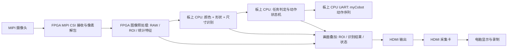

# 分赛区决赛实施开发路线

> 项目：第十届集创赛雄芯院方向  
> 阶段：分赛区决赛  
> 版本：v0.3，已基于重新解压后的完整初赛 demo 复扫更新经验库，后续继续细化到模块接口级  
> 日期：2026-07-01  
> 基准文件：`赛题要求提取.md`

## 1. 当前目标

本阶段目标不是一开始追求炫技，而是在 2026-07-20 前完成一套低风险、可解释、可调试、可上场的分赛区决赛保底方案。

核心目标：

- 摄像头接入 FPGA，由 FPGA 侧完成图像采集、像素流整理、ROI/统计特征和显示基础；板上 CPU 负责视觉识别分类、任务判定和参数管理。
- HDMI 输出到采集卡，电脑只作为显示和录制设备，不参与正式识别决策。
- 对所有物体输出完整识别结果：形状、颜色、尺寸。
- 根据现场评委给出的分拣指令，只对符合条件的正方体执行抓取分拣。
- 不符合条件的物体只显示识别结果，不执行机械臂动作。
- 分拣横向搬运距离大于 10 cm。
- 优先保证指定颜色、指定颜色正方体、指定尺寸正方体三类分赛区任务稳定拿分。

本方案先覆盖系统架构与实施路线。后续在初赛 demo 复盘基础上，再补充 RTL/软件模块接口、信号定义、状态机、调参入口和验证脚本。

## 2. 约束与已知配置

### 2.1 赛题约束

- 视频采集必须由指定 FPGA 直接控制摄像头完成。
- 摄像头不能是带内置处理器或集成图像处理模块的智能摄像头。
- 目标识别必须在指定 FPGA 平台完成；根据现有确认口径，可使用板上 CPU。
- 机械臂由指定 FPGA 与机械臂通信实现控制逻辑。
- 分赛区决赛现场每项通常放置 5 次，按正确率给分。
- 现场颜色、尺寸等目标条件由评委临时给出，因此系统必须具备快速切换目标条件的能力。

### 2.2 硬件配置

- FPGA 开发板：`WZZY_FPGA / TJ375N529`。
- 机械臂：`myCobot 280`。
- 摄像头：已采购 2 个，参数均为前述 400 万像素 MIPI RAW 摄像头。
- 显示链路：FPGA HDMI 输出 -> HDMI 采集卡 -> 电脑显示/录制。
- 工程策略：最终另起干净工程；初赛 demo 只作为链路经验、调试顺序和风险清单来源，不作为直接代码基线。

### 2.3 初赛 demo 复盘结论

已重新扫描 `初赛demo/2ChMIPICSI_2ChMIPIDSI_Demo_Test` 的完整解压目录。当前目录已包含 `src/`、`sw/`、`embedded_sw/`、`ip/`、`outflow/`、`Work_Log.md`、`CATALOG.md`、`QCRV32_SOC_INTERFACE_GUIDE.md` 等关键文件。结论更新为：该 demo 可作为经验库、问题库和链路参考，但不作为决赛代码基线；识别和机械臂控制路线仍坚持“FPGA 前端 + 板上 CPU 决策/控制”，不回到纯 FPGA 方案。

可复用的视频链路经验：

- 调试顺序应沿用“彩条/HDMI -> 摄像头 MIPI -> DDR/framebuffer -> debayer/gamma -> 识别/OSD”的递进路径。初赛记录证明，一上来叠加识别会把 MIPI、DDR、Bayer、颜色和显示问题混在一起，排查成本很高。
- MIPI 摄像头输出是 RAW/Bayer，不是 RGB。初赛 HDMI 改造中确认过 Bayer 相位错误会导致画面偏紫，RAW 线性数据不做 gamma 会整体偏暗。决赛第一阶段必须保留 RAW 相位确认、灰卡/白物块观察、gamma/白平衡开关对比。
- `frame_buffer`、`ddr_wr_buffer`、`ddr_rd_buffer`、`fifo_d512t128`、`color_bar_rgb` 这类模块体现了可借鉴的 DDR 视频链路组织方式；但最终应在干净工程中按实际需要重接，不直接搬整个初赛顶层。
- HDMI/OSD 是现场可视化主通道。初赛的 `osd_overlay` 经验说明，结果、ROI、bbox、状态、响应时间和诊断标志应直接叠到画面上；UART 只适合日志，不适合作为唯一现场判断依据。
- Efinity Debugger 配置会引用具体探针名。初赛曾因删除 `ch0_hs/ch0_vs/ch0_de` 别名导致 Debugger 生成包装器失败，后续修改顶层信号时要保留调试探针别名或同步更新 debug profile。

可复用的颜色识别经验：

- 摄像头 AWB/曝光是颜色分类最大干扰项。初赛记录中 HSV 饱和度曾被 AWB 压缩，红色变粉棕、蓝色变蓝灰，单纯 HSV 阈值或单像素阈值都不稳。
- 决赛应把颜色分类阈值、白平衡/归一化、背景抑制和多帧投票放到板上 CPU 可调参数表中。FPGA 侧只建议提供 ROI 内 RGB/Bayer 通道均值、直方图、颜色比值、亮度统计、候选前景掩码等轻量特征。
- 初赛出现过背景被误分类为黄色、计数器饱和、进而拖垮形状判断的级联故障。决赛必须加入背景比例过滤、前景面积上下限、低饱和背景抑制和“绿色/背景吸收类”策略，不能只按最大颜色计数选目标。
- 颜色判断优先使用区域统计，而不是整帧最大计数。推荐流程是先限定托盘 ROI，再做背景差分/前景筛选，最后在前景区域统计颜色；整帧统计只能作为诊断值。

可复用的形状和尺寸识别经验：

- 初赛 `sw/shape_detect.c` 和 `shape_classifier.v` 都围绕轻量几何特征：bbox、前景面积、填充率、宽高比、行宽轮廓、顶部/底部宽度比、过渡行数、边缘平滑度。这些特征适合迁移到 CPU 侧作为规则分类输入。
- 纯 RTL 形状分类不适合作为决赛主线。初赛硬件版从决策树、投票、响应计时到时序拆流水，复杂度快速膨胀；文档中还记录过 `DECIM=2/960x540` 提升区分度但引入乘法路径时序压力。决赛应让 FPGA 只做 ROI/降采样/基础统计，CPU 侧完成分类决策和阈值调整。
- 当前源码实际接入的 `shape_classifier` 和 `frame_downscaler` 是 `DECIM=8/240x135` 路线，而部分 README/调试记录提到过 `DECIM=4`、`DECIM=2` 等实验版本。后续引用初赛参数时必须以当前源码、构建日志和上板现象交叉确认，不能直接相信单个 README。
- 尺寸识别应借鉴 bbox/面积/像素标定思路，但分赛区需要区分 2 cm、2.5 cm、3 cm，必须通过固定相机高度、固定物块区域、像素/cm 标定、多帧平均和 CPU 阈值表实现，不能把初赛形状阈值当尺寸阈值使用。

可复用的 CPU、DDR、AXI 和调试经验：

- 初赛已经走通过 QCRV32 参与的方向：`embedded_sw/qcrv32_soc` 提供 BSP、OpenOCD、链接脚本、UART/Timer/DDR 示例；`sw/shape_detect.c` 证明 CPU 可处理 240x135 降采样帧，但逐像素读 DDR 会慢且会与 HDMI 抢 AXI 带宽。
- 决赛 CPU 不能再全帧逐像素扫 DDR。更稳的边界是：FPGA 写小 ROI、低频降采样帧或直接写统计特征寄存器/共享缓冲；CPU 每帧只读小数据量，完成颜色/形状/尺寸分类、目标匹配、状态机和 myCobot 协议。
- QCRV32 集成必须尽早做最小闭环：JTAG 能 halt/resume，UART 能打印，CPU 能读写寄存器，CPU 能读一小块 DDR/ROI 数据，CPU 能把识别结果写回 `axi_reg_file` 并显示到 OSD。不要等视觉算法写完后再接 CPU。
- 初赛排查证明，Interface Designer 不会自动把 BSCAN 模板端口连到 QCRV32 调试模块。需要显式实例化 `qcrv32_soc` 并连接 `jtag_inst1_*` 到 `jtagCtrl_*`；“TAP 能识别但 halt 超时”优先查 BSCAN 到 CPU Debug Module 的连线，而不是反复降 JTAG 速度。
- CPU 访问 DDR 时要确认 SoC DDR master 是否真的接到 DDR 控制器。初赛曾因 `io_ddrA_*` 被 tie-off 导致 CPU 读 DDR 全 0，后续通过 ARW 128-bit 到 AXI4 512-bit 的宽度转换桥接。决赛若使用共享 DDR，也要先验证地址映射、位宽转换、burst、cache/flush 和总线仲裁。
- `outflow/*.err.log` 可能追加旧错误，不能只看文件里是否还有 ERROR。复核时要结合时间戳、最新构建产物、timing report 和 Efinity GUI 当前结果。

可复用的 OSD、响应时间和现场调试经验：

- 画面上至少应显示：当前任务模式、目标颜色/尺寸、识别颜色、识别形状、估计尺寸、match/skip/grab、CPU/FPGA链路状态、机械臂状态、bbox/ROI 和响应时间。
- 初赛 OSD 中出现过时间换算位宽溢出、显示单位不一致、响应计时器状态冻结等问题。决赛 OSD 的数值换算要明确时钟频率、单位、上限和溢出钳位；响应时间只作为辅助指标，不能牺牲识别稳定性。
- `DEMO_MODE` 这类固定序列演示逻辑只能用于录制演示，不能进入正式比赛工程。正式工程必须保证 OSD 显示来自真实识别结果和 CPU 状态机。

对机械臂控制的启示：

- 初赛 demo 没有成熟的 myCobot 控制闭环，不能从中继承机械臂控制方案。
- 决赛必须把 myCobot 协议封包、点位表、动作序列、互锁、返回值解析、超时重试和急停状态放到板上 CPU。FPGA RTL 只提供串口物理层或简单 FIFO/寄存器，不承担复杂动作逻辑。
- PC + `pymycobot` 只用于开发期标定点位、验证速度/角度/夹爪范围和记录安全姿态；正式闭环由 FPGA 平台内的 CPU 发命令。

必须避免的做法：

- 不直接复用初赛 demo 的识别 RTL。当前目录中 README、Work_Log、修正方案和实际源码存在版本差异，且顶层包含 `DEMO_MODE=1`、临时脚本、硬编码路径、debug 残留和未完全接通的未来接口。
- 不再走纯 FPGA 视觉识别路线。FPGA 只承担高速视频前端、RAW/ROI/统计特征、显示叠加和少量必要硬件加速；颜色、形状、尺寸、目标匹配和阈值管理放到板上 CPU。
- 不再走纯 FPGA 机械臂控制主线。myCobot 的协议和动作控制放到板上 CPU，避免 RTL 状态机后期不可调、难排错、难加安全互锁。
- 不把 PC 或外部 MCU 放入正式识别/控制闭环；它们只用于开发阶段调试、标定和日志观察。
- 不把初赛 `outflow` 构建结果当作当前工程质量保证。它们只能说明历史尝试和风险点，决赛工程必须重新综合、布局布线、检查 warning、上板验证。

### 2.3.1 官方 RISC-V 例程吸收结论

已复扫 `赛方提供材料/例程/RISC-V例程` 与 Efinity RISC-V Embedded Software IDE 流程图。结论是：官方 CPU 例程最适合补强我们的“板上 CPU 决策控制”工程化路线，而不是把 Ethernet/eMMC/SD 功能纳入比赛主链路。

应吸收的内容：

- Efinity 推荐流程是：先下载 FPGA bitstream，再在 RISC-V IDE 中导入 makefile project、build、进入 debug、打开串口终端运行。决赛 CPU 工程必须保持 IDE 可导入，同时保留命令行 make 的可复现入口。
- 官方包结构包含 Hardware、Software、IDE 三部分。对应到本项目就是：FPGA SoC/RTL 生成物、CPU BSP/应用、IDE/OpenOCD/JTAG 调试配置必须成套管理，不能只拷 C 文件。
- `01_eth_test-v4/embedded_sw/efx_hard_soc/` 更适合作为 TJ375C529 顶层硬核 SoC 软件包参考；`gDMA/.../soc_dma_exp_0/` 适合学习 `EfxAxi4Example`、`EfxApb3Example` 和 `dCacheFlushDemo`。
- 官方示例中至少有两套不同地址映射：`efx_hard_soc` 使用如 `SYSTEM_UART_0_IO_CTRL=0xe8010000`、`SYSTEM_AXI_A_BMB=0xe8000000`、`IO_APB_SLAVE_0_INPUT=0xe8100000`；`gDMA/soc_dma_exp_0` 使用如 `SYSTEM_UART_0_IO_CTRL=0xf8010000`、`IO_APB_SLAVE_0_INPUT=0xf8100000`。因此最终工程必须以当前 Efinity 生成的 `soc.h` 为地址真源。
- `dCacheFlushDemo` 证明 FPGA/custom logic 经 AXI 写 DDR 后，CPU 可能因 D-cache 读到旧值。决赛主链路应优先用寄存器窗口传统计特征；共享 DDR/ROI 只作为可选调试或低频缓冲，并显式做 invalidate/flush。
- 截图中的 debug GUI 包含 breakpoint、step、terminal、register view、memory view、peripheral register view。决赛验收也应保留这些可观察入口，不能只靠 HDMI 或只靠 UART。

落到本项目的新增文件与同步项：

- 详细记录：`final_project/docs/architecture/riscv_official_examples_integration.md`。
- CPU 平台层规则：`final_project/cpu/README.md`。
- FPGA/CPU 接口与寄存器草案：`final_project/integration/fpga_cpu_interface.md`、`final_project/integration/register_map.md`。
- 上板 bring-up 顺序：`final_project/integration/bringup_checklist.md`。

### 2.4 摄像头参数解读

截图给出的摄像头关键参数如下：

| 参数 | 含义 | 对本项目的影响 |
|---|---|---|
| 分辨率 400 万 | 图像传感器约 4MP | 分辨率足够识别 2-3 cm 小物块，但全分辨率处理资源压力较大。 |
| 像素阵列 2568(H) x 1448(V) | 传感器物理有效像素矩阵 | 输出图像可裁剪到 2560 x 1440。识别可只取 ROI，不必全画面逐像素复杂处理。 |
| 像素尺寸 2.0 um x 2.0 um | 单个像素的物理尺寸 | 像素较小，光照不足时噪声更明显。现场不能额外打光，因此算法必须增强环境光兼容性。 |
| 镜头光学尺寸 1/3.06 英寸 | 匹配镜头成像圈规格 | 选镜头时需匹配该 optical format，避免暗角或视场异常。 |
| 最大图像传输速率 2560(H) x 1440(V) @ 30/60 fps, 10-bit, 1.2V | 最大输出分辨率、帧率、位深和 MIPI 电平域 | 分赛区静态单物块识别不需要 60 fps。建议先配置 1080p/720p 或较低帧率，降低 FPGA 带宽和调试风险。 |
| 输出接口 8/10-bit 1/2/4-Lane MIPI | 图像数据通过 MIPI CSI-2 类高速差分通道输出，可配置位宽和 lane 数 | FPGA 需使用 MIPI CSI 接收 IP。lane 越多带宽越高，但布线、约束、调试更复杂。建议优先复用开发板现有 MIPI Demo 的 lane 配置。 |
| 输出格式 RAW RGB | 传感器输出 Bayer RAW 数据，而非已经处理好的 RGB 图像 | FPGA 需做黑电平/白平衡/去马赛克或至少做适合识别的简化颜色统计。不能把 RAW 当普通 RGB 使用。 |
| CRA 15 deg | Chief Ray Angle，主光线角 | 影响镜头匹配；一般按推荐镜头选择即可。 |
| 灵敏度 4319 mV/lux*s | 感光灵敏度 | 有利于低照度。由于现场不能打光，应优先使用固定曝光/自动曝光锁定、白平衡校正和归一化颜色特征。 |
| 动态范围 81 dB / HDR >100 dB | 明暗同时存在时的保留能力 | HDR 对强反光/阴影有帮助，但比赛物块为哑光，优先用稳定普通模式，减少调试变量。 |
| 信噪比 38.47 dB | 图像噪声水平 | 颜色阈值识别时需做区域平均和滤波，避免单像素噪声影响判断。 |
| 工作温度 -30C 到 +85C | 可运行温度范围 | 对室内比赛不是主要风险。 |
| 最佳工作温度 -20C 到 +60C | 推荐工作范围 | 正常室内可满足。 |
| 电源 AVDD/DVDD/DOVDD | 模拟、数字核心、IO 电源 | 接线和板级供电必须匹配，不能随意接 3.3V。 |
| CSP 35-pin | 芯片封装 | 说明该参数来自图像传感器芯片，不等于模块接口排针定义。 |
| ESD HBM 2 / CDM C3 | 静电防护等级 | 接线、插拔时仍需断电和防静电。 |

接口含义重点：

- `MIPI` 是高速串行差分图像接口，不是普通 GPIO，也不能直接用软件读引脚。
- `1/2/4-Lane` 表示使用 1、2 或 4 组高速数据通道。lane 数越多，能承载的分辨率和帧率越高。
- `8/10-bit` 表示每个像素采样的有效位深。RAW10 常见，处理时需要把 10 bit 像素解包或由 MIPI IP 输出并行像素流。
- `RAW RGB` 更准确地说通常是 Bayer RAW。每个像素只有 R/G/B 之一，需要去马赛克变成 RGB，或者直接基于 Bayer 格式做颜色统计。
- `1.2V` 是高速接口/核心相关电压描述，不代表能直接接普通 1.2V GPIO。实际接法必须遵守开发板摄像头接口定义。

对项目的建议：

- 不以最高 2560 x 1440 @ 60 fps 为第一目标。
- 第一版先用现有 MIPI Demo 可稳定输出的模式，优先跑通“摄像头 -> FPGA -> HDMI”。
- 识别算法只在画面中央或固定托盘区域做 ROI，降低计算量。
- 比赛识别不能依赖额外打光，应以固定相机高度、固定背景、固定物块区域和光照自适应算法为前提做工程化优化。
- 两个摄像头短期不建议同时上主链路。保底方案优先单摄稳定闭环；第二摄像头可作为备件，或在后续探索中用于机械臂侧视角/抓取确认。

## 3. MCU 调试辅助是什么意思

这里的 MCU 调试辅助指：在开发阶段临时使用外部 MCU、PC 或 USB 串口工具帮助调试外设、采集日志、验证协议、校准参数，但正式比赛的识别决策和机械臂控制闭环仍由指定 FPGA 平台完成。

可以接受的调试辅助示例：

- 用 PC 跑 `pymycobot` 验证机械臂串口协议、关节角度、夹爪动作、安全姿态。
- 用 USB 串口工具监听 FPGA 发出的控制帧，确认命令格式正确。
- 用外部逻辑分析仪或串口助手观察 MIPI 初始化 I2C、机械臂 UART 波形。
- 赛前用 PC 工具辅助标定颜色阈值、ROI 坐标、机械臂目标点位，然后把参数固化进 FPGA 工程或板上 CPU 程序。

正式比赛中应避免的做法：

- 外部 PC/MCU 参与图像识别，告诉 FPGA 物体颜色、形状或尺寸。
- 外部 PC/MCU 根据识别结果决定是否抓取。
- 外部 MCU 运行主要机械臂控制逻辑，FPGA 只做触发按钮。
- 使用带内置识别、分类或图像处理能力的智能摄像头。

本项目推荐边界：

- PC 可以作为 HDMI 显示、视频录制、串口日志查看工具。
- PC 可以在开发调试阶段控制机械臂摸清协议，但最终上场方案应由 FPGA 平台直接发命令。
- 若使用板上硬核 RISC-V，它属于指定 FPGA 平台内部资源，可以承担串口协议封包、状态机、参数表和机械臂动作序列。
- 外部 MCU 只作为临时调试桥接工具，不放入最终比赛闭环。

## 4. 推荐系统架构

### 4.1 保底架构



保底链路特点：

- 摄像头采集、预处理、识别、条件判定、机械臂控制都在指定 FPGA 平台内完成。
- 根据初赛经验，纯 FPGA RTL 做颜色和形状识别算力与灵活性不足，因此主线采用方案 B：FPGA 负责高速视频接入、ROI、基础统计和显示；板上 CPU 负责分类决策、参数切换、机械臂协议和动作状态机。
- PC 不参与识别，只显示 HDMI 输出画面。
- 识别信息优先叠加到 HDMI 画面，若短期叠字困难，先用色块/框线/编号/LED/UART 日志过渡。
- 机械臂控制采用预设点位序列，不做复杂视觉伺服。

### 4.2 识别策略

分赛区是单物块、静态放置、多次测试，适合采用“FPGA 提取稳定特征 + 板上 CPU 做规则分类和参数管理”的工程化识别路线，而不是复杂 AI 模型，也不建议回到纯 RTL 颜色/形状识别。

建议识别流程：

1. 固定摄像头位置、固定工作台、固定背景和物块放置区域；不能依赖现场额外打光。
2. 在画面中定义物块识别 ROI。
3. 对 ROI 做背景分割，得到物体候选区域。
4. 提取颜色特征：
   - 使用 RGB/HSV/YUV 中更稳的颜色空间。
   - 对物体区域做平均值、直方图或主色统计。
   - 用阈值表识别白、黑、红、蓝、黄。
   - 针对现场光照变化，使用亮度归一化、白平衡/灰世界校正、颜色比值特征（如 R/G、B/G、色相）和多帧投票，减少绝对亮度变化对颜色判断的影响。
5. 提取形状特征：
   - 先以俯视/近俯视摆放为前提。
   - 通过轮廓外接矩形、面积、长宽比、边缘/圆度判断正方体、圆柱体、锥体。
   - 分赛区抓取只对正方体执行，但仍显示所有形状识别结果。
6. 提取尺寸特征：
   - 用像素面积、外接矩形宽高或标定后的像素/cm 比例估算尺寸。
   - 对正方体重点区分 2 cm、2.5 cm、3 cm。
   - 比赛要求 1 cm 和 0.5 cm 尺寸差识别，分界阈值要通过实物标定得到。
7. 板上 CPU 根据 FPGA 输出的统计特征和可调参数表完成最终分类，并输出完整识别结果：
   - `shape = cube/cylinder/cone/unknown`
   - `color = white/black/red/blue/yellow/unknown`
   - `size = 2.0/2.5/3.0 cm/unknown`
   - `match = yes/no`
   - `action = grab/skip`

### 4.3 分拣决策逻辑

现场目标条件建议抽象为一个任务寄存器或参数表：

```text
task_mode:
  0 = 仅颜色分拣
  1 = 正方体 + 颜色分拣
  2 = 正方体 + 尺寸分拣
  3 = 仅颜色分拣但强制正方体保护

target_color:
  white / black / red / blue / yellow

target_size:
  2.0 cm / 2.5 cm / 3.0 cm

cube_only_guard:
  0 = 按赛题评分项原始条件执行
  1 = 所有抓取动作都必须额外满足 shape == cube
```

系统对所有物体均识别形状、颜色、大小。抓取条件需要区分“评分项原始条件”和“现场只允许抓正方体”的安全口径。

| 模式 | 显示内容 | 抓取条件 |
|---|---|---|
| 指定颜色分拣 | 显示形状、颜色、尺寸 | 默认：`color == target_color` |
| 指定形状 + 指定颜色分拣 | 显示形状、颜色、尺寸 | `shape == cube && color == target_color` |
| 指定尺寸正方体分拣 | 显示形状、颜色、尺寸 | `shape == cube && size == target_size` |

上一版把“指定颜色分拣”也写成 `shape == cube && color == target_color`，这会导致它与“指定形状 + 指定颜色分拣”条件完全相同，评分项失去区分度。修正后的默认逻辑应是：

- 指定颜色分拣：主要考颜色识别与分拣，形状和尺寸仍显示，但默认不参与抓取门槛。
- 指定形状 + 指定颜色分拣：同时考正方体识别和颜色识别，必须满足 `shape == cube && color == target_color`。
- 指定尺寸正方体分拣：同时考正方体识别和尺寸识别，必须满足 `shape == cube && size == target_size`。

如果现场评委或正式规则明确要求“所有抓取对象只能是正方体”，则开启 `cube_only_guard = 1`，此时指定颜色分拣会临时收紧为：

```text
color == target_color && shape == cube
```

这样做的好处：

- 满足“所有物体均识别出来”的内部能力要求。
- 保留三类评分项的逻辑差异。
- 现场如果临时要求只抓正方体，可通过 `cube_only_guard` 一键收紧抓取条件。

需要后续确认的点：

- 赛方对“指定颜色分拣”到底是任意形状按颜色抓取，还是只对指定颜色正方体抓取。由于这会影响 10 分项与 20 分项的区分，建议在现场或赛前尽快确认。

## 5. 机械臂控制方案对比

### 5.1 方案 A：FPGA 纯 RTL UART 直控机械臂，不采用

```text
识别结果 -> RTL 决策状态机 -> UART 发送 myCobot 命令 -> 机械臂动作
```

理论优点：

- 最符合“FPGA 直接控制”的直观解释。
- 延迟低，结构简单。
- 不依赖软件运行环境。

缺点：

- myCobot 协议封包、校验、返回解析用 RTL 写会比较费时间。
- 动作序列、点位参数、异常处理不够灵活。
- 后期现场调点位和速度会痛苦。

结论：

- 不作为决赛正式路线。
- 不作为机械臂控制备份路线。
- 只允许保留为开发期 UART 波形/串口发送模块的最小自测，不承载 myCobot 动作序列、点位表、抓取判断或异常处理。

### 5.2 方案 B：FPGA 负责视频前端，板上 RISC-V/CPU 负责识别决策与机械臂协议

```text
FPGA 视频前端/特征统计 -> 寄存器/AXI/FIFO -> 板上 CPU 识别决策 -> UART -> myCobot
```

优点：

- 符合“指定 FPGA 平台完成”的口径，且可使用板上 CPU。
- 颜色、形状、尺寸分类可以用 C 实现，便于快速迭代阈值、光照归一化、多帧投票和异常分支。
- 串口协议封包、校验、点位表、动作序列也可用 C 实现。
- 现场可快速改参数、速度、动作等待时间。
- 便于日志记录和错误处理。

缺点：

- 需要跑通 FPGA 视频/特征模块与 CPU 之间的数据通道。
- 需要确认板上 CPU 工程、UART 引脚和启动流程。
- 软件和硬件集成复杂度比裸 RTL 串口略高。

推荐程度：最高。  
建议作为正式方案主线。

### 5.3 方案 C：PC 通过 `pymycobot` 控制机械臂，FPGA 只输出识别结果

```text
FPGA -> HDMI/串口输出识别结果 -> PC -> pymycobot -> 机械臂
```

优点：

- 开发最快。
- 适合前期验证机械臂点位、夹爪动作、抓取路径。
- Python 调试和可视化方便。

缺点：

- 正式比赛合规风险高，因为 PC 参与控制闭环。
- 不能作为最终保底方案。

推荐用途：

- 仅用于 7 月上旬调试机械臂动作与点位。
- 不作为最终比赛架构。

### 5.4 方案 D：外部 MCU 做串口桥接

```text
FPGA -> 简单 GPIO/UART 指令 -> 外部 MCU -> myCobot
```

优点：

- MCU 写串口协议容易。
- 可以降低 FPGA 侧软件压力。

缺点：

- 正式比赛合规风险较高。
- 容易被认为机械臂控制逻辑不在指定 FPGA 平台。
- 多一个硬件节点，多一个故障源。

推荐用途：

- 只作为调试工具或应急串口桥。
- 不建议进入最终比赛方案。

### 5.5 推荐路线

推荐采用“两步走”：

1. 开发前期用 PC + `pymycobot` 快速摸清机械臂协议、点位、夹爪、速度和安全边界。
2. 正式方案采用方案 B：FPGA 做视频前端和特征统计，板上 CPU 做识别决策、现场参数切换和 myCobot 控制。

正式主线优先级：

1. 板上 CPU 同时负责识别决策和机械臂控制，FPGA 提供视频流、ROI、统计特征和显示基础。
2. 不再保留纯 RTL 机械臂控制作为正式备份；若板上 CPU 未跑通，应优先降级为“只显示识别结果、不抓取”的安全演示。
3. PC/外部 MCU 只保留为开发调试辅助。

## 6. 工程分层设计

### 6.1 顶层模块分层

建议另起干净工程后分为以下层级：

| 层级 | 模块 | 说明 |
|---|---|---|
| 输入层 | `camera_init` | 摄像头寄存器初始化，通常为 I2C/SCCB。 |
| 输入层 | `mipi_csi_rx` | MIPI CSI 接收、lane 对齐、RAW 数据输出。 |
| 图像层 | `raw_unpack` | RAW8/RAW10 解包为像素流。 |
| 图像层 | `simple_isp` | 去马赛克、白平衡、亮度/颜色校正，可先简化。 |
| 图像层 | `roi_crop` | 固定 ROI 裁剪，降低后续计算量。 |
| 特征层 | `feature_extract` | FPGA 侧提取 ROI 面积、边界框、颜色均值/直方图、亮度统计等。 |
| CPU 层 | `vision_classifier.c` | 板上 CPU 完成五色、三形状、三尺寸分类。 |
| CPU 层 | `task_matcher.c` | 根据现场目标条件和 `cube_only_guard` 判断是否抓取。 |
| CPU 层 | `arm_controller.c` | myCobot 串口协议、动作序列、互锁和复位。 |
| 显示层 | `osd_overlay` | HDMI 叠加 ROI、框线、状态码、识别结果。 |
| 输出层 | `hdmi_tx` | 输出给 HDMI 采集卡。 |
| 调试层 | `debug_regs` | 参数寄存器、阈值、状态、计数器。 |

### 6.2 第一版可降低复杂度的地方

为保证 7 月 20 日前可完成，第一版可以这样收敛：

- 只处理固定 ROI，不做全画面搜索。
- 只允许单物块进入 ROI。
- 摄像头、工作台、背景和物块高度固定；不能要求现场额外补光。
- 颜色识别优先基于区域平均、颜色比值、亮度归一化和 CPU 侧阈值表。
- 尺寸识别优先基于外接矩形像素宽高标定。
- 机械臂分拣使用固定抓取点和固定放置点，不做视觉坐标实时映射。
- HDMI 文本叠加如短期困难，可先显示色框、状态条、数字编号，再逐步升级到字符叠加。

## 7. 实施开发路线

时间目标：7 月 20 日前完成可演示、可评分、可解释的分赛区决赛系统。

详细日程表和三人分工已单独整理到 `分赛区决赛日程与三人分工.md`。本节保留阶段路线，后续排期和每日责任以独立分工文档为准。

### 7.1 第 1 阶段：7 月 1 日 - 7 月 3 日，工程骨架与硬件链路确认

目标：

- 建立干净工程目录和版本管理结构。
- 明确摄像头 MIPI 接口配置、HDMI 输出链路、机械臂串口链路。
- 确认 FPGA Demo 中哪些模块可复用，哪些只参考。

任务：

- 跑通现有 Demo 的摄像头到 HDMI 输出。
- 记录可稳定工作的分辨率、帧率、MIPI lane 数、像素格式。
- 确认 HDMI 采集卡在电脑端可稳定显示。
- 用 PC + `pymycobot` 或串口助手确认机械臂端口、波特率、基础动作、安全姿态。
- 建立 `docs/`、`rtl/`、`sw/`、`constraints/`、`tests/`、`logs/` 等干净工程结构。

验收标准：

- 摄像头画面能进入 FPGA 并通过 HDMI 采集卡显示。
- 至少保存一份显示截图或录屏。
- 机械臂能完成只读状态读取或极小幅安全动作测试。
- 写明当前摄像头输出模式和机械臂通信参数。

### 7.2 第 2 阶段：7 月 4 日 - 7 月 7 日，识别保底闭环

目标：

- 在板上 CPU 侧实现颜色、形状、尺寸的第一版分类；FPGA 侧提供 ROI、降采样、颜色/亮度/轮廓统计和显示输出。
- 先不接机械臂，输出识别结果和匹配结果。

任务：

- 固定 ROI 和背景。
- 完成 CPU 侧颜色阈值/颜色比值/亮度归一化初版。
- 完成 FPGA 或 CPU 侧物体区域面积、外接矩形、长宽比、圆度等基础统计；第一版以“易集成”为优先。
- 完成 CPU 侧正方体/圆柱体/锥体的规则分类初版。
- 完成 CPU 侧 2/2.5/3 cm 尺寸标定初版。
- 输出识别结果到 HDMI 画面、LED、UART 日志三者中的至少一种。

验收标准：

- 5 种颜色能稳定区分。
- 3 种形状能稳定区分。
- 正方体 2/2.5/3 cm 能稳定区分。
- 每次放置单物块后，系统能输出完整识别结果。

### 7.3 第 3 阶段：7 月 8 日 - 7 月 11 日，机械臂动作闭环

目标：

- 板上 CPU 根据识别结果触发机械臂完成抓取/跳过。
- 初步满足横向分拣距离大于 10 cm。

任务：

- 标定固定抓取点、分拣放置点、安全中间点。
- 建立动作序列：
  - 回安全位。
  - 移动到抓取上方。
  - 下探。
  - 夹取。
  - 抬升。
  - 横向移动到分拣区。
  - 放置。
  - 回安全位。
- 实现 `match == yes` 时抓取，`match == no` 时跳过。
- 设置动作互锁，避免重复触发。
- 增加手动复位/急停流程。

验收标准：

- 手动指定目标条件后，符合条件物体能被抓取到分拣区。
- 不符合条件物体不抓取。
- 单次流程可连续运行 5 次。
- 机械臂动作没有明显碰撞、拉扯、越界风险。

### 7.4 第 4 阶段：7 月 12 日 - 7 月 15 日，分赛区评分项专项打磨

目标：

- 按三类分赛区评分项做 5 次一组的模拟测试。
- 优先提升正确率和现场可解释性。

任务：

- 指定颜色分拣专项测试。
- 正方体 + 指定颜色分拣专项测试。
- 正方体 + 指定尺寸分拣专项测试。
- 每项至少做多轮 5 次测试，记录成功/失败原因。
- 优化光照、背景、ROI、阈值、机械臂点位。
- 完善 HDMI 指示：识别结果、目标条件、是否抓取、计数、错误状态。

验收标准：

- 三项任务每项至少能连续达到 80% 以上正确率。
- 目标条件能在现场快速切换。
- 能解释每次抓取或跳过的原因。

### 7.5 第 5 阶段：7 月 16 日 - 7 月 18 日，稳定性与文档证据

目标：

- 把可运行 Demo 固化成可比赛状态。
- 收集技术文档和答辩所需证据。

任务：

- 固定工程版本和 bitstream。
- 保存 Efinity 构建日志、资源占用、关键 warning。
- 保存摄像头配置、识别阈值、机械臂点位参数。
- 录制三类评分任务演示视频。
- 整理问题清单与现场操作手册。

验收标准：

- 断电重启后可按固定步骤恢复演示。
- 三类任务流程均有录屏证据。
- 文档可说明系统方案、功能、实现过程、资源消耗和风险处理。

### 7.6 第 6 阶段：7 月 19 日 - 7 月 20 日，冻结与应急预案

目标：

- 停止大改，只做必要修复。
- 准备现场应急方案。

任务：

- 冻结主工程。
- 准备备用 bitstream、备用参数、备用线缆、备用供电。
- 准备“只显示不抓取”“手动复位”“机械臂安全位”应急模式。
- 明确 3 名队员现场分工。

验收标准：

- 任意一名队员能按操作手册启动系统。
- 任意一名队员能解释识别和分拣逻辑。
- 出现识别异常、机械臂异常、显示异常时有明确处理路径。

## 8. 三人分工建议

详细每日分工见 `分赛区决赛日程与三人分工.md`。这里仅保留角色总览。

| 角色 | 主责 | 近期重点 |
|---|---|---|
| A：视觉/FPGA+CPU | MIPI、RAW、ROI、统计特征、CPU 视觉分类、HDMI 显示 | 摄像头到 HDMI、CPU 侧颜色/形状/尺寸识别 |
| B：机械臂/CPU 控制 | myCobot 通信、点位标定、动作序列、安全互锁 | PC 调试协议，迁移到板上 CPU 控制 |
| C：集成/文档/测试 | 工程集成、测试记录、技术文档、答辩材料 | 评分项测试表、视频证据、资源统计 |

每日协作节奏：

- 每天固定一次 20 分钟同步，只汇报阻塞、风险、当天可验收产物。
- 每个阶段结束必须保留可回退版本。
- 任何机械臂动作改动都先空跑，再低速小幅，再带物块测试。

## 9. 关键风险与降级方案

| 风险 | 影响 | 降级方案 |
|---|---|---|
| MIPI 摄像头高分辨率不稳定 | 无法稳定采集 | 降分辨率、降帧率、复用官方 Demo 配置，只处理 ROI。 |
| RAW 转 RGB 质量不足 | 颜色识别漂移 | 不能依赖补光，需使用亮度归一化、颜色比值、白平衡校正、多帧投票和 CPU 侧阈值表；必要时直接基于 Bayer 通道统计。 |
| HDMI 文字叠加来不及 | 结果指示不清晰 | 先用颜色框、状态条、数字编号、LED/UART 组合，后续补字符。 |
| 尺寸 0.5 cm 区分不稳 | 分赛区高分项丢分 | 固定物块高度和相机高度，使用像素/cm 标定，多帧平均。 |
| 机械臂抓取不稳 | 扣分或损坏 | 固定抓取点，降低速度，增大夹取容错，增加安全中间点。 |
| 板上 CPU 集成慢 | 识别决策或控制链路延期 | 优先缩小 CPU 任务：只处理低分辨率 ROI/统计特征；若仍未跑通，降级为“只显示识别结果、不抓取”，PC 控制只作为开发调试，不作为最终方案。 |
| 现场光照变化 | 颜色误判 | 不打光，改用环境光兼容策略：自动/固定曝光对比测试、白平衡锁定、亮度归一化、颜色比值特征、多帧投票、现场快速阈值切换。 |
| 评委口径要求任意形状颜色分拣 | 若强制只抓正方体会少抓 | 默认按评分项原始条件执行指定颜色分拣；若赛方明确只允许抓正方体，则开启 `cube_only_guard`。 |

## 10. 近期需要补充的信息

基于当前初赛 demo 复盘，还需要继续确认：

- 摄像头初始化方式和寄存器表。
- 当前 MIPI lane 数、RAW 位宽、像素时钟、输出分辨率。
- 是否已有 RAW 转 RGB、HDMI 输出、OSD 或字符叠加模块。
- 初赛 demo 中 README、Work_Log、修正方案、源码和 outflow 之间存在版本差异；后续若引用其中任何参数，必须以当前源码、最新构建日志和上板实测交叉确认，原则上只借鉴经验，不迁移识别 RTL。
- 是否已有资源占用和时序报告。
- myCobot 当前控制方式、点位表、串口协议测试结果。
- 现场目标条件的输入方式：拨码开关、按键、串口命令、板上 CPU 菜单或预编译参数。

## 11. 当前结论

第一版最稳路线是：

1. 复用官方 Demo 的摄像头到 HDMI 链路经验，但另起干净工程。
2. 采用方案 B：FPGA 负责视频前端、ROI、统计特征和 HDMI 显示基础，板上 CPU 负责颜色/形状/尺寸分类、任务判定和机械臂控制。
3. 用任务参数选择现场目标条件；指定颜色分拣默认按颜色抓取，指定形状 + 颜色和指定尺寸任务必须满足正方体条件；若现场明确“所有抓取只限正方体”，开启 `cube_only_guard`。
4. 前期用方案 C，即 PC + `pymycobot` 调机械臂点位和安全动作；最终比赛闭环切回板上 CPU 控制 myCobot。
5. 7 月 12 日前必须完成“识别 + 是否抓取判定 + 机械臂动作”的闭环；之后主要做稳定性、文档和评分项专项优化。
