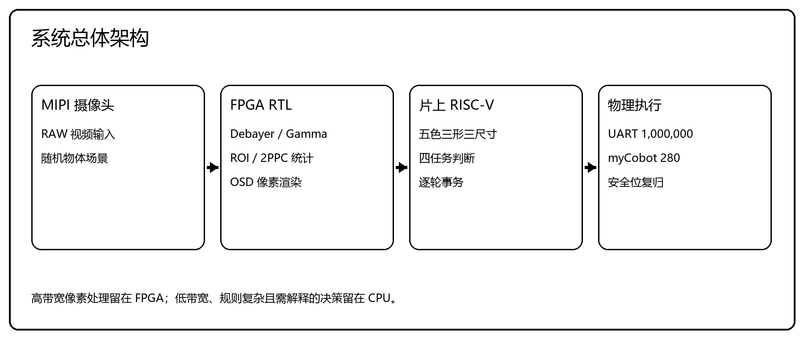
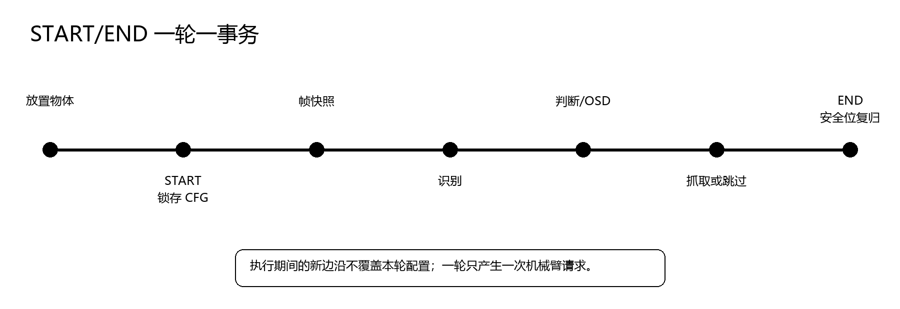
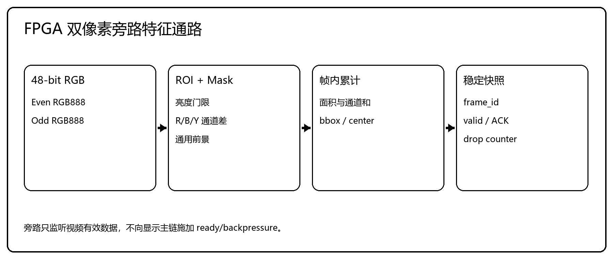
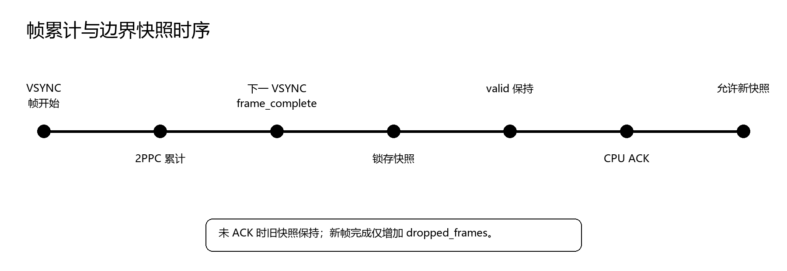
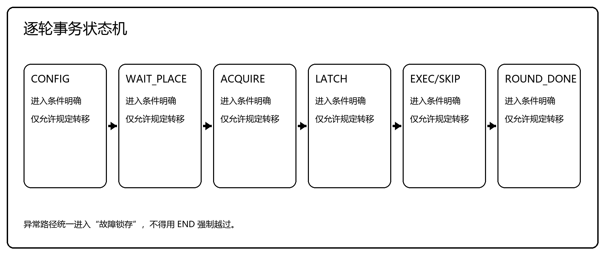
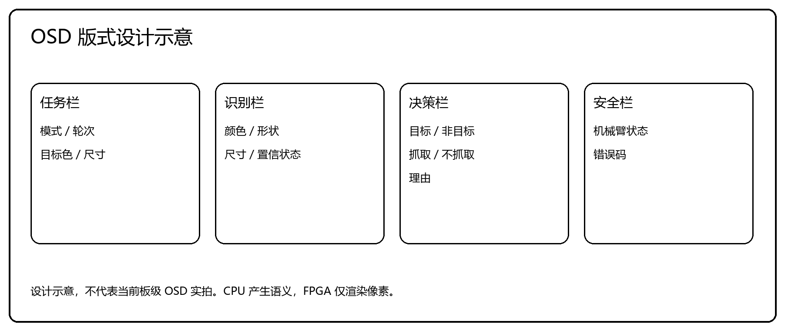
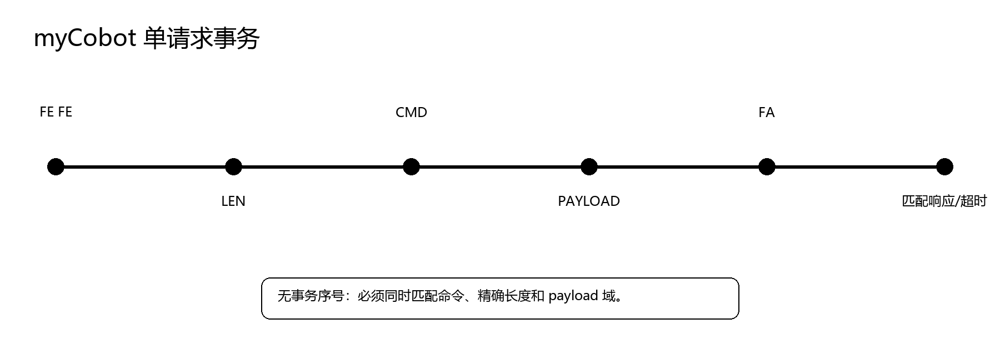
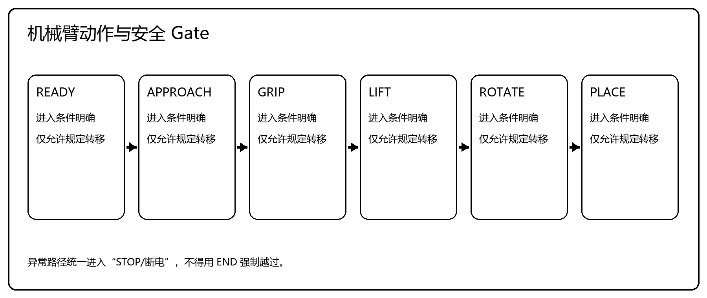
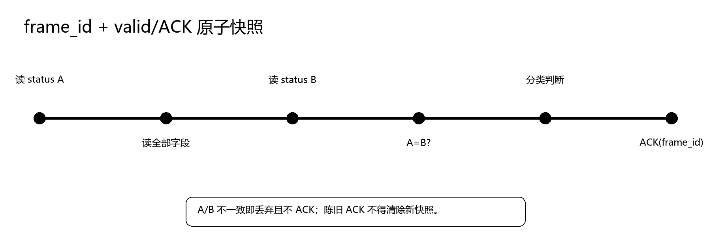
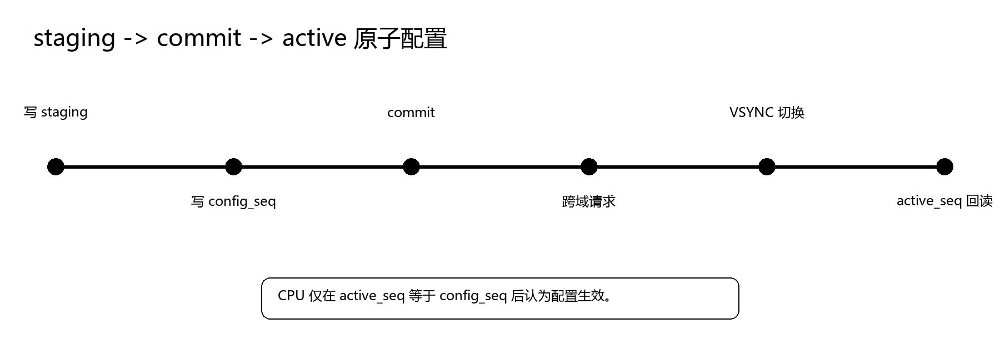

# 具身智能机器人芯机协同多场景目标感知与自主操控系统设计

> 文档类型：第十届全国大学生集成电路创新创业大赛分赛区决赛“雄芯院”企业命题技术报告

## 封面信息

- 报告类型：技术报告
- 杯赛题目：“雄芯院”企业命题
- 作品名称：具身智能机器人芯机协同多场景目标感知与自主操控系统设计
- 参赛队号：CICC1002207
- 团队名称：没钱买板子

> 审查说明：本文件用于内容审查。正式封面、字体、页眉页脚、分页和表格边框以 `技术文档.docx` 为准。

## 摘要

本文面向分赛区决赛随机顺序、多类别识别、目标关系判断与唯一动作响应共存的竞赛场景，设计了一套由国产 Ti375 FPGA、片上 RISC-V 处理器和 myCobot 280 机械臂组成的感知—决策—执行系统。FPGA 以双像素并行（2PPC）方式旁路监听视频流，在不使用 DDR 帧缓存、不对显示主链施加回压的条件下，每帧输出 ROI 像素数、颜色面积、亮度、前景区域与包围盒等固定数量的 32-bit 统计寄存器；CPU 从这些低带宽快照完成五色、三形状、三尺寸分类与四任务关系判断，统一生成 OSD 显示语义和机械臂请求；机械臂控制采用单请求在途、有限超时和故障锁存，保证每轮至多一次动作、故障时零盲动。

三项核心设计选择贯穿全文：用旁路统计替代完整帧缓存，将随分辨率增长的像素搬运转化为每帧一次定长寄存器读取；用 frame_id/ACK 与 staging/commit/active 两个原子协议保证 FPGA 与 CPU 之间的快照不撕裂、配置不半更新；用事件序号去重、动作单发和稳定理由码将串行评分链（识别 25% + 判断 25% + 执行 50%）约束为每轮一次、可追溯的事务。

固定 SHA 工程完成了 Map、PNR、STA、CDC 与 bitstream 生成，CPU Host 运行时断言 182/182，软硬件模块均通过对应的功能检查。

**关键词：国产 FPGA；Ti375；芯机协同；机器视觉；RISC-V；自主操控**

# 第1章 项目概述与设计目标

## 1.1 比赛场景与评分规则

分赛区决赛要求参赛队伍在 10 分钟内完成四类分拣任务，每个任务 5 轮，总分 65 分。被测物体涵盖五色（白、黑、红、蓝、黄）、三形（正方体、圆柱体、锥体）、三尺寸（2/2.5/3 cm），由评委随机设定顺序，逐轮不可调换，允许主动放弃。四项任务的定义与分值如表 1-1 所示。根据 0715 修正版规则，任务三、四正文未将颜色列为必需条件，因此系统将颜色保留为可配置筛选项。

**表 1-1 四项任务概要**

| 任务 | 被测物体组成 | 目标定义 | 单轮分值（识/判/执） | 总分 |
| --- | --- | --- | --- | --- |
| 一 | 同尺寸正方体 5 个（五色各一） | 指定颜色的正方体 | 0.5 / 0.5 / 1 | 10 |
| 二 | 正方体 2 + 圆柱体 2 + 锥体 1（同尺寸） | 指定颜色的正方体 | 1 / 1 / 2 | 20 |
| 三 | 正方体 5 个（2 cm×2, 2.5 cm×1, 3 cm×2） | 与参考正方体边长差 = 1 cm | 1 / 1 / 1 | 15 |
| 四 | 正方体 5 个（组成同任务三） | 与目标正方体边长差 ≤ 0.5 cm | 1 / 1 / 2 | 20 |

每轮评分采用串行链：识别（25%）→ 判断（25%）→ 执行或不执行（50%），前一环节错误直接阻断后续得分。目标物需轻取轻放、旋转 180°±10° 放至臂展最大位置，跌落扣减一半执行分；非目标物须明确输出不抓取理由。

## 1.2 技术挑战与设计原则

核心难点在于持续视频流、低速机械臂协议与串行评分规则三者如何在同一事务边界内协同。视频帧连续到达，但每轮仅允许一次判断和至多一次动作。系统以2PPC旁路统计替代DDR帧缓存，以`frame_id/ACK`和`staging/commit/active`保证跨域数据一致性，并通过事件序号和动作单发约束同一物体的重复触发。

# 第2章 系统总体设计

## 2.1 功能要求与架构选择

比赛要求系统连续完成识别、判断和执行三个环节。识别结果必须包含颜色、形状和尺寸；判断结果要说明物体是否满足当前任务条件；执行环节既包括对目标物的抓取，也包括对非目标物保持不动作。由于摄像头持续输出视频，而比赛操作按物体逐轮进行，系统内部同时存在两种时间尺度：像素流按时钟周期连续传输，任务控制则在每次按下 START 后运行一次。若把两类处理全部放在可编程逻辑中，任务规则和原因码不便修改；若把完整视频交给处理器，数据搬运和软件调度又会占用大量带宽。基于这一矛盾，系统采用 FPGA 与片上 RISC-V 分工的实现方式。

总体结构如图2-1所示。MIPI摄像头输出的RAW数据首先进入FPGA视频前端，完成数据接收、Debayer和Gamma等处理。处理后的视频一方面进入显示链路，另一方面由特征提取模块旁路监听。旁路模块在ROI内累计颜色面积、亮度、前景面积和包围盒等统计量，并在帧边界形成快照。片上CPU读取快照后完成颜色、形状和尺寸分类，再依据本轮配置作出目标判断。判断结果分别送往OSD结果寄存器和机械臂控制状态机：前者由FPGA叠加到显示画面，后者经myCobot协议和UART通道发往机械臂。



**图2-1 系统总体架构**

这种划分把规则固定、数据量大的处理放在FPGA，把数据量小但分支较多的处理放在CPU。FPGA不判断“四项任务”中的目标关系，也不直接产生抓取许可；CPU不参与逐像素运算，也不改变视频主链时序。两侧通过帧快照和结果提交接口交换数据。这样既保留了硬件流水线的吞吐能力，又便于在固件中调整分类阈值、任务配置和错误处理策略。

视频数据经FPGA前端处理后直接送往显示端，特征提取模块从主链旁路取数，不参与流量控制。帧统计通过快照接口送入CPU，传输内容只有分类所需的面积、亮度和几何量。CPU完成分类和任务判断后，把类别、动作和原因码作为一组结果回写，FPGA据此绘制OSD。若本轮需要抓取，动作请求由CPU协议层编码为myCobot串口帧，再经UART通道发送。像素、特征、结果和动作在各自通路中单向传递，任务规则只在CPU侧维护。

## 2.2 数据组织与芯机接口

视频接口采用双像素并行格式。每个有效周期输入Even和Odd两个RGB888像素，数据宽度为48 bit。若将完整图像送入CPU，输入带宽可写为

`B_pixel = f_pixel × 48 bit`

其中，`f_pixel`表示双像素数据的有效周期频率。FPGA在内部完成像素累计，CPU每帧读取`N_reg`个32 bit统计寄存器，对应带宽为

`B_snapshot = f_frame × N_reg × 32 bit`

其中，`f_frame`为帧率。`N_reg`由接口字段数量决定，不随图像分辨率增加，因此CPU侧每帧读取的数据量是固定的。这里的关系只说明数据组织方式；实际读取时间还取决于帧率、总线延迟和固件调度，本文不据此推导未经测试的帧率或响应时间。

FPGA到CPU的数据不能直接取自正在累加的寄存器。帧结束时，累计结果先锁存到快照寄存器，再置位`valid`并更新`frame_id`。CPU读取时先取一次状态字，随后读取全部特征，最后再次读取状态字。两次`frame_id`一致，才能确认本次数据来自同一帧；否则丢弃本次读取，不回写ACK。该方法避免了总线访问跨越帧边界时出现字段撕裂。

CPU到FPGA的配置和OSD结果采用另一套提交方式。CPU先写入staging寄存器，字段全部更新后再写commit序号；像素域在约定的帧边界切换active寄存器，并回报生效序号。配置提交和快照读取分别处理两个方向的一致性问题，二者不能用单次普通寄存器读写替代。

APB窗口按快照、确认、配置、结果和系统状态分组。基址与字段偏移由SoC生成的`soc.h`统一定义，时钟域之间通过快照握手和提交序号传递控制事件。

## 2.3 单轮工作流程

系统以一次START到一次合法结束为一轮。拨码输入抽象为`CFG[5:0]`，START和END分别作为轮次开始与结束事件。

物体放置完成后，操作者设置任务配置并按下START。CPU在消抖后的有效按下边沿一次性锁存6位配置。长按、按键抖动以及执行期间出现的重复边沿均不重新触发，也不覆盖本轮配置。随后控制器等待一帧有效快照，完成颜色、形状和尺寸分类，并根据锁存配置进行目标判断。

对于非目标物，CPU提交识别结果、判断结果和不执行原因，机械臂请求保持为0。物体由人工移走，END用于确认本轮结果已经处理。本文不规定人工移走与END的先后，只要求结束事件不能破坏当前状态。

对于目标物，CPU在提交显示结果后继续检查机械臂使能、忙状态、通信状态和安全互锁。条件全部满足且本轮尚未发送请求时，控制器只产生一次抓取请求。机械臂完成接近、夹取、抬升、旋转、放置和复归后，轮次才进入完成状态。动作超时、通信错误或安全条件失效时进入故障状态，END不能绕过故障处理。



**图2-2 START/END单轮工作流程**

这一流程对应三个关键约束：本轮配置在START后保持不变；同一物体最多产生一次动作请求；结果未处理或机械臂未回到安全位时，不进入下一轮。

# 第3章 关键模块详细设计

本章按数据流说明FPGA特征提取、CPU分类与轮次控制、myCobot协议及芯机接口。相关模块已有RTL或C代码，现有证据限于特征提取仿真和CPU Host测试。真实APB读写、CPU到OSD回写及板上UART2机械臂链路尚未完成同一批次的板级验证，以下将其作为接口设计说明，不作为闭环结果。

## 3.1 FPGA视频预处理与特征提取

视频主链需要持续输出，任务判断则只在轮次内消费帧级信息。为避免CPU搬运完整图像，特征提取模块从视频前端的RGB数据旁路取数，在一帧内完成ROI统计，并以快照形式输出颜色、亮度和几何特征。该支路不参与显示链路的流量控制。

### 3.1.1 双像素数据通路

`vision_preprocess_channel`的输入包括帧同步、行同步、数据有效信号和48 bit双像素RGB数据。`vision_stream_adapter_2ppc`将每拍数据拆成Even、Odd两个RGB888像素，同时生成横坐标`x0`、`x1`和共用纵坐标`y`。ROI按左闭右开区间判断，两路像素分别产生命中信号；同一拍仅有一路落入ROI时，计数仍按一个像素更新。

该模块没有反向`ready`信号，也不改写输入同步信号。CPU未及时确认快照时，视频流仍继续传输，未被接收的后续帧只反映在`dropped_frames`计数中。这里的“无回压”仅指特征支路不能阻塞视频主链，并不表示CPU可以无期限延迟读取。



**图3-1 双像素旁路特征提取通路**

### 3.1.2 像素掩码与帧内累计

`pixel_mask_2ppc`先计算两路像素的`R+G+B`亮度和，再结合亮度窗口、背景色差以及RGB通道差阈值，分别生成红、蓝、黄和通用前景掩码。FPGA只输出掩码面积和通道统计，不在像素域给出最终颜色、形状或尺寸类别。分类阈值和任务规则由CPU参数表管理。

`feature_accumulator_2ppc`在同一时钟周期内处理两个像素。ROI命中像素计入像素总数和RGB/Y通道和，颜色掩码计入相应面积，前景掩码用于累计前景面积并更新包围盒。首次出现前景时写入包围盒初值，随后以坐标比较更新四个边界。累计逻辑节选如下。

```verilog
if (i_roi_hit0 || i_roi_hit1) begin
    o_roi_pixel_count <= o_roi_pixel_count + i_roi_hit0 + i_roi_hit1;
    o_sum_r <= o_sum_r + (i_roi_hit0 ? i_r0 : 8'd0)
                         + (i_roi_hit1 ? i_r1 : 8'd0);
    o_red_area <= o_red_area + i_red0 + i_red1;
    o_fg_area  <= o_fg_area  + fg0 + fg1;
end
```

**代码3-1 双像素累计逻辑节选**

### 3.1.3 帧边界快照

累计器以新一帧的开始沿作为上一帧统计结束条件。若上一帧接收过有效像素，`feature_snapshot`锁存该帧统计量，随后累计寄存器清零。快照字段包括`frame_id`、ROI像素数、RGB/Y通道和、三色面积、前景面积、包围盒、中心点、状态位和丢帧计数。

`snapshot_valid`置位后，各字段保持到收到ACK。保持期间若又产生完整帧，旧快照不被覆盖，只增加`dropped_frames`。该策略舍弃中间帧，换取快照字段的一致性，适合按物体逐轮处理的场景。其正确性已由RTL testbench覆盖；CPU经真实APB读取并回写ACK仍需板级验证。



**图3-2 帧累计与快照保持时序**

## 3.2 CPU识别与任务判断

FPGA快照中的面积、亮度和包围盒不能直接作为比赛结果，CPU还需将其转换为颜色、形状和尺寸类别。分类过程采用参数化规则，阈值可由标定结果调整，并可在Host环境中对正常样本和异常输入分别测试。

### 3.2.1 颜色、形状和尺寸分类

颜色分类首先比较红、蓝、黄三类掩码面积。最大面积达到本类下限后输出相应彩色，并根据其与次大面积的关系给出置信度。三类彩色均未达到下限时，分类器利用ROI内RGB/Y统计计算平均亮度，以区分白色和黑色；仅当这些帧统计字段不可用时，才退回填充率兼容路径。无法形成可靠结论时输出`COLOR_UNKNOWN`，而不是强制归入某一颜色。

形状分类以包围盒填充率

`fill = foreground_area / bbox_area`

为主要特征，但填充率本身不能在任意视角下直接区分三种立体形状。现有双视角软件接口中，俯视观测区分方形投影与圆形投影，侧视观测区分矩形投影与三角形投影，再按“方形+矩形=正方体、圆形+矩形=圆柱体、圆形+三角形=锥体”的规则融合。当前单摄候选只使用`ch0`，不具备上述双视角融合条件；正方体候选可在Host层验证，圆柱体与锥体的稳定区分仍需固定机位实拍标定和混淆矩阵验证。

尺寸分类采用定点查表：将目标像素高度与2 cm、2.5 cm、3 cm三档标定高度分别求绝对差，取差值最小的一档。

```c
d20 = abs(height_px - height_px_20mm);
d25 = abs(height_px - height_px_25mm);
d30 = abs(height_px - height_px_30mm);
if (d20 <= d25 && d20 <= d30) return 20;
if (d25 <= d20 && d25 <= d30) return 25;
return 30;
```

**代码3-2 尺寸分类逻辑节选**

2.5 cm是被测物体可能的尺寸类别，不作为任务三的参考值或任务四的目标配置值。像素高度受相机位置、焦距、畸变和ROI影响，三档高度必须在机械结构和物体位置固定后实测。当前单摄`ch0`没有可靠的侧面高度来源，因此尺寸结果在单摄流程中按不可用处理；任务三、任务四不得据此产生抓取请求。

### 3.2.2 任务配置

为说明任务规则，软件层将目标条件抽象为6位逻辑配置，见表3-1。形状条件固定为正方体，不单独占位。该表描述逻辑编码，不代表现场拨码位或APB寄存器位域已经定版；正式输入接口应以同一批次SoC生成物和接口审查结果为准。

**表3-1 逻辑配置定义**

| 位域 | 含义 | 编码 |
| --- | --- | --- |
| `CFG[0]` | 尺寸关系模式 | 尺寸关闭时忽略；0表示差值为1 cm，1表示差值不超过0.5 cm |
| `CFG[3:1]` | 目标颜色 | 000白、001黑、010红、011蓝、100黄；其余编码无效 |
| `CFG[5:4]` | 尺寸条件和参考值 | 00关闭尺寸条件，01选择2 cm，10选择3 cm，11无效 |

任务一和任务二的目标条件均为“指定颜色且形状为正方体”，尺寸不参与判断。两项任务的差别在于官方提供的被测物池：任务一为五种颜色的同尺寸正方体，任务二为同尺寸的混合形状物体。固件保留独立任务模式，以便结果显示和测试统计按赛项区分，但二者使用相同的颜色、形状匹配条件。

任务三判断被测正方体与2 cm或3 cm参考正方体的边长差是否等于1 cm；任务四判断被测正方体与2 cm或3 cm目标正方体的边长差是否不超过0.5 cm。官方细则未将颜色列为这两项任务的必要条件，因此现场配置不能额外增加颜色限制。若尺寸输入缺失，判定结果为“观测不可用”，既不输出目标，也不输出抓取动作。

**表3-2 目标判断条件**

| 判定模式 | 必需条件 | 不满足时的结果 |
| --- | --- | --- |
| 颜色+正方体 | 颜色匹配，形状为正方体 | 输出颜色不符、形状不符或识别不稳定，不抓取 |
| 尺寸差=1 cm | 形状为正方体，尺寸有效，`|s-r|=1 cm` | 尺寸不可用时保持等待；关系不符时跳过，不抓取 |
| 尺寸差≤0.5 cm | 形状为正方体，尺寸有效，`|s-t|≤0.5 cm` | 尺寸不可用时保持等待；关系不符时跳过，不抓取 |

`task_matcher_set_target_ex`装载新目标时将事务置为`ROUND_TARGET_LOCKED`。匹配成功后，`task_matcher_evaluate`把状态推进到`ROUND_GRAB_REQUESTED`；在显式开始下一轮之前，同一目标配置不会重新解锁。这样，连续视频帧只能更新观测，不能对同一物体重复产生`GRAB`结果。

## 3.3 轮次控制与结果显示

同一物体停留在视野内时会连续产生多帧观测，动作控制不能直接由“某帧匹配”触发。轮次控制器将配置、放置确认、稳定观测、结果锁存、执行或跳过以及移除确认组织为一个事务；帧快照只提供观测数据，不决定事务边界。

### 3.3.1 轮次状态机

轮次控制器的主路径为`CONFIG`、`WAIT_PLACE_CONFIRM`、`ACQUIRE_STABLE`、`LATCH_RECOGNITION`、`LATCH_DECISION`、`EXECUTE_OR_SKIP`、`WAIT_ARM_DONE`和`ROUND_DONE`，异常时进入`ARM_FAULT`。操作事件携带16位序号；控制器只接受按模回绕规则判定为更新的序号，并对每个新事件返回接受或拒绝状态。重复、陈旧或当前状态不允许的事件均不推进轮次。



**图3-3 单轮事务状态机**

进入`EXECUTE_OR_SKIP`后，非目标物保留跳过原因并进入完成状态。目标物还要检查机械臂使能和忙状态。条件不满足时，已锁存的识别和目标判断不变，但动作改为`NONE`，原因为`ARM_NOT_READY`；条件满足时，`arm_request_sent`保证本轮只产生一个动作请求。

```c
if (decision_action == MATCH_ACTION_GRAB) {
    if (!arm_enabled || arm_busy) {
        make_result(MATCH_ACTION_NONE, 1u, REASON_ARM_NOT_READY);
    } else if (!arm_request_sent) {
        arm_request_sent = 1u;
        request_arm_grab = 1u;
    }
}
```

**代码3-3 动作请求单发逻辑节选**

等待动作完成期间若收到故障输入或超过截止时间，控制器锁存`REASON_ARM_FAULT`并进入`ARM_FAULT`。`REMOVE_CONFIRM`仅在`ROUND_DONE`中有效；软复位和放弃事件不能中断`WAIT_ARM_DONE`，也不能清除已经锁存的故障证据。

### 3.3.2 OSD结果组织

OSD按本轮事务组织信息，拟显示任务模式、轮次、目标条件、识别颜色、形状和尺寸、目标判断、动作结果、原因码、机械臂状态及错误码。语义由CPU生成，FPGA只负责字符和图形绘制，不在像素域重新解释任务规则。



**图3-4 OSD版式示意**

结果字段应在同一提交序号下切换，避免画面混用相邻轮次的数据。任务一、任务二显示“颜色+正方体”，任务三、任务四分别显示“尺寸差=1 cm”和“尺寸差≤0.5 cm”。图3-4仅说明信息层级与排布；当前CPU到OSD回写尚无板级闭环证据。

## 3.4 myCobot通信与动作控制

机械臂链路按命令事务工作，完成条件不能等同于串口字节已经发出。协议层需要检查帧结构和响应内容，动作层还需根据关节读回、超时和安全互锁判断阶段是否完成。夹爪到达设定位置也不能单独证明物体已经夹稳。

### 3.4.1 协议帧与事务

myCobot串口帧格式为`FE FE LEN CMD PAYLOAD... FA`。`LEN`等于payload长度加2，其中两个附加字节分别为`CMD`和帧尾`FA`。六关节角度按大端有符号16位编码；线上单位为0.01°，C代码内部使用0.1°，编码时乘10，解码时除10。

该帧格式没有CRC和事务序号，接收端不能仅凭帧头判断响应归属。软件采用单请求在途策略：对于有返回值的命令，只有命令字、payload长度和数据范围均符合预期的响应才可完成当前事务；坏帧、命令不匹配帧和超时均不能推进动作状态机。接收解析器同时处理半帧、噪声、错误帧尾和缓冲区回绕，以便在错误后重新寻找合法帧头。



**图3-5 myCobot单请求事务**

**表3-3 主要命令及完成判据**

| 命令 | ID | 本系统采用的完成判据 |
| --- | ---: | --- |
| `GET_ANGLES` | `0x20` | 收到12字节角度响应，命令和长度匹配，关节值在允许范围内 |
| `SEND_ANGLES` | `0x22` | 命令无ACK；后续周期性执行`GET_ANGLES`，连续满足角度误差阈值后判为到位 |
| `STOP` | `0x29` | 作为软件停止请求；不能替代物理断电或急停 |
| 夹爪命令 | `0x65/0x66/0x67/0x69` | 协议层支持位置、状态和运动查询；正式动作需补充停止与位置稳定确认，且位置反馈不能单独证明物体已夹牢 |

UART0 Hello使用115200 baud，myCobot链路规定为1000000 baud。二者使用不同端口并属于不同验证Gate；UART0 Hello通过不能证明UART2、J52接线或myCobot协议可用。

### 3.4.2 动作状态机与安全条件

动作状态机依次执行预检查、抓取点上方、下降、闭合夹爪、抬升、放置点上方、下降、打开夹爪和复归。各阶段由非阻塞`tick`推进；关节运动命令每阶段只发送一次，随后按固定周期读取角度，连续达到误差阈值后才进入下一状态。超时后先执行一次最终读回，仍未到位时以较低速度有限重试一次，重试失败则进入故障状态。

当前`arm_controller`在夹爪命令接口返回成功后即进入下一运动阶段，尚未接入`IS_GRIPPER_MOVING`和`GET_GRIPPER_VALUE`的稳定确认。因此，现有代码只能证明动作顺序和异常分支的Host逻辑，不能证明实物已夹稳。正式接入机械臂前必须补齐夹爪确认、接线电平核验和独立动作审查。



**图3-6 机械臂动作状态机**

比赛要求目标物放置方位相对起点旋转180°±10°，且位于机械臂最大臂展处。控制方案采用预先标定的关节角点位，不在比赛运行时生成未经验证的轨迹。PC端候选五点路径的独立动作记录仅用于核对点位顺序、旋转方向和回零过程；它不包含FPGA识别触发、板上UART2或CPU实机控制，不能作为正式闭环证据。

## 3.5 FPGA与CPU接口

FPGA和CPU以不同时间尺度更新数据：快照按帧发布，CPU按总线事务读取，配置和结果又需要在帧边界生效。若只规定寄存器字段而不规定提交顺序，CPU可能读到跨帧快照，FPGA也可能显示来自不同轮次的结果。接口据此分别定义快照确认和配置提交协议。

寄存器按快照、确认、配置、结果和系统状态分组。快照由FPGA写入、CPU读取，ACK由CPU回写；ROI、阈值和OSD结果先写staging字段，再提交序号；机械臂状态和错误码随本轮结果更新。这里给出的是接口契约，正式基址、偏移和跨时钟域实现必须由同一批次SoC生成的`soc.h`、RTL和接口Review Packet共同确定，历史占位地址不得用于上板访问。

快照读取顺序如图3-7所示。CPU先读取状态和`frame_id`，再读取全部特征，最后复读状态；只有前后`frame_id`一致且`valid`仍有效时，才接受该快照并回写对应ACK。陈旧或序号不匹配的ACK不得清除新快照。



**图3-7 `frame_id + valid/ACK`快照读取时序**

配置写入顺序如图3-8所示。CPU先更新全部staging字段，再递增并写入commit序号；像素域只在帧边界切换active组。CPU轮询到`active_seq`与本次commit序号相等后，才能确认配置生效。提交超时不得推进软件侧序号。



**图3-8 `staging → commit → active`配置提交流程**

快照协议解决FPGA到CPU的读一致性，提交协议解决CPU到像素域的写一致性，两者方向和失效条件不同。当前源码与离线测试已覆盖相应软件/RTL行为，但真实APB地址、CDC、CPU取数和OSD提交仍为待验证项；在这些证据补齐前，本节接口只作为实现约束，不作为板级通过结论。

# 第4章 仿真、测试与资源分析

## 4.1 FPGA特征提取仿真

特征提取模块采用Icarus Verilog进行独立仿真。测试平台以确定的双像素序列代替摄像头输入，不依赖DDR和厂商IP。测试数据覆盖单像素命中、双像素命中、ROI边界、空前景和快照阻塞等情况。

`tb_vision_preprocess_channel.v`首先检查输入数据的`{B1,G1,R1,B0,G0,R0}`字节顺序。随后在半开ROI内输入红、蓝、黄和背景像素，逐项比对ROI像素数、RGB/Y通道和、颜色面积、前景面积、bbox和中心点。快照产生后保持ACK为低，继续输入下一帧，检查原快照是否保持以及`dropped_frames`是否递增。ROI内没有前景时，模块仍发布快照，并在状态字中标记空bbox。

`tb_synthetic_2ppc_source.v`检查合成输入源的VS、HS、DE和valid时序，以及双像素打包顺序。两个testbench由同一PowerShell脚本依次编译和执行，任一用例失败即返回非零状态。仿真覆盖了特征通路的主要边界条件和快照握手行为。

## 4.2 CPU功能测试

CPU模块使用Host测试验证分类、任务判断和轮次控制。运行时测试以fake transport提供特征快照，其调用顺序与固件一致：读取快照、检查状态、适配特征、执行分类、完成任务判断、提交结果并回写ACK。

测试输入覆盖五种颜色、正方体与非正方体、三档尺寸以及目标和非目标分支。异常用例包括快照标志错误、前后`frame_id`不一致、配置版本错误、ACK不匹配、重复帧、重复放置事件、稳定等待超时、人工放弃、尺寸不可用和分类结果不稳定。固定基线复测共执行182项C断言，全部通过；离线日志工具的有效和负向bundle回归共3项，全部通过。

为检查连续运行行为，测试程序执行20个确定性轮次事务，得到20次快照ACK和20次结果提交。重复事件未产生额外轮次，错误ACK被拒绝，目标和非目标均保留对应的动作结果与原因码。A7测试进一步检查了配置提交后的轮内保持，以及PLACE、结果锁存、ACK和REMOVE的事件顺序。

**表4-1 CPU Host测试结果**

| 测试对象 | 用例内容 | 结果 |
| --- | --- | ---: |
| CPU运行时 | 快照检查、分类、判断、ACK、异常分支 | 182/182通过 |
| 日志bundle回归 | 有效bundle及7类负向原始日志 | 3/3通过 |
| 连续轮次 | 20个确定性事务 | 20次ACK，20次结果提交 |

## 4.3 FPGA构建与时序分析

单摄Hard SoC工程使用Efinity 2025.2.288.4.15完成冷构建，输入基线为`489ab5b0c1773bfcb776cedd9f39b3f088fb4a0f`。构建在新建输出目录中运行，依次完成Map、Interface、PNR、STA、CDC和bitstream生成。

**表4-2 FPGA构建结果**

| 项目 | 结果 |
| --- | --- |
| Map / Interface / PNR | PASS；Interface报告4条设计warning |
| STA | setup WNS 1.321 ns；hold WHS 0.026 ns |
| CDC | PASS；报告无synchronizer warning |
| Route资源 | Inputs 732/4370；Outputs 1051/5891；XLRs 17796/362880；Clocks 12/96 |
| 存储与DSP | Memory Blocks 169/2688；DSP Blocks 0/1344 |
| Map资源摘要 | LUT4 11385；FF 10104；RAM10 165；DPRAM10 4 |
| bitstream SHA-256 | `A897E33514A1079BB1B46C02C464B0BD679AF551CEFCB67C4A0EBD5B8FCD1ACD` |

Interface阶段的4条设计warning分别涉及MIPI和TMDS接口距离规则。post-synthesis报告记录118条warning；route输出中的SDC端口匹配和组合环切断信息按原报告分类保留。时序报告中最差setup和hold裕量均为正，CDC报告未给出同步器warning。

UART0 Hello固件使用同批次BSP和工具链构建。ELF入口位于`0xF9000000`，唯一LOAD段范围为`0xF9000000..0xF9000A30`，占用片上RAM 2608 byte。ELF SHA-256为`E5BC80A2F18A7E2951D53DA539BE2FC61AAECFA90C5CDADB29E65FFC6141928A`。

## 4.4 机械臂动作测试

机械臂动作测试在PC端采用五点路径：安全位、抓取上方、抓取位、放置上方和放置位。程序依次完成接近物体、夹爪闭合、抬升、旋转、放置和回到安全位。最新连续测试完成5/5轮抓取和自动回零，过程中未记录异常或人工扶正。

根据抓取点和放置点坐标计算，路径绕基座的方位变化为177.72°。各移动阶段使用关节角读回检查到位状态；`drop_hover`阶段在固件同步返回0后，以最大轴误差2.02°不超过3.0°的软到位条件继续执行。该结果用于确认点位顺序、旋转方向和复归流程。

固件中的动作状态机沿用相同的点位顺序，并将角度、超时、通信错误和机械臂状态纳入状态转移条件，异常时停止本轮后续动作。
